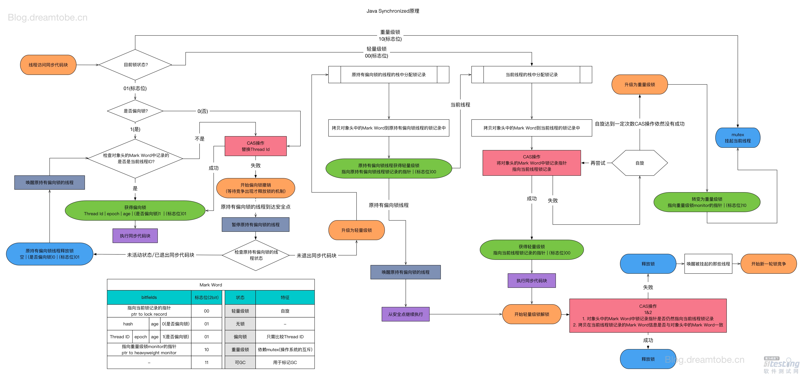

# 1.java锁的膨胀过程1

首先简单说下先偏向锁、轻量级锁、重量级锁三者各自的应用场景：

- 偏向锁：只有一个线程进入临界区；
- 轻量级锁：多个线程交替进入临界区**；**
- 重量级锁：多个线程同时进入临界区。

锁膨胀过程：




上图跟下面这个解析基本相同：

> 偏向所锁，轻量级锁都是乐观锁，重量级锁是悲观锁。
> 一个对象刚开始实例化的时候，没有任何线程来访问它的时候。它是可偏向的，意味着，它现在认为只可能有一个线程来访问它，所以当第一个
> 线程来访问它的时候，它会偏向这个线程，此时，对象持有偏向锁。偏向第一个线程，这个线程在修改对象头成为偏向锁的时候使用CAS操作，并将
> 对象头中的ThreadID改成自己的ID，之后再次访问这个对象时，只需要对比ID，不需要再使用CAS在进行操作。
> 一旦有第二个线程访问这个对象，因为偏向锁不会主动释放，所以第二个线程可以看到对象时偏向状态，这时表明在这个对象上已经存在竞争了，检查原来持有该对象锁的线程是否依然存活，如果挂了，则可以将对象变为无锁状态，然后重新偏向新的线程，如果原来的线程依然存活，则马上执行那个线程的操作栈，检查该对象的使用情况，如果仍然需要持有偏向锁，则偏向锁升级为轻量级锁，（ **偏向锁就是这个时候升级为轻量级锁的**）。如果不存在使用了，则可以将对象回复成无锁状态，然后重新偏向。
> 轻量级锁认为竞争存在，但是竞争的程度很轻，一般两个线程对于同一个锁的操作都会错开，或者说稍微等待一下（自旋），另一个线程就会释放锁。 但是当自旋超过一定的次数，或者一个线程在持有锁，一个在自旋，又有第三个来访时，轻量级锁膨胀为重量级锁，重量级锁使除了拥有锁的线程以外的线程都阻塞，防止CPU空转。
>
> ## 2.java锁的膨胀过程
>
> 看到这个标题的时候我的确也有些蒙，之前也很少看这方面的文章，整理下，填充下自己的空白。
>
> ## 一、背景
>
> 在 Java 语言中，使用 Synchronized 是能够实现线程同步的，即**加锁**。并且实现的是**悲观锁**，在操作同步资源的时候直接先加锁。
>
> 加锁可以使一段代码在同一时间只有一个线程可以访问，在增加安全性的同时，牺牲掉的是程序的执行性能，所以为了在一定程度上减少获得锁和释放锁带来的性能消耗，在 jdk6 之后便引入了“偏向锁”和“轻量级锁”，所以总共有4种锁状态，级别由低到高依次为：**无锁状态**、**偏向锁状态**、**轻量级锁状态**、**重量级锁状态**。这几个状态会随着竞争情况逐渐升级，此过程为不可逆。所以 synchronized 锁膨胀过程其实就是**无锁 → 偏向锁 → 轻量级锁 → 重量级锁**的一个过程。
>
> 
>
> 
>
> 在使用 synchronized 来同步代码块的时候，编译后，会在代码块的起始位置插入 **monitorenter指令**，在结束或异常处插入 **monitorexit指令。**当执行到 monitorenter 指令时，将会尝试获取对象所对应的 **monitor **的所有权，即尝试获得对象的锁。而 synchronized 用的锁是存放在 **Java对象头** 中的。
>
> 所以引出了两个关键词：“Java 对象头” 和 “Monitor”
>
> ## 二、Java 对象头和 Monitor
>
> 1、Java 对象头
>
> 我们以 Hotspot 虚拟机为例，Hotspot 的<u>**对象头主要包括两部分数据：Mark Word（标记字段）、Class Pointer（类型指针**</u>）。
>
> **Mark Word**：默认存储对象的 HashCode，分代年龄和锁标志位信息。这些信息都是与对象自身定义无关的数据，所以 Mark Word 被设计成一个非固定的数据结构以便在极小的空间内存存储尽量多的数据。它会根据对象的状态复用自己的存储空间，也就是说在运行期间 Mark Word 里存储的数据会随着锁标志位的变化而变化。
>
> **Class Point**：对象指向它的类元数据的指针，虚拟机通过这个指针来确定这个对象是哪个类的实例。
>
> 2、Monitor
>
> Monitor 可以理解为一个同步工具或一种同步机制，通常被描述为一个对象。每一个 Java 对象就有一把看不见的锁，称为内部锁或者 Monitor 锁。
>
> Monitor 是线程私有的数据结构，每一个线程都有一个可用 monitor record 列表，同时还有一个全局的可用列表。每一个被锁住的对象都会和一个 monitor 关联，同时 monitor 中有一个 Owner 字段存放拥有该锁的线程的唯一标识，表示该锁被这个线程占用。
>
> ## 三、锁
>
> **无锁**
>
> 无锁是指没有对资源进行锁定，所有的线程都能访问并修改同一个资源，但同时只有一个线程能修改成功。
>
> 无锁的特点是修改操作会在循环内进行，线程会不断的尝试修改共享资源。如果没有冲突就修改成功并退出，否则就会继续循环尝试。如果有多个线程修改同一个值，必定会有一个线程能修改成功，而其他修改失败的线程会不断重试直到修改成功。
>
> **偏向锁**
>
> 引入偏向锁的主要目的是：为了在无多线程竞争的情况下尽量减少不必须要的轻量级锁执行路径。其实在大多数情况下，锁不仅不存在多线程竞争，而且总是由同一个线程多次获取，所以引入偏向锁就可以减少很多不必要的性能开销和上下文切换。
>
> 偏向锁是指当一段同步代码一直被同一个线程所访问时，即不存在多个线程的竞争时，那么该线程在后续访问时便会自动获得锁，从而降低获取锁带来的消耗，即提高性能。
>
> 当一个线程访问同步代码块并获取锁时，会在 Mark Word 里存储锁偏向的线程 ID。在线程进入和退出同步块时不再通过 CAS 操作来加锁和解锁，而是检测 Mark Word 里是否存储着指向当前线程的偏向锁。轻量级锁的获取及释放依赖多次 CAS 原子指令，而偏向锁只需要在置换 ThreadID 的时候依赖一次 CAS 原子指令即可。
>
> 偏向锁只有遇到其他线程尝试竞争偏向锁时，持有偏向锁的线程才会释放锁，线程是不会主动释放偏向锁的。
>
> 关于偏向锁的撤销，需要等待全局安全点，即在某个时间点上没有字节码正在执行时，它会先暂停拥有偏向锁的线程，然后判断锁对象是否处于被锁定状态。如果线程不处于活动状态，则将对象头设置成无锁状态，并撤销偏向锁，恢复到无锁（标志位为01）或轻量级锁（标志位为00）的状态。
>
> 偏向锁在 JDK 6 及之后版本的 JVM 里是默认启用的。可以通过 JVM 参数关闭偏向锁：-XX:-UseBiasedLocking=false，关闭之后程序默认会进入轻量级锁状态。
>
> **轻量级锁**
>
> 引入轻量级锁的主要目的是：在多线程竞争不激烈的前提下，减少传统的重量级锁使用操作系统互斥量产生的性能消耗。需要注意的是轻量级锁并不是取代重量级锁，而是在大多数情况下同步块并不会出现严重的竞争情况，所以引入轻量级锁可以减少重量级锁对线程的阻塞带来的开销。
>
> 所以偏向锁是认为环境中不存在竞争情况，而轻量级锁则是认为环境中不存在竞争或者竞争不激烈，所以轻量级锁一般都只会有少数几个线程竞争锁对象，其他线程只需要稍微等待（自旋）下就可以获取锁，但是自旋次数有限制，如果自旋超过一定的次数，或者一个线程在持有锁，一个在自旋，又有第三个来访时，轻量级锁膨胀为重量级锁，重量级锁使除了拥有锁的线程以外的线程都阻塞，防止CPU空转。
>
> **重量级锁**
>
> 重量级锁是指当有一个线程获取锁之后，其余所有等待获取该锁的线程都会处于阻塞状态。
>
> 重量级锁通过对象内部的监视器（monitor）实现，而其中 monitor 的本质是依赖于底层操作系统的 Mutex Lock 实现，操作系统实现线程之间的切换需要从用户态切换到内核态，切换成本非常高。
>
> 简言之，就是所有的控制权都交给了操作系统，由操作系统来负责线程间的调度和线程的状态变更。而这样会出现频繁地对线程运行状态的切换，线程的挂起和唤醒，从而消耗大量的系统资源，导致性能低下。
>
> 下面说下膨胀过程，直接上图：
>
> 
>
> 
>
> synchronized 用的锁是存储在 **Java 对象头**里的，下图是锁状态变化的情况，在分析 synchronized 锁升级需要对照这图：
>
> 
>
> 64bits
>
> epoch:偏向时间戳
>
> 为了让一个字大小存储更多信息，jvm将最低两位设置为标记位
>
> 
>
> ​    一个锁对象刚刚开始创建的时候，没有任何线程来访问它，它是可偏向的，它现在认为只可能有一个线程来访问它，所以当第一个线程来访问他的时候，它会偏向这个线程。此时线程状态为无锁状态，锁标志位为 01，此时 Mark Word 如下图：
>
> ​                        
>
> 当一个线程（线程 A）来获取锁的时，会首先检查所标志位，此时锁标志位为 01，然后检查是否为偏向锁，此时不为偏向锁，所以当前线程会修改对象头状态为偏向锁，同时将对象头中的 ThreadID 改成自己的 Thread ID，此时 Mark Word 如下图
>
> ​                         
>
> 如果再有一个线程（线程 B）过来，此时锁状态为偏向锁，该线程会检查 Mark Word 中记录的线程 ID 是否为自己的线程 ID，如果是，则获取偏向锁，执行同步代码块。如果不是，**则利用 CAS 尝试替换 Mark Word 中的 Thread ID，成功，表示该线程（线程 B）获取偏向锁，**执行同步代码块，此时 Mark Word 如下图：
>
> ​                           
>
> 如果失败，则表明当前环境存在锁竞争情况，则执行偏向锁的撤销工作（**这里有一点需要注意的是：\**偏向锁的释放并不是主动\**，而是被动的，什么意思呢？就是说持有偏向锁的线程执行完同步代码后不会主动释放偏向锁，而是等待其他线程来竞争才会释放锁**）。撤销偏向锁的操作需要等到全局安全点才会执行，然后暂停持有偏向锁的线程，同时检查该线程的状态，如果该线程不处于活动状态或者已经退出同步代码块，则设置为无锁状态（线程 ID 为空，是否为偏向锁为 0 ，锁标志位为01）重新偏向，同时恢复该线程。若该线程活着，则会遍历该线程栈帧中的锁记录，检查锁记录的使用情况，如果仍然需要持有偏向锁，则撤销偏向锁，升级为轻量级锁。
>
> 在升级为轻量级锁之前，持有偏向锁的线程（线程 A）是暂停的，JVM 首先会在原持有偏向锁的线程（线程 A）的栈中创建一个名为**锁记录**的空间（Lock Record），用于存放锁对象目前的 **Mark Word 的拷贝**，然后拷贝对象头中的 Mark Word 到原持有偏向锁的线程（线程 A）的锁记录中（官方称之为 Displaced Mark Word ），这时线程 A 获取轻量级锁，此时 Mark Word 的锁标志位为 00，指向锁记录的指针指向线程 A 的锁记录地址，如下图： 
>
> 
>
> 
>
> 当原持有偏向锁的线程（线程 A）获取轻量级锁后，JVM 唤醒线程 A，线程 A 执行同步代码块，执行完成后，开始轻量级锁的释放过程。
>
> 对于其他线程而言，也会在栈帧中建立锁记录，存储锁对象目前的 Mark Word 的拷贝。JVM 利用 CAS 操作尝试将锁对象的 Mark Word 更正指向当前线程的 Lock Record，如果成功，表明竞争到锁，则执行同步代码块，如果失败，那么线程尝试使用自旋的方式来等待持有轻量级锁的线程释放锁。当然，它不会一直自旋下去，因为自旋的过程也会消耗 CPU，而是自旋一定的次数，如果自旋了一定次数后还是失败，则升级为重量级锁，阻塞所有未获取锁的线程，等待释放锁后唤醒。
>
> 
>
> 轻量级锁的释放，会使用 CAS 操作将 Displaced Mark Word 替换到**对象头**中，成功，则表示没有发生竞争，直接释放。如果失败，表明锁对象存在竞争关系，这时会轻量级锁会升级为重量级锁，然后释放锁，唤醒被挂起的线程，开始新一轮锁竞争，注意这个时候的锁是重量级锁。
>
> ## 四、自旋
>
> 引入自旋这一规则的原因其实也很简单，因为阻塞或唤醒一个 Java 线程需要操作系统切换 CPU 状态来完成，这种状态转换需要耗费处理器时间。如果同步代码块中的内容过于简单，状态转换消耗的时间有可能比用户代码执行的时间还要长。并且在许多场景中，同步资源的锁定时间很短，为了这一小段时间去切换线程，这部分操作的开销其实是得不偿失的。
>
> 所以，在物理机器有多个处理器的情况下，当两个或两个以上的线程同时并行执行时，我们就可以让后面那个请求锁的线程不放弃 CPU 的执行时间，看看持有锁的线程是否很快就会释放锁。而为了让当前线程“稍等一下”，我们需让当前线程进行自旋。如果在自旋完成后前面锁定同步资源的线程已经释放了锁，那么当前线程就可以不必阻塞而是直接获取同步资源，从而避免切换线程的开销。
>
> 自旋锁本身是有缺点的，它不能代替阻塞。自旋等待虽然避免了线程切换的开销，但它要占用处理器时间。如果锁被占用的时间很短，自旋等待的效果就会非常好。反之，如果锁被占用的时间很长，那么自旋的线程只会白浪费处理器资源。
>
> 所以，自旋等待的时间必须要有一定的限度，如果自旋超过了限定次数（默认是10次，可以使用 -XX:PreBlockSpin 来更改）没有成功获得锁，就应当挂起线程。
>
> 自旋锁在 JDK1.4.2 中引入，使用 -XX:+UseSpinning 来开启。JDK 6 中变为默认开启，并且引入了自适应的自旋锁（适应性自旋锁）。
>
> 自适应自旋锁意味着自旋的时间（次数）不再固定，而是由前一次在同一个锁上的自旋时间及锁的拥有者的状态来决定。如果在同一个锁对象上，自旋等待刚刚成功获得过锁，并且持有锁的线程正在运行中，那么虚拟机就会认为这次自旋也是很有可能再次成功，进而它将允许自旋等待持续相对更长的时间。如果对于某个锁，自旋很少成功获得过锁，那在以后尝试获取这个锁时将可能省略掉自旋过程，直接阻塞线程，避免浪费处理器资源。
>
> 

# 2.线程池设置多大合适呢?

## a.参考

虽然线程池大小的设置受到很多因素影响，但是这里给出一个参考公式：

最佳线程数目 = （（线程等待时间+线程CPU时间）/线程CPU时间 ）* CPU数目

比如平均每个线程CPU运行时间为0.5s，而线程等待时间（非CPU运行时间，比如IO）为1.5s，CPU核心数为8，那么根据上面这个公式估算得到：((0.5+1.5)/0.5)*8=32。这个公式进一步转化为：

最佳线程数目 = （线程等待时间与线程CPU时间之比 + 1）* CPU数目

线程等待时间所占比例越高，需要越多线程。线程CPU时间所占比例越高，需要越少线程。

可以通过控制台输入jconsole,打开图形监控界面,监控线程运行情况

## b.参考

一般需要根据任务的类型来配置线程池大小：

　　如果是CPU密集型任务，就需要尽量压榨CPU，参考值可以设为 NCPU+1

　　如果是IO密集型任务，参考值可以设置为2*NCPU

　　当然，这只是一个参考值，具体的设置还需要根据实际情况进行调整，比如可以先将线程池大小设置为参考值，再观察任务运行情况和系统负载、资源利用率来进行适当调整。


与CPU密集型的关系:
        一般情况下,CPU核心数 == 最大同时执行线程数.在这种情况下(设CPU核心数为n),大量客户端会发送请求到服务器,但是服务器最多只能同时执行n个线程.
        设线程池大小为m,且m>>n,则此时会导致CPU频繁切换线程来执行
        所以这种情况下,无需设置过大的线程池工作队列,(工作队列长度 = CPU核心数 || CPU核心数+1) 即可.
与I/O密集型的关系:
        1个线程对应1个方法栈,线程的生命周期与方法栈相同.
比如某个线程的方法栈对应的入站顺序为:controller()->service()->DAO(),由于DAO长时间的I/O操作,导致该线程一直处于工作队列,但它又不占用CPU,则此时有1个CPU是处于空闲状态的.(就是说CPU的性能超过I/O很多，大多数情况下都是cpu在等待I/O这样浪费CPU性能，所以设置线程数为2*NCPU)
        所以,这种情况下,应该加大线程池工作队列的长度(如果CPU调度算法使用的是FCFS,则无法切换),尽量不让CPU空闲下来,提高CPU利用率.

总结：

> IO密集型=2Ncpu（可以测试后自己控制大小，2Ncpu一般没问题）（常出现于线程中：数据库数据交互、文件上传下载、网络数据传输等等）
>
> 计算密集型=Ncpu（常出现于线程中：复杂算法）

# 3.[eclipse中对于Java虚拟机参数的设置与思考](https://www.cnblogs.com/bravecode/p/10613412.html)

常用设置及其含义

 常用设置：1) -Xmx3550m -Xms3550m -Xmn2g -Xss128k

​          2) -Xmx3550m -Xms3550m -Xss128k -XX:NewRatio=4 -XX:SurvivorRatio=4 -XX:MaxPermSize=16m -XX:MaxTenuringThreshold=0

设置项解释：
**-Xmx3550m：**设置JVM最大可用内存为3550M。
**-Xms3550m：**设置JVM初始内存为3550m。此值可以设置与-Xmx相同，以避免每次垃圾回收完成后JVM重新分配内存。
**-Xmn2g：**设置年轻代大小为2G。整个JVM内存大小=年轻代大小 + 年老代大小 + 持久代大小。持久代一般固定大小为64m，所以增大年轻代后，将会减小年老代大小。此值对系统性能影响较大，Sun官方推荐配置为整个堆的3/8。
**-Xss128k：**设置每个线程的堆栈大小。JDK5.0以后每个线程堆栈大小为1M，以前每个线程堆栈大小为256K。更具应用的线程所需内存大小进行调整。在相同物理内存下，减小这个值能生成更多的线程。但是操作系统对一个进程内的线程数还是有限制的，不能无限生成，经验值在3000~5000左右。 
**-XX:NewRatio=4:** 设置年轻代（包括Eden和两个Survivor区）与年老代的比值（除去持久代）。设置为4，则年轻代与年老代所占比值为1：4，年轻代占整个堆栈的1/5
**-XX:SurvivorRatio=4：**设置年轻代中Eden区与Survivor区的大小比值。设置为4，则两个Survivor区与一个Eden区的比值为2:4，一个Survivor区占整个年轻代的1/6
**-XX:MaxPermSize=16m:**设置持久代大小为16m。
**-XX:MaxTenuringThreshold=0：**设置垃圾最大年龄。如果设置为0的话，则年轻代对象不经过Survivor区，直接进入年老代。对于年老代比较多的应用，可以提高效率。如果将此值设置为一个较大值，则年轻代对象会在Survivor区进行多次复制，这样可以增加对象再年轻代的存活时间，增加在年轻代即被回收的机率。

 

3 虚拟机参数设置使用场景举例

网站在使用过程中出现周期性卡顿，于是用Jstat查看虚拟机的各项指标，发现FullGc耗时很大，说明虚拟机频繁进行fullGc导致卡顿


分析原因及解决办法：

**1. 旧生代空间不足**

旧生代空间只有在新生代对象转入及创建为大对象、大数组时才会出现不足的现象，当执行Full GC后空间仍然不足，则抛出如下错误：

1. java.lang.OutOfMemoryError: Java heap space 

为避免以上两种状况引起的Full GC，调优时应尽量做到让对象在Minor GC阶段被回收、让对象在新生代多存活一段时间及不要创建过大的对象及数组。

**2. Permanet Generation空间满**

Permanet Generation中存放的为一些class的信息等，当系统中要加载的类、反射的类和调用的方法较多时，Permanet Generation可能会被占满，在未配置为采用CMS GC的情况下会执行Full GC。如果经过Full GC仍然回收不了，那么JVM会抛出如下错误信息：

1. java.lang.OutOfMemoryError: PermGen space 

为避免Perm Gen占满造成Full GC现象，可采用的方法为增大Perm Gen空间或转为使用CMS GC。

**3. CMS GC时出现promotion failed和concurrent mode failure**

对于采用CMS进行旧生代GC的程序而言，尤其要注意GC日志中是否有promotion failed和concurrent mode failure两种状况，当这两种状况出现时可能会触发Full GC。

promotion failed是在进行Minor GC时，survivor space放不下、对象只能放入旧生代，而此时旧生代也放不下造成的；concurrent mode failure是在执行CMS GC的过程中同时有对象要放入旧生代，而此时旧生代空间不足造成的。

应对措施为：增大survivor space、旧生代空间或调低触发并发GC的比率，但在JDK 5.0+、6.0+的版本中有可能会由于JDK的bug29导致CMS在remark完毕后很久才触发sweeping动作。对于这种状况，可通过设置-XX: CMSMaxAbortablePrecleanTime=5（单位为ms）来避免。

**4. 统计得到的Minor GC晋升到旧生代的平均大小大于旧生代的剩余空间**

这是一个较为复杂的触发情况，Hotspot为了避免由于新生代对象晋升到旧生代导致旧生代空间不足的现象，在进行Minor GC时，做了一个判断，如果之前统计所得到的Minor GC晋升到旧生代的平均大小大于旧生代的剩余空间，那么就直接触发Full GC。

例如程序第一次触发Minor GC后，有6MB的对象晋升到旧生代，那么当下一次Minor GC发生时，首先检查旧生代的剩余空间是否大于6MB，如果小于6MB，则执行Full GC。

当新生代采用PS GC时，方式稍有不同，PS GC是在Minor GC后也会检查，例如上面的例子中第一次Minor GC后，PS GC会检查此时旧生代的剩余空间是否大于6MB，如小于，则触发对旧生代的回收。

除了以上4种状况外，对于使用RMI来进行RPC或管理的Sun JDK应用而言，默认情况下会一小时执行一次Full GC。可通过在启动时通过- java -Dsun.rmi.dgc.client.gcInterval=3600000来设置Full GC执行的间隔时间或通过-XX:+ DisableExplicitGC来禁止RMI调用System.gc。

**解决办法参考自：http://book.51cto.com/art/201011/235592.htm**

JVM调优得看gc log，然后针对性分析、调优。没有通用的、一劳永逸的方案。

# 4.java虚拟机

本文是学习了《深入理解Java虚拟机》之后的总结，主要内容都来自于书中，也有作者的一些理解。一是为了梳理知识点，归纳总结，二是为了分享交流，如有错误之处还望指出。

用XMind画了一张导图（源文件对部分节点有详细备注和参考资料，需要的朋友可以关注我的微信公众号：Java团长，然后回复“JVM”获取）：

》规定，Java 虚拟机所管理的内存如下图所示。


 

#### 1.1.1 程序计数器

> 内存空间小，线程私有。字节码解释器工作是就是通过改变这个计数器的值来选取下一条需要执行指令的字节码指令，分支、循环、跳转、异常处理、线程恢复等基础功能都需要依赖计数器完成

如果线程正在执行一个 Java 方法，这个计数器记录的是正在执行的虚拟机字节码指令的地址；如果正在执行的是 Native 方法，这个计数器的值则为 (Undefined)。此内存区域是唯一一个在 Java 虚拟机规范中没有规定任何 OutOfMemoryError 情况的区域。

#### 1.1.2 Java 虚拟机栈

> 线程私有，生命周期和线程一致。描述的是 Java 方法执行的内存模型：**每个方法在执行时都会创建一个栈帧(Stack Frame)**用于存储***`<u>局部变量表`、`操作数栈`、`动态链接`、`方法出口`</u>***等信息。每一个方法从调用直至执行结束，就对应着一个栈帧从虚拟机栈中入栈到出栈的过程。

- **局部变量表**：存放了编译期可知的各种基本类型(boolean、byte、char、short、int、float、long、double)、对象引用(reference 类型)和 returnAddress 类型(指向了一条字节码指令的地址)

StackOverflowError：线程请求的栈深度大于虚拟机所允许的深度。
OutOfMemoryError：如果虚拟机栈可以动态扩展，而扩展时无法申请到足够的内存。

#### 1.1.3 本地方法栈

> 区别于 Java 虚拟机栈的是，Java 虚拟机栈为虚拟机执行 Java 方法(也就是字节码)服务，而**本地方法栈则为虚拟机使用到的 Native 方法服务**。也会有 StackOverflowError 和 OutOfMemoryError 异常。

#### **1.1.4 Java 堆**

> 对于绝大多数应用来说，这块区域是 JVM 所管理的内存中最大的一块。线程共享，<u>主要是存放对象实例和数组</u>。**内部会划分出多个线程私有的分配缓冲区**(Thread Local Allocation Buffer, TLAB)。可**以位于物理上不连续的空间，但是逻辑上要连续。**

OutOfMemoryError：如果堆中没有内存完成实例分配，并且堆也无法再扩展时，抛出该异常。

#### 1.1.5 方法区

> 属于共享内存区域，存储已被虚拟机加载的类信息、常量、静态变量、即时编译器编译后的代码等数据。

现在用一张图来介绍每个区域存储的内容。


1.1.6 运行时常量池

> 属于方法区一部分，用于存放编译期生成的各种字面量和符号引用。编译器和运行期(String 的 intern() )都可以将常量放入池中。内存有限，无法申请时抛出 OutOfMemoryError。

1.1.7 直接内存

> 非虚拟机运行时数据区的部分

在 JDK 1.4 中新加入 NIO (New Input/Output) 类，引入了一种基于通道(Channel)和缓存(Buffer)的 I/O 方式，它可以使用 Native 函数库直接分配堆外内存，然后通过一个存储在 Java 堆中的 DirectByteBuffer 对象作为这块内存的引用进行操作。可以避免在 Java 堆和 Native 堆中来回的数据耗时操作。
OutOfMemoryError：会受到本机内存限制，如果内存区域总和大于物理内存限制从而导致动态扩展时出现该异常。

### 1.2 HotSpot 虚拟机对象探秘

> 主要介绍数据是如何创建、如何布局以及如何访问的。

1.2.1 对象的创建

> 创建过程比较复杂，建议看书了解，这里提供个人的总结。

遇到 new 指令时，首先检查这个指令的参数是否能在常量池中定位到一个类的符号引用，并且检查这个符号引用代表的类是否已经被加载、解析和初始化过。如果没有，执行相应的类加载。

类加载检查通过之后，为新对象分配内存(内存大小在类加载完成后便可确认)。在堆的空闲内存中划分一块区域(‘指针碰撞-内存规整’或‘空闲列表-内存交错’的分配方式)。

前面讲的每个线程在堆中都会有私有的分配缓冲区(TLAB)，这样可以很大程度避免在并发情况下频繁创建对象造成的线程不安全。

内存空间分配完成后会初始化为 0(不包括对象头)，接下来就是填充对象头，把对象是哪个类的实例、如何才能找到类的元数据信息、对象的哈希码、对象的 GC 分代年龄等信息存入对象头。

执行 new 指令后执行 init 方法后才算一份真正可用的对象创建完成。

1.2.2 对象的内存布局

> 在 HotSpot 虚拟机中，分为 3 块区域：`对象头(Header)`、`实例数据(Instance Data)`和`对齐填充(Padding)`

`对象头(Header)`：包含两部分，第一部分用于存储对象自身的运行时数据，如哈希码、GC 分代年龄、锁状态标志、线程持有的锁、偏向线程 ID、偏向时间戳等，32 位虚拟机占 32 bit，64 位虚拟机占 64 bit。官方称为 ‘Mark Word’。第二部分是类型指针，即对象指向它的类的元数据指针，虚拟机通过这个指针确定这个对象是哪个类的实例。另外，如果是 Java 数组，对象头中还必须有一块用于记录数组长度的数据，因为普通对象可以通过 Java 对象元数据确定大小，而数组对象不可以。

`实例数据(Instance Data)`：程序代码中所定义的各种类型的字段内容(包含父类继承下来的和子类中定义的)。

`对齐填充(Padding)`：不是必然需要，主要是占位，保证对象大小是某个字节的整数倍。

1.2.3 对象的访问定位

> 使用对象时，通过栈上的 reference 数据来操作堆上的具体对象。

通过句柄访问

> Java 堆中会分配一块内存作为句柄池。reference 存储的是句柄地址。详情见图。


 

使用直接指针访问

> reference 中直接存储对象地址


 

比较：使用句柄的最大好处是 reference 中存储的是稳定的句柄地址，在对象移动(GC)是只改变实例数据指针地址，reference 自身不需要修改。直接指针访问的最大好处是速度快，节省了一次指针定位的时间开销。如果是对象频繁 GC 那么句柄方法好，如果是对象频繁访问则直接指针访问好。

### 1.3 实战

> // 待填

## 2. 垃圾回收器与内存分配策略

### 2.1 概述

> 程序计数器、虚拟机栈、本地方法栈 3 个区域随线程生灭(因为是线程私有)，栈中的栈帧随着方法的进入和退出而有条不紊地执行着出栈和入栈操作。而 Java 堆和方法区则不一样，一个接口中的多个实现类需要的内存可能不一样，一个方法中的多个分支需要的内存也可能不一样，我们只有在程序处于运行期才知道那些对象会创建，这部分内存的分配和回收都是动态的，垃圾回收期所关注的就是这部分内存。

### 2.2 对象已死吗？

> 在进行内存回收之前要做的事情就是判断那些对象是‘死’的，哪些是‘活’的。

2.2.1 引用计数法

> 给对象添加一个引用计数器。但是难以解决循环引用问题。


 

从图中可以看出，如果不下小心直接把 Obj1-reference 和 Obj2-reference 置 null。则在 Java 堆当中的两块内存依然保持着互相引用无法回收。

2.2.2 可达性分析法

> 通过一系列的 ‘GC Roots’ 的对象作为起始点，从这些节点出发所走过的路径称为引用链。当一个对象到 GC Roots 没有任何引用链相连的时候说明对象不可用。


 

可作为 GC Roots 的对象：

- 虚拟机栈(栈帧中的本地变量表)中引用的对象
- 方法区中类静态属性引用的对象
- 方法区中常量引用的对象
- 本地方法栈中 JNI(即一般说的 Native 方法) 引用的对象

2.2.3 再谈引用

> 前面的两种方式判断存活时都与‘引用’有关。但是 JDK 1.2 之后，引用概念进行了扩充，下面具体介绍。

下面四种引用强度一次逐渐减弱

强引用

> 类似于 `Object obj = new Object();` 创建的，只要强引用在就不回收。

软引用

> SoftReference 类实现软引用。在系统要发生内存溢出异常之前，将会把这些对象列进回收范围之中进行二次回收。

弱引用

> WeakReference 类实现弱引用。对象只能生存到下一次垃圾收集之前。在垃圾收集器工作时，无论内存是否足够都会回收掉只被弱引用关联的对象。

虚引用

> PhantomReference 类实现虚引用。无法通过虚引用获取一个对象的实例，为一个对象设置虚引用关联的唯一目的就是能在这个对象被收集器回收时收到一个系统通知。

2.2.4 生存还是死亡

> 即使在可达性分析算法中不可达的对象，也并非是“facebook”的，这时候它们暂时出于“缓刑”阶段，一个对象的真正死亡至少要经历两次标记过程：如果对象在进行中可达性分析后发现没有与 GC Roots 相连接的引用链，那他将会被第一次标记并且进行一次筛选，筛选条件是此对象是否有必要执行 finalize() 方法。当对象没有覆盖 finalize() 方法，或者 finalize() 方法已经被虚拟机调用过，虚拟机将这两种情况都视为“没有必要执行”。
>
> 如果这个对象被判定为有必要执行 finalize() 方法，那么这个对象竟会放置在一个叫做 F-Queue 的队列中，并在稍后由一个由虚拟机自动建立的、低优先级的 Finalizer 线程去执行它。这里所谓的“执行”是指虚拟机会出发这个方法，并不承诺或等待他运行结束。finalize() 方法是对象逃脱死亡命运的最后一次机会，稍后 GC 将对 F-Queue 中的对象进行第二次小规模的标记，如果对象要在 finalize() 中成功拯救自己 —— 只要重新与引用链上的任何一个对象简历关联即可。
>
> finalize() 方法只会被系统自动调用一次。

2.2.5 回收方法区

> 在堆中，尤其是在新生代中，一次垃圾回收一般可以回收 70% ~ 95% 的空间，而永久代的垃圾收集效率远低于此。
>
> 永久代垃圾回收主要两部分内容：废弃的常量和无用的类。

判断废弃常量：一般是判断没有该常量的引用。

判断无用的类：要以下三个条件都满足

- 该类所有的实例都已经回收，也就是 Java 堆中不存在该类的任何实例
- 加载该类的 ClassLoader 已经被回收
- 该类对应的 java.lang.Class 对象没有任何地方呗引用，无法在任何地方通过反射访问该类的方法

### 2.3 垃圾回收算法

> 仅提供思路

2.3.1 标记 —— 清除算法

> 直接标记清除就可。

两个不足：

- 效率不高
- 空间会产生大量碎片

2.3.2 复制算法

> 把空间分成两块，每次只对其中一块进行 GC。当这块内存使用完时，就将还存活的对象复制到另一块上面。

解决前一种方法的不足，但是会造成空间利用率低下。因为大多数新生代对象都不会熬过第一次 GC。所以没必要 1 : 1 划分空间。可以分一块较大的 Eden 空间和两块较小的 Survivor 空间，每次使用 Eden 空间和其中一块 Survivor。当回收时，将 Eden 和 Survivor 中还存活的对象一次性复制到另一块 Survivor 上，最后清理 Eden 和 Survivor 空间。大小比例一般是 8 : 1 : 1，每次浪费 10% 的 Survivor 空间。但是这里有一个问题就是如果存活的大于 10% 怎么办？这里采用一种分配担保策略：多出来的对象直接进入老年代。

2.3.3 标记-整理算法

> 不同于针对新生代的复制算法，针对老年代的特点，创建该算法。主要是把存活对象移到内存的一端。

2.3.4 分代回收

> 根据存活对象划分几块内存区，一般是分为新生代和老年代。然后根据各个年代的特点制定相应的回收算法。

新生代

> 每次垃圾回收都有大量对象死去，只有少量存活，选用复制算法比较合理。

老年代

> 老年代中对象存活率较高、没有额外的空间分配对它进行担保。所以必须使用 `标记 —— 清除` 或者 `标记 —— 整理` 算法回收。

### 2.4 HotSpot 的算法实现

> // 待填

### 2.5 垃圾回收器

> 收集算法是内存回收的理论，而垃圾回收器是内存回收的实践。


 

说明：如果两个收集器之间存在连线说明他们之间可以搭配使用。

2.5.1 Serial 收集器

> 这是一个单线程收集器。意味着它只会使用一个 CPU 或一条收集线程去完成收集工作，并且在进行垃圾回收时必须暂停其它所有的工作线程直到收集结束。


 

2.5.2 ParNew 收集器

> 可以认为是 Serial 收集器的多线程版本。


 

并行：Parallel

> 指多条垃圾收集线程并行工作，此时用户线程处于等待状态

并发：Concurrent

> 指用户线程和垃圾回收线程同时执行(不一定是并行，有可能是交叉执行)，用户进程在运行，而垃圾回收线程在另一个 CPU 上运行。

2.5.3 Parallel Scavenge 收集器

> 这是一个新生代收集器，也是使用复制算法实现，同时也是并行的多线程收集器。

CMS 等收集器的关注点是尽可能地缩短垃圾收集时用户线程所停顿的时间，而 Parallel Scavenge 收集器的目的是达到一个可控制的吞吐量(Throughput = 运行用户代码时间 / (运行用户代码时间 + 垃圾收集时间))。

作为一个吞吐量优先的收集器，虚拟机会根据当前系统的运行情况收集性能监控信息，动态调整停顿时间。这就是 GC 的自适应调整策略(GC Ergonomics)。

2.5.4 Serial Old 收集器

> 收集器的老年代版本，单线程，使用 `标记 —— 整理`。


 

2.5.5 Parallel Old 收集器

> Parallel Old 是 Parallel Scavenge 收集器的老年代版本。多线程，使用 `标记 —— 整理`


 

2.5.6 CMS 收集器

> CMS (Concurrent Mark Sweep) 收集器是一种以获取最短回收停顿时间为目标的收集器。基于 `标记 —— 清除` 算法实现。

运作步骤:

1. 初始标记(CMS initial mark)：标记 GC Roots 能直接关联到的对象
2. 并发标记(CMS concurrent mark)：进行 GC Roots Tracing
3. 重新标记(CMS remark)：修正并发标记期间的变动部分
4. 并发清除(CMS concurrent sweep)


 

缺点：对 CPU 资源敏感、无法收集浮动垃圾、`标记 —— 清除` 算法带来的空间碎片

2.5.7 G1 收集器

> 面向服务端的垃圾回收器。

优点：并行与并发、分代收集、空间整合、可预测停顿。

运作步骤:

1. 初始标记(Initial Marking)
2. 并发标记(Concurrent Marking)
3. 最终标记(Final Marking)
4. 筛选回收(Live Data Counting and Evacuation)


 

### 2.6 内存分配与回收策略

2.6.1 对象优先在 Eden 分配

> 对象主要分配在新生代的 Eden 区上，如果启动了本地线程分配缓冲区，将线程优先在 (TLAB) 上分配。少数情况会直接分配在老年代中。

一般来说 Java 堆的内存模型如下图所示：


 

新生代 GC (Minor GC)

> 发生在新生代的垃圾回收动作，频繁，速度快。

老年代 GC (Major GC / Full GC)

> 发生在老年代的垃圾回收动作，出现了 Major GC 经常会伴随至少一次 Minor GC(非绝对)。Major GC 的速度一般会比 Minor GC 慢十倍以上。

2.6.2 大对象直接进入老年代

2.6.3 长期存活的对象将进入老年代

2.6.4 动态对象年龄判定

2.6.5 空间分配担保

## 3. Java 内存模型与线程


 

### 3.1 Java 内存模型

> 屏蔽掉各种硬件和操作系统的内存访问差异。


 

3.1.1 主内存和工作内存之间的交互

| 操作   | 作用对象 | 解释                                                         |
| :----- | :------- | :----------------------------------------------------------- |
| lock   | 主内存   | 把一个变量标识为一条线程独占的状态                           |
| unlock | 主内存   | 把一个处于锁定状态的变量释放出来，释放后才可被其他线程锁定   |
| read   | 主内存   | 把一个变量的值从主内存传输到线程工作内存中，以便 load 操作使用 |
| load   | 工作内存 | 把 read 操作从主内存中得到的变量值放入工作内存中             |
| use    | 工作内存 | 把工作内存中一个变量的值传递给执行引擎， 每当虚拟机遇到一个需要使用到变量值的字节码指令时将会执行这个操作 |
| assign | 工作内存 | 把一个从执行引擎接收到的值赋接收到的值赋给工作内存的变量， 每当虚拟机遇到一个给变量赋值的字节码指令时执行这个操作 |
| store  | 工作内存 | 把工作内存中的一个变量的值传送到主内存中，以便 write 操作    |
| write  | 工作内存 | 把 store 操作从工作内存中得到的变量的值放入主内存的变量中    |

3.1.2 对于 volatile 型变量的特殊规则

> 关键字 volatile 是 Java 虚拟机提供的最轻量级的同步机制。

一个变量被定义为 volatile 的特性：

1. 保证此变量对所有线程的可见性。但是操作并非原子操作，并发情况下不安全。

> 如果不符合 `运算结果并不依赖变量当前值，或者能够确保只有单一的线程修改变量的值` 和 `变量不需要与其他的状态变量共同参与不变约束` 就要通过加锁(使用 synchronize 或 java.util.concurrent 中的原子类)来保证原子性。

1. 禁止指令重排序优化。

> 通过插入内存屏障保证一致性。

3.1.3 对于 long 和 double 型变量的特殊规则

> Java 要求对于主内存和工作内存之间的八个操作都是原子性的，但是对于 64 位的数据类型，有一条宽松的规定：允许虚拟机将没有被 volatile 修饰的 64 位数据的读写操作划分为两次 32 位的操作来进行，即允许虚拟机实现选择可以不保证 64 位数据类型的 load、store、read 和 write 这 4 个操作的原子性。这就是 long 和 double 的非原子性协定。

3.1.4 原子性、可见性与有序性

> 回顾下并发下应该注意操作的那些特性是什么，同时加深理解。

- 原子性(Atomicity)

> 由 Java 内存模型来直接保证的原子性变量操作包括 read、load、assign、use、store 和 write。大致可以认为基本数据类型的操作是原子性的。同时 lock 和 unlock 可以保证更大范围操作的原子性。而 synchronize 同步块操作的原子性是用更高层次的字节码指令 monitorenter 和 monitorexit 来隐式操作的。

- 可见性(Visibility)

> 是指当一个线程修改了共享变量的值，其他线程也能够立即得知这个通知。主要操作细节就是修改值后将值同步至主内存(volatile 值使用前都会从主内存刷新)，除了 volatile 还有 synchronize 和 final 可以保证可见性。同步块的可见性是由“对一个变量执行 unlock 操作之前，必须先把此变量同步会主内存中( store、write 操作)”这条规则获得。而 final 可见性是指：被 final 修饰的字段在构造器中一旦完成，并且构造器没有把 “this” 的引用传递出去( this 引用逃逸是一件很危险的事情，其他线程有可能通过这个引用访问到“初始化了一半”的对象)，那在其他线程中就能看见 final 字段的值。

- 有序性(Ordering)

> 如果在被线程内观察，所有操作都是有序的；如果在一个线程中观察另一个线程，所有操作都是无序的。前半句指“线程内表现为串行的语义”，后半句是指“指令重排”现象和“工作内存与主内存同步延迟”现象。Java 语言通过 volatile 和 synchronize 两个关键字来保证线程之间操作的有序性。volatile 自身就禁止指令重排，而 synchronize 则是由“一个变量在同一时刻指允许一条线程对其进行 lock 操作”这条规则获得，这条规则决定了持有同一个锁的两个同步块只能串行的进入。

3.1.5 先行发生原则

> 也就是 happens-before 原则。这个原则是判断数据是否存在竞争、线程是否安全的主要依据。先行发生是 Java 内存模型中定义的两项操作之间的偏序关系。

天然的先行发生关系

| 规则              | 解释                                                         |
| :---------------- | :----------------------------------------------------------- |
| 程序次序规则      | 在一个线程内，代码按照书写的控制流顺序执行                   |
| 管程锁定规则      | 一个 unlock 操作先行发生于后面对同一个锁的 lock 操作         |
| volatile 变量规则 | volatile 变量的写操作先行发生于后面对这个变量的读操作        |
| 线程启动规则      | Thread 对象的 start() 方法先行发生于此线程的每一个动作       |
| 线程终止规则      | 线程中所有的操作都先行发生于对此线程的终止检测 (通过 Thread.join() 方法结束、 Thread.isAlive() 的返回值检测) |
| 线程中断规则      | 对线程 interrupt() 方法调用优先发生于被中断线程的代码检测到中断事件的发生 (通过 Thread.interrupted() 方法检测) |
| 对象终结规则      | 一个对象的初始化完成(构造函数执行结束)先行发生于它的 finalize() 方法的开始 |
| 传递性            | 如果操作 A 先于 操作 B 发生，操作 B 先于 操作 C 发生，那么操作 A 先于 操作 C |

### 3.2 Java 与线程

3.2.1 线程的实现

使用内核线程实现

> 直接由操作系统内核支持的线程，这种线程由内核完成切换。程序一般不会直接去使用内核线程，而是去使用内核线程的一种高级接口 —— 轻量级进程(LWP)，轻量级进程就是我们通常意义上所讲的线程，每个轻量级进程都有一个内核级线程支持。


 

使用用户线程实现

> 广义上来说，只要不是内核线程就可以认为是用户线程，因此可以认为轻量级进程也属于用户线程。狭义上说是完全建立在用户空间的线程库上的并且内核系统不可感知的。


 

使用用户线程夹加轻量级进程混合实现

> 直接看图


 

**Java 线程实现**

> 平台不同实现方式不同，可以认为是一条 Java 线程映射到一条轻量级进程。

3.2.2 Java 线程调度

协同式线程调度

> 线程执行时间由线程自身控制，实现简单，切换线程自己可知，所以基本没有线程同步问题。坏处是执行时间不可控，容易阻塞。

抢占式线程调度

> 每个线程由系统来分配执行时间。

3.2.3 状态转换

五种状态：

- 新建(new)

> 创建后尚未启动的线程。

- 运行(Runable)

> Runable 包括了操作系统线程状态中的 Running 和 Ready，也就是出于此状态的线程有可能正在执行，也有可能正在等待 CPU 为他分配时间。

- 无限期等待(Waiting)

> 出于这种状态的线程不会被 CPU 分配时间，它们要等其他线程显示的唤醒。

以下方法会然线程进入无限期等待状态：
1.没有设置 Timeout 参数的 Object.wait() 方法。
2.没有设置 Timeout 参数的 Thread.join() 方法。
3.LookSupport.park() 方法。

- 限期等待(Timed Waiting)

> 处于这种状态的线程也不会分配时间，不过无需等待配其他线程显示地唤醒，在一定时间后他们会由系统自动唤醒。

以下方法会让线程进入限期等待状态：
1.Thread.sleep() 方法。
2.设置了 Timeout 参数的 Object.wait() 方法。
3.设置了 Timeout 参数的 Thread.join() 方法。
4.LockSupport.parkNanos() 方法。
5.LockSupport.parkUntil() 方法。

- 阻塞(Blocked)

> 线程被阻塞了，“阻塞状态”和“等待状态”的区别是：“阻塞状态”在等待着获取一个排他锁，这个时间将在另外一个线程放弃这个锁的时候发生；而“等待状态”则是在等待一段时间，或者唤醒动作的发生。在程序等待进入同步区域的时候，线程将进入这种状态。

- 结束(Terminated)

> 已终止线程的线程状态。


 

## 4. 线程安全与锁优化

> // 待填

## 5. 类文件结构

> // 待填

有点懒了。。。先贴几个网址吧。

[1. Official：The class File Format](https://link.juejin.im/?target=https%3A%2F%2Fdocs.oracle.com%2Fjavase%2Fspecs%2Fjvms%2Fse7%2Fhtml%2Fjvms-4.html)
[2.亦山: 《Java虚拟机原理图解》 1.1、class文件基本组织结构](https://link.juejin.im/?target=http%3A%2F%2Fblog.csdn.net%2Fluanlouis%2Farticle%2Fdetails%2F39892027)

## 6. 虚拟机类加载机制

> 虚拟机把描述类的数据从 Class 文件加载到内存，并对数据进行校验、装换解析和初始化，最终形成可以被虚拟机直接使用的 Java 类型。

在 Java 语言中，类型的加载、连接和初始化过程都是在程序运行期间完成的。

### 6.1 类加载时机

类的生命周期( 7 个阶段)


 

其中加载、验证、准备、初始化和卸载这五个阶段的顺序是确定的。解析阶段可以在初始化之后再开始(运行时绑定或动态绑定或晚期绑定)。

以下五种情况必须对类进行初始化(而加载、验证、准备自然需要在此之前完成)：

1. 遇到 new、getstatic、putstatic 或 invokestatic 这 4 条字节码指令时没初始化触发初始化。使用场景：使用 new 关键字实例化对象、读取一个类的静态字段(被 final 修饰、已在编译期把结果放入常量池的静态字段除外)、调用一个类的静态方法。
2. 使用 java.lang.reflect 包的方法对类进行反射调用的时候。
3. 当初始化一个类的时候，如果发现其父类还没有进行初始化，则需先触发其父类的初始化。
4. 当虚拟机启动时，用户需指定一个要加载的主类(包含 main() 方法的那个类)，虚拟机会先初始化这个主类。
5. 当使用 JDK 1.7 的动态语言支持时，如果一个 java.lang.invoke.MethodHandle 实例最后的解析结果 REF_getStatic、REF_putStatic、REF_invokeStatic 的方法句柄，并且这个方法句柄所对应的类没有进行过初始化，则需先触发其初始化。

前面的五种方式是对一个类的主动引用，除此之外，所有引用类的方法都不会触发初始化，佳作被动引用。举几个例子~

```java
public class SuperClass {
    static {
        System.out.println("SuperClass init!");
    }
    public static int value = 1127;
}
public class SubClass extends SuperClass {
    static {
        System.out.println("SubClass init!");
    }
}
public class ConstClass {
    static {
        System.out.println("ConstClass init!");
    }
    public static final String HELLOWORLD = "hello world!"
}
public class NotInitialization {
    public static void main(String[] args) {
        System.out.println(SubClass.value);
        /**
         *  output : SuperClass init! 
         * 通过子类引用父类的静态对象不会导致子类的初始化
         * 只有直接定义这个字段的类才会被初始化
         */
        SuperClass[] sca = new SuperClass[10];
        /**
         *  output : 
         * 
         * 通过数组定义来引用类不会触发此类的初始化
         * 虚拟机在运行时动态创建了一个数组类
         */
        System.out.println(ConstClass.HELLOWORLD);
        /**
         *  output : 
         * 
         * 常量在编译阶段会存入调用类的常量池当中，本质上并没有直接引用到定义类常量的类，
         * 因此不会触发定义常量的类的初始化。
         * “hello world” 在编译期常量传播优化时已经存储到 NotInitialization 常量池中了。
         */
    }
}
```

### 6.2 类的加载过程

#### 6.2.1 加载

1. 通过一个类的全限定名来获取定义次类的二进制流(ZIP 包、网络、运算生成、JSP 生成、数据库读取)。
2. 将这个字节流所代表的静态存储结构转化为方法区的运行时数据结构。
3. 在内存中生成一个代表这个类的 java.lang.Class 对象，作为方法去这个类的各种数据的访问入口。

数组类的特殊性：数组类本身不通过类加载器创建，它是由 Java 虚拟机直接创建的。但数组类与类加载器仍然有很密切的关系，因为数组类的元素类型最终是要靠类加载器去创建的，数组创建过程如下：

1. 如果数组的组件类型是引用类型，那就递归采用类加载加载。
2. 如果数组的组件类型不是引用类型，Java 虚拟机会把数组标记为引导类加载器关联。
3. 数组类的可见性与他的组件类型的可见性一致，如果组件类型不是引用类型，那数组类的可见性将默认为 public。

内存中实例的 java.lang.Class 对象存在方法区中。作为程序访问方法区中这些类型数据的外部接口。
加载阶段与连接阶段的部分内容是交叉进行的，但是开始时间保持先后顺序。

#### 6.2.2 验证

> 是连接的第一步，确保 Class 文件的字节流中包含的信息符合当前虚拟机要求。

文件格式验证

1. 是否以魔数 0xCAFEBABE 开头
2. 主、次版本号是否在当前虚拟机处理范围之内
3. 常量池的常量是否有不被支持常量的类型（检查常量 tag 标志）
4. 指向常量的各种索引值中是否有指向不存在的常量或不符合类型的常量
5. CONSTANT_Utf8_info 型的常量中是否有不符合 UTF8 编码的数据
6. Class 文件中各个部分集文件本身是否有被删除的附加的其他信息
7. ……

只有通过这个阶段的验证后，字节流才会进入内存的方法区进行存储，所以后面 3 个验证阶段全部是基于方法区的存储结构进行的，不再直接操作字节流。

元数据验证

1. 这个类是否有父类（除 java.lang.Object 之外）
2. 这个类的父类是否继承了不允许被继承的类（final 修饰的类）
3. 如果这个类不是抽象类，是否实现了其父类或接口之中要求实现的所有方法
4. 类中的字段、方法是否与父类产生矛盾（覆盖父类 final 字段、出现不符合规范的重载）

这一阶段主要是对类的元数据信息进行语义校验，保证不存在不符合 Java 语言规范的元数据信息。

字节码验证

1. 保证任意时刻操作数栈的数据类型与指令代码序列都鞥配合工作（不会出现按照 long 类型读一个 int 型数据）
2. 保证跳转指令不会跳转到方法体以外的字节码指令上
3. 保证方法体中的类型转换是有效的（子类对象赋值给父类数据类型是安全的，反过来不合法的）
4. ……

这是整个验证过程中最复杂的一个阶段，主要目的是通过数据流和控制流分析，确定程序语义是合法的、符合逻辑的。这个阶段对类的方法体进行校验分析，保证校验类的方法在运行时不会做出危害虚拟机安全的事件。

符号引用验证

1. 符号引用中通过字符创描述的全限定名是否能找到对应的类
2. 在指定类中是否存在符方法的字段描述符以及简单名称所描述的方法和字段
3. 符号引用中的类、字段、方法的访问性（private、protected、public、default）是否可被当前类访问
4. ……

最后一个阶段的校验发生在迅疾将符号引用转化为直接引用的时候，这个转化动作将在连接的第三阶段——解析阶段中发生。符号引用验证可以看做是对类自身以外（常量池中的各种符号引用）的信息进行匹配性校验，还有以上提及的内容。
符号引用的目的是确保解析动作能正常执行，如果无法通过符号引用验证将抛出一个 java.lang.IncompatibleClass.ChangeError 异常的子类。如 java.lang.IllegalAccessError、java.lang.NoSuchFieldError、java.lang.NoSuchMethodError 等。

#### 6.2.3 准备

> 这个阶段正式为类分配内存并设置类变量初始值，内存在方法去中分配(含 static 修饰的变量不含实例变量)。

`public static int value = 1127;`
这句代码在初始值设置之后为 0，因为这时候尚未开始执行任何 Java 方法。而把 value 赋值为 1127 的 putstatic 指令是程序被编译后，存放于 clinit() 方法中，所以初始化阶段才会对 value 进行赋值。

基本数据类型的零值

| 数据类型 | 零值      | 数据类型  | 零值  |
| :------- | :-------- | :-------- | :---- |
| int      | 0         | boolean   | false |
| long     | 0L        | float     | 0.0f  |
| short    | (short) 0 | double    | 0.0d  |
| char     | '\u0000'  | reference | null  |
| byte     | (byte) 0  |           |       |

特殊情况：如果类字段的字段属性表中存在 ConstantValue 属性，在准备阶段虚拟机就会根据 ConstantValue 的设置将 value 赋值为 1127。

#### 6.2.4 解析

> 这个阶段是虚拟机将常量池内的符号引用替换为直接引用的过程。

1. 符号引用
   符号引用以一组符号来描述所引用的目标，符号可以使任何形式的字面量。
2. 直接引用
   直接引用可以使直接指向目标的指针、相对偏移量或是一个能间接定位到目标的句柄。直接引用和迅疾的内存布局实现有关

解析动作主要针对类或接口、字段、类方法、接口方法、方法类型、方法句柄和调用点限定符 7 类符号引用进行，分别对应于常量池的 7 中常量类型。

#### 6.2.5 初始化

> 前面过程都是以虚拟机主导，而初始化阶段开始执行类中的 Java 代码。

### 6.3 类加载器

> 通过一个类的全限定名来获取描述此类的二进制字节流。

#### 6.3.1 双亲委派模型

> 从 Java 虚拟机角度讲，只存在两种类加载器：一种是启动类加载器（C++ 实现，是虚拟机的一部分）；另一种是其他所有类的加载器（Java 实现，独立于虚拟机外部且全继承自 java.lang.ClassLoader）

1. 启动类加载器
   加载 lib 下或被 -Xbootclasspath 路径下的类
2. 扩展类加载器
   加载 lib/ext 或者被 java.ext.dirs 系统变量所指定的路径下的类
3. 引用程序类加载器
   ClassLoader负责，加载用户路径上所指定的类库。


 

除顶层启动类加载器之外，其他都有自己的父类加载器。
工作过程：如果一个类加载器收到一个类加载的请求，它首先不会自己加载，而是把这个请求委派给父类加载器。只有父类无法完成时子类才会尝试加载。

#### 6.3.2 破坏双亲委派模型

> keyword：线程上下文加载器(Thread Context ClassLoader)

## 最后

> 前面两次粗略的阅读，能理解内容，但是很难记住细节。每每碰到不会的知识点就上网查，所以知识点太碎片脑子里没有体系不仅更不容易记住，而且更加容易混乱。但是通过这种方式记录发现自己清晰了很多，就算以后忘记，知识再次捡起的成本也低了很多。
>
> 这次还有一些章节虽然阅读了，但是还未完成记录。等自己理解深刻有空闲了就再次记录下来，这里的内容均出自周志明老师的《深入理解 Java 虚拟机》，有兴趣的可以入手纸质版。

# 5【JAVA核心】Java GC机制详解


[老莫8](https://me.csdn.net/laomo_bible) 2018-10-17 16:30:13  33513  收藏 108

分类专栏： [Java](https://blog.csdn.net/laomo_bible/category_8265270.html)

版权

垃圾收集 Garbage Collection 通常被称为“GC”，本文详细讲述Java垃圾回收机制。

> 导读：
>
> 1、什么是GC
>
> 2、GC常用算法
>
> 3、垃圾收集器
>
> 4、finalize()方法详解
>
> 5、总结--根据GC原理来优化代码

正式阅读之前需要了解相关概念：

> Java 堆内存分为新生代和老年代，新生代中又分为1个 Eden 区域 和 2个 Survivor 区域。

 

**一、什么是GC：**

每个程序员都遇到过内存溢出的情况，程序运行时，内存空间是有限的，那么如何及时的把不再使用的对象清除将内存释放出来，这就是GC要做的事。

**理解GC机制就从：“GC的区域在哪里”，“GC的对象是什么”，“GC的时机是什么”，“GC做了哪些事”几方面来分析。**

 

**1、需要GC的内存区域**

jvm 中，程序计数器、虚拟机栈、本地方法栈都是随线程而生随线程而灭，栈帧随着方法的进入和退出做入栈和出栈操作，实现了自动的内存清理，因此，我们的内存垃圾回收主要集中于 java 堆和方法区中，在程序运行期间，这部分内存的分配和使用都是动态的。


 

**2、GC的对象**

需要进行回收的对象就是已经没有存活的对象，判断一个对象是否存活常用的有两种办法：引用计数和可达分析。

（1）引用计数：每个对象有一个引用计数属性，新增一个引用时计数加1，引用释放时计数减1，计数为0时可以回收。此方法简单，无法解决对象相互循环引用的问题。

（2）可达性分析（Reachability Analysis）：从GC Roots开始向下搜索，搜索所走过的路径称为引用链。当一个对象到GC Roots没有任何引用链相连时，则证明此对象是不可用的。不可达对象。

> 在Java语言中，GC Roots包括：
>
> 虚拟机栈中引用的对象。
>
> 方法区中类静态属性实体引用的对象。
>
> 方法区中常量引用的对象。
>
> 本地方法栈中JNI引用的对象。

 

**3、什么时候触发GC**

(1)程序调用System.gc时可以触发

(2)系统自身来决定GC触发的时机（根据Eden区和From Space区的内存大小来决定。当内存大小不足时，则会启动GC线程并停止应用线程）

> GC又分为 minor GC 和 Full GC (也称为 Major GC )
>
> **Minor GC触发条件：**当Eden区满时，触发Minor GC。
>
> **Full GC触发条件：**
>
>  a.调用System.gc时，系统建议执行Full GC，但是不必然执行
>
>  b.老年代空间不足
>
>  c.方法去空间不足
>
>  d.通过Minor GC后进入老年代的平均大小大于老年代的可用内存
>
>  e.由Eden区、From Space区向To Space区复制时，对象大小大于To Space可用内存，则把该对象转存到老年代，且老年代的可用内存小于该对象大小

 

**4、GC做了什么事**

 主要做了清理对象，整理内存的工作。Java堆分为新生代和老年代，采用了不同的回收方式。（回收方式即回收算法详见后文）

 

**二、GC常用算法**

GC常用算法有：**标记-清除算法**，**标记-压缩算法**，**复制算法**，**分代收集算法。**

目前主流的JVM（HotSpot）采用的是分代收集算法。

 **1、标记-清除算法**

为每个对象存储一个标记位，记录对象的状态（活着或是死亡）。分为两个阶段，一个是标记阶段，这个阶段内，为每个对象更新标记位，检查对象是否死亡；第二个阶段是清除阶段，该阶段对死亡的对象进行清除，执行 GC 操作。

**优点**
最大的优点是，标记—清除算法中每个活着的对象的引用只需要找到一个即可，找到一个就可以判断它为活的。此外，更重要的是，这个算法并不移动对象的位置。

**缺点**
它的缺点就是效率比较低（递归与全堆对象遍历）。每个活着的对象都要在标记阶段遍历一遍；所有对象都要在清除阶段扫描一遍，因此算法复杂度较高。没有移动对象，导致可能出现很多碎片空间无法利用的情况。

**图例**

****

 

 

 

 **2、标记-压缩算法（标记-整理）**

标记-压缩法是标记-清除法的一个改进版。同样，在标记阶段，该算法也将所有对象标记为存活和死亡两种状态；不同的是，在第二个阶段，该算法并没有直接对死亡的对象进行清理，而是将所有存活的对象整理一下，放到另一处空间，然后把剩下的所有对象全部清除。这样就达到了标记-整理的目的。

**优点**
该算法不会像标记-清除算法那样产生大量的碎片空间。
**缺点**
如果存活的对象过多，整理阶段将会执行较多复制操作，导致算法效率降低。
**图例**

 

左边是标记阶段，右边是整理之后的状态。可以看到，该算法不会产生大量碎片内存空间。

 

 **3、复制算法**

该算法将内存平均分成两部分，然后每次只使用其中的一部分，当这部分内存满的时候，将内存中所有存活的对象复制到另一个内存中，然后将之前的内存清空，只使用这部分内存，循环下去。

注意： 
这个算法与标记-整理算法的区别在于，该算法不是在同一个区域复制，而是将所有存活的对象复制到另一个区域内。

**优点**

实现简单；不产生内存碎片

**缺点**
每次运行，总有一半内存是空的，导致可使用的内存空间只有原来的一半。

**图例**


 

**4、分代收集算法**

现在的虚拟机垃圾收集大多采用这种方式，它根据对象的生存周期，将堆分为**新生代(Young)和老年代(Tenure)**。在新生代中，由于对象生存期短，每次回收都会有大量对象死去，那么这时就采用复制算法。老年代里的对象存活率较高，没有额外的空间进行分配担保，所以可以使用标记-整理 或者 标记-清除。

 具体过程：**新生代(Young)分为\*Eden区，From区与To区\***


当系统创建一个对象的时候，总是在Eden区操作，当这个区满了，那么就会触发一次*YoungGC*，也就是*年轻代的垃圾回收*。一般来说这时候不是所有的对象都没用了，所以就会把还能用的对象复制到From区。 

 

这样整个Eden区就被清理干净了，可以继续创建新的对象，当Eden区再次被用完，就再触发一次YoungGC，然后呢，注意，这个时候跟刚才稍稍有点区别。这次触发YoungGC后，*会将Eden区与From区还在被使用的对象复制到To区*， 


再下一次YoungGC的时候，则是将*Eden区与To区中的还在被使用的对象复制到From区*。


经过若干次YoungGC后，有些对象在From与To之间来回游荡，这时候From区与To区亮出了底线（阈值），这些家伙要是到现在还没挂掉，对不起，一起滚到（复制）老年代吧。 


老年代经过这么几次折腾，也就扛不住了（空间被用完），好，那就来次集体大扫除（*Full GC*），也就是全量回收。如果Full GC使用太频繁的话，无疑会对系统性能产生很大的影响。所以要合理设置年轻代与老年代的大小，尽量减少Full GC的操作。

 

**三、垃圾收集器**

如果说收集算法是内存回收的方法论，垃圾收集器就是内存回收的具体实现

## 1.Serial收集器

串行收集器是最古老，最稳定以及效率高的收集器
可能会产生较长的停顿，只使用一个线程去回收
-XX:+UseSerialGC

- 新生代、老年代使用串行回收
- 新生代复制算法
- 老年代标记-压缩


## 2. 并行收集器

### 2.1 ParNew

-XX:+UseParNewGC（new代表新生代，所以适用于新生代）

- 新生代并行
- 老年代串行

Serial收集器新生代的并行版本
在新生代回收时使用复制算法
多线程，需要多核支持
-XX:ParallelGCThreads 限制线程数量


 

### 2.2 Parallel收集器

类似ParNew 
新生代复制算法 
老年代标记-压缩 
更加关注吞吐量 
-XX:+UseParallelGC 

- 使用Parallel收集器+ 老年代串行

-XX:+UseParallelOldGC 

- 使用Parallel收集器+ 老年代并行


 

2.3 其他GC参数

-XX:MaxGCPauseMills

- 最大停顿时间，单位毫秒
- GC尽力保证回收时间不超过设定值

-XX:GCTimeRatio 

- 0-100的取值范围
- 垃圾收集时间占总时间的比
- 默认99，即最大允许1%时间做GC

这两个参数是矛盾的。因为停顿时间和吞吐量不可能同时调优

## 3. CMS收集器

- Concurrent Mark Sweep 并发标记清除（应用程序线程和GC线程交替执行）
- 使用标记-清除算法
- 并发阶段会降低吞吐量（停顿时间减少，吞吐量降低）
- 老年代收集器（新生代使用ParNew）
- -XX:+UseConcMarkSweepGC

CMS运行过程比较复杂，着重实现了标记的过程，可分为

\1. 初始标记（会产生全局停顿）

- 根可以直接关联到的对象
- 速度快

\2. 并发标记（和用户线程一起） 

- 主要标记过程，标记全部对象

\3. 重新标记 （会产生全局停顿） 

- 由于并发标记时，用户线程依然运行，因此在正式清理前，再做修正

\4. 并发清除（和用户线程一起） 

- 基于标记结果，直接清理对象


 

这里就能很明显的看出，为什么CMS要使用标记清除而不是标记压缩，如果使用标记压缩，需要多对象的内存位置进行改变，这样程序就很难继续执行。但是标记清除会产生大量内存碎片，不利于内存分配。 

CMS收集器特点：

尽可能降低停顿
会影响系统整体吞吐量和性能

- 比如，在用户线程运行过程中，分一半CPU去做GC，系统性能在GC阶段，反应速度就下降一半

清理不彻底 

- 因为在清理阶段，用户线程还在运行，会产生新的垃圾，无法清理

因为和用户线程一起运行，不能在空间快满时再清理（因为也许在并发GC的期间，用户线程又申请了大量内存，导致内存不够） 

- -XX:CMSInitiatingOccupancyFraction设置触发GC的阈值
- 如果不幸内存预留空间不够，就会引起concurrent mode failure

一旦 concurrent mode failure产生，将使用串行收集器作为后备。

CMS也提供了整理碎片的参数：

-XX:+ UseCMSCompactAtFullCollection Full GC后，进行一次整理

- 整理过程是独占的，会引起停顿时间变长

-XX:+CMSFullGCsBeforeCompaction 

- 设置进行几次Full GC后，进行一次碎片整理

-XX:ParallelCMSThreads 

- 设定CMS的线程数量（一般情况约等于可用CPU数量）

CMS的提出是想改善GC的停顿时间，在GC过程中的确做到了减少GC时间，但是同样导致产生大量内存碎片，又需要消耗大量时间去整理碎片，从本质上并没有改善时间。 

 

## 4. G1收集器

G1是目前技术发展的最前沿成果之一，HotSpot开发团队赋予它的使命是未来可以替换掉JDK1.5中发布的CMS收集器。

与CMS收集器相比G1收集器有以下特点：

(1) 空间整合，G1收集器采用标记整理算法，不会产生内存空间碎片。分配大对象时不会因为无法找到连续空间而提前触发下一次GC。

(2)可预测停顿，这是G1的另一大优势，降低停顿时间是G1和CMS的共同关注点，但G1除了追求低停顿外，还能建立可预测的停顿时间模型，能让使用者明确指定在一个长度为N毫秒的时间片段内，消耗在垃圾收集上的时间不得超过N毫秒，这几乎已经是实时Java（RTSJ）的垃圾收集器的特征了。

上面提到的垃圾收集器，收集的范围都是整个新生代或者老年代，而G1不再是这样。使用G1收集器时，Java堆的内存布局与其他收集器有很大差别，它将整个Java堆划分为多个大小相等的独立区域（Region），虽然还保留有新生代和老年代的概念，但新生代和老年代不再是物理隔阂了，它们都是一部分（可以不连续）Region的集合。

G1的新生代收集跟ParNew类似，当新生代占用达到一定比例的时候，开始出发收集。

和CMS类似，G1收集器收集老年代对象会有短暂停顿。

步骤：

(1)标记阶段，首先初始标记(Initial-Mark),这个阶段是停顿的(Stop the World Event)，并且会触发一次普通Mintor GC。对应GC log:GC pause (young) (inital-mark)

(2)Root Region Scanning，程序运行过程中会回收survivor区(存活到老年代)，这一过程必须在young GC之前完成。

(3)Concurrent Marking，在整个堆中进行并发标记(和应用程序并发执行)，此过程可能被young GC中断。在并发标记阶段，若发现区域对象中的所有对象都是垃圾，那个这个区域会被立即回收(图中打X)。同时，并发标记过程中，会计算每个区域的对象活性(区域中存活对象的比例)。


 

(4)Remark, 再标记，会有短暂停顿(STW)。再标记阶段是用来收集 并发标记阶段 产生新的垃圾(并发阶段和应用程序一同运行)；G1中采用了比CMS更快的初始快照算法:snapshot-at-the-beginning (SATB)。

(5)Copy/Clean up，多线程清除失活对象，会有STW。G1将回收区域的存活对象拷贝到新区域，清除Remember Sets，并发清空回收区域并把它返回到空闲区域链表中。


 

(6)复制/清除过程后。回收区域的活性对象已经被集中回收到深蓝色和深绿色区域。

 

**四、finalize()方法详解**

**1. finalize的作用**

(1)finalize()是Object的protected方法，子类可以覆盖该方法以实现资源清理工作，GC在回收对象之前调用该方法。
(2)finalize()与C++中的析构函数不是对应的。C++中的析构函数调用的时机是确定的（对象离开作用域或delete掉），但Java中的finalize的调用具有不确定性
(3)不建议用finalize方法完成“非内存资源”的清理工作，但建议用于：① 清理本地对象(通过JNI创建的对象)；② 作为确保某些非内存资源(如Socket、文件等)释放的一个补充：在finalize方法中显式调用其他资源释放方法。其原因可见下文[finalize的问题]


**2. finalize的问题**
(1)一些与finalize相关的方法，由于一些致命的缺陷，已经被废弃了，如System.runFinalizersOnExit()方法、Runtime.runFinalizersOnExit()方法
(2)System.gc()与System.runFinalization()方法增加了finalize方法执行的机会，但不可盲目依赖它们
(3)Java语言规范并不保证finalize方法会被及时地执行、而且根本不会保证它们会被执行
(4)finalize方法可能会带来性能问题。因为JVM通常在单独的低优先级线程中完成finalize的执行
(5)对象再生问题：finalize方法中，可将待回收对象赋值给GC Roots可达的对象引用，从而达到对象再生的目的
(6)finalize方法至多由GC执行一次(用户当然可以手动调用对象的finalize方法，但并不影响GC对finalize的行为)

**3. finalize的执行过程(生命周期)**

(1) 首先，大致描述一下finalize流程：当对象变成(GC Roots)不可达时，GC会判断该对象是否覆盖了finalize方法，若未覆盖，则直接将其回收。否则，若对象未执行过finalize方法，将其放入F-Queue队列，由一低优先级线程执行该队列中对象的finalize方法。执行finalize方法完毕后，GC会再次判断该对象是否可达，若不可达，则进行回收，否则，对象“复活”。
(2) 具体的finalize流程：
 对象可由两种状态，涉及到两类状态空间，一是终结状态空间 F = {unfinalized, finalizable, finalized}；二是可达状态空间 R = {reachable, finalizer-reachable, unreachable}。各状态含义如下：

- unfinalized: 新建对象会先进入此状态，GC并未准备执行其finalize方法，因为该对象是可达的
- finalizable: 表示GC可对该对象执行finalize方法，GC已检测到该对象不可达。正如前面所述，GC通过F-Queue队列和一专用线程完成finalize的执行
- finalized: 表示GC已经对该对象执行过finalize方法
- reachable: 表示GC Roots引用可达
- finalizer-reachable(f-reachable)：表示不是reachable，但可通过某个finalizable对象可达
- unreachable：对象不可通过上面两种途径可达

状态变迁图：


变迁说明：

 (1)新建对象首先处于[reachable, unfinalized]状态(A)
 (2)随着程序的运行，一些引用关系会消失，导致状态变迁，从reachable状态变迁到f-reachable(B, C, D)或unreachable(E, F)状态
 (3)若JVM检测到处于unfinalized状态的对象变成f-reachable或unreachable，JVM会将其标记为finalizable状态(G,H)。若对象原处于[unreachable, unfinalized]状态，则同时将其标记为f-reachable(H)。
 (4)在某个时刻，JVM取出某个finalizable对象，将其标记为finalized并在某个线程中执行其finalize方法。由于是在活动线程中引用了该对象，该对象将变迁到(reachable, finalized)状态(K或J)。该动作将影响某些其他对象从f-reachable状态重新回到reachable状态(L, M, N)
 (5)处于finalizable状态的对象不能同时是unreahable的，由第4点可知，将对象finalizable对象标记为finalized时会由某个线程执行该对象的finalize方法，致使其变成reachable。这也是图中只有八个状态点的原因
 (6)程序员手动调用finalize方法并不会影响到上述内部标记的变化，因此JVM只会至多调用finalize一次，即使该对象“复活”也是如此。程序员手动调用多少次不影响JVM的行为
 (7)若JVM检测到finalized状态的对象变成unreachable，回收其内存(I)
 (8)若对象并未覆盖finalize方法，JVM会进行优化，直接回收对象（O）
 (9)注：System.runFinalizersOnExit()等方法可以使对象即使处于reachable状态，JVM仍对其执行finalize方法

 

**五、总结**

 

根据GC的工作原理，我们可以通过一些技巧和方式，让GC运行更加有效率，更加符合应用程序的要求。一些关于程序设计的几点建议： 

1.最基本的建议就是尽早释放无用对象的引用。大多数程序员在使用临时变量的时候，都是让引用变量在退出活动域（scope）后，自动设置为 null.我们在使用这种方式时候，必须特别注意一些复杂的对象图，例如数组，队列，树，图等，这些对象之间有相互引用关系较为复杂。对于这类对象，GC 回收它们一般效率较低。如果程序允许，尽早将不用的引用对象赋为null.这样可以加速GC的工作。 

2.尽量少用finalize函数。finalize函数是Java提供给程序员一个释放对象或资源的机会。但是，它会加大GC的工作量，因此尽量少采用finalize方式回收资源。 

3.如果需要使用经常使用的图片，可以使用soft应用类型。它可以尽可能将图片保存在内存中，供程序调用，而不引起OutOfMemory. 

4.注意集合数据类型，包括数组，树，图，链表等数据结构，这些数据结构对GC来说，回收更为复杂。另外，注意一些全局的变量，以及一些静态变量。这些变量往往容易引起悬挂对象（dangling reference），造成内存浪费。 

5.当程序有一定的等待时间，程序员可以手动执行System.gc（），通知GC运行，但是Java语言规范并不保证GC一定会执行。使用增量式GC可以缩短Java程序的暂停时间。

# 6.Java - 对象如何从年轻代到老年代

## 几种 GC 方式

1. Minor GC：年轻代，频率高，速度快
2. Major GC：老年代
3. Full GC：整个堆（年轻代，老年代）

## 对象的生命历程

一般新生对象要进入Eden 区，Eden 区被填满时，要进行GC，GC之后还存活的对象将被复制到两个Survivor 区域中的一个。假定该Survivor 为From 区，From 区被填满之后，这个区域也要进行GC，GC 之后存活的的对象将会复制到To 区，From区清空。To区也被填满时，之前从From 区复制过来的那部分对象仍在活动则进入老年代。（From，To 必有一区会是空的）

## 对象年龄与转移时机

- 通过年龄计数器判断一个对象是否需要转移。对象每经过一个GC 仍然活着，年龄计数器加1。当年龄超过设定的值，则将其通过担保机制转移到老年代。
- 也可以动态判定，当Survivor 中 年龄相同的对象超半数，则年龄大于该年龄的对象转移到老年代，无需等待到达设置的最大年龄值。
- 大对象直接进入老年代。

## GC 安全检查

- 在Minor GC 之前，检查老年代的可用空间是否大于年轻代的对象总和，若大于则是一次安全的Minor GC，不大于[ 允许担保失败]，则比较历次晋升到老年代的对象的平均大小是否大于老年代的最大可用空间，若大于则进行一次冒险的Minor GC。
- 有可能老年代不满足空间需求（不大于，并且不允许担保失败），则进行一次Full GC。
- Minor GC 存在的原因是，年轻代只使用要给Survivor 保存仍存活的对象。
- 在一次安全Minor GC 中，仍然存活的对象不能在另一个Survivor 完全容纳，则会通过担保机制进入老年代。

## 老年代的对象

- 大对象（字符串与数组），即超过了设定值的对象
- 长期存活的对象

# 7. isInstance instanceOf


# 8.static遇到的坑！

- 类加载过程：包含了加载、验证、准备、解析和初始化这 5 个阶段。

**类变量是被 static 修饰的变量**，**<u>准备阶段**为类变量分配内存并设置初始值，使用的是**方法区的内存**</u>。

**实例变量不会在这阶段分配内存，它会在对象实例化时随着对象一起被分配在堆中**。应该注意到，实例化不是类加载的一个过程，类加载发生在所有实例化操作之前，并且类加载只进行一次，实例化可以进行多次。

<u>初始值一般为 0 值，例如下面的类变量 value 被初始化为 0 而不是 123</u>。

```java
public static int value = 123;
```

<u>如果类变量是常量，那么它将初始化为表达式所定义的值而不是 0。例如下面的常量 value 被初始化为 123 而不是 0。</u>

~~~java
public static final int value = 123;
~~~

## 1.第一个坑

~~~java
/**
1. 因为static Main2 m = new Main2();用了static修饰，所以类初始化的时候，会执行一次构造方法
2. 因为static Main2 m = new Main2();是写在public static int cnt=1;之后的，所以syso将会输出cnt=2
**/
public class Main2 {
	public static int cnt=1;
	static Main2 m = new Main2();
	public Main2(){
		cnt++;
		System.out.println("\tcnt="+cnt);
	}
    public static void main(String[] args) {}
}

~~~

~~~java
/**
静态字段的初始化规则为：1.首先默认初始化为0，null等等；然后再显示初始化。
所以显示初始化m=new Main2()的之前，cnt=0；然后再执行构造函数，其中cnt++使cnt的值变为1；然后再显示初始化cnt=1，所以syso输出cnt=1
**/
public class Main2 {
    static Main2 m = new Main2();
	public static int cnt=1;
	public Main2(){
		cnt++;
		System.out.println("\tcnt="+cnt);
	}
    public static void main(String[] args) {}
}
~~~

## 2.变量与代码块

- a.静态变量可以在<u>**定义之前**</u>使用静态代码块赋值，但是不能引用

~~~java
public class Main{
    static{
        a=2;
        b=3;
        a=a+1;//引用了a，出错
		a=b;// 引用了b，出错
        System.out.println(a);//出错
	}
	public static int a;
	public static int b=1;
    public static void Main(String[] args){
        System.out.println(Main.a);//a=2
        System.out.println(Main.b);//b=1,并不是3
    }
}
~~~

- b.静态变量可以在**<u>定义之后</u>**赋值，但是不能引用

- ~~~java
  public class Main{
  
  	public static int a;
  	public static int b=1;
      static{
          a=2;
          b=3;
          System.out.println(a);//引用了a，可以
  	}
       public static void Main(String[] args){
          System.out.println(Main.a);//a=2
          System.out.println(Main.b);//b=3
      }
  }
  ~~~

**<u>上面两种情况注意变量a，b的值</u>**

- c.实例变量只能在定义之后才能赋值、引用

  ~~~java
  public class Main{
      {
          cnt++;//出错
      }
      public  int cnt=1;
  	{
  		cnt++;//可以
  	}
  }
  ~~~

  


## 2.注意事项（类变量与实例变量）

同一类的不同对象有自己的实例变量，但是共享一个类变量。

### 类变量-<u>**方法区的内存**</u>：

（**类变量是被 static 修饰的变量**，**准备阶段**为类变量分配内存并设置初始值，使用的是<u>**方法区的内存**</u>。）

- 定义类变量public static int cnt=1;

- ~~~java
  public class Main2 {
  	public static int cnt=1;
  	static Main2 m = new Main2();
  	public Main2(){
  		cnt++;
  		System.out.println("\tcnt="+cnt);
  	}
      public static void main(String[] args) {
      	for (int i = 0; i < 3; i++) {
      		new Main2();
          	System.out.println("___");
  		}
      	System.out.println("Main2.cnt="+Main2.cnt);			
  	}
  }
  ~~~

- ~~~java
  //输出
  cnt=2
  cnt=3
  ___
  cnt=4
  ___
  cnt=5
  ___
  Main2.cnt=5
  
  ~~~

- 我们可以看到，可以用类变量cnt达到计数的效果（Main2一共被初始化了4次）

### 全局变量（成员变量）：全局区（静态区）

这个public  int cnt=1;是全局变量或者叫做字段。

1.全局变量既不在堆中，也不在栈中，而是在全局区（静态区），全局变量的存储和静态变量是在一起的。

2.初始化的全局变量和静态变量在同一块区域“数据段”；未初始化的全局变量和静态变量在相邻的另一块区域“数据段中的BSS段：特点是可读可写；在程序执行前BSS段会清0”

~~~java
public class Main{
	public  int cnt=1;
	public Main2(){//构造代码块，在实例化对象时才执行，并且先于构造方法的第一行代码执行
		cnt++;
		System.out.println("cnt="+cnt);
	}
    public static void main(String[] args) {
    	for (int i = 0; i < 3; i++) {
    		new Main2();
		}
    	System.out.println(new Main2().cnt);
	}
}
//输出：
cnt=2
cnt=2
cnt=2
cnt=2
2
~~~

### 实例变量-<u>分配在堆中</u>：

<u>实例变量其实是包含在成员变量中的一种，是有指针引用类型的可叫实例变量，其他的叫基础数据类型变量。</u>

实例变量：包括数值型变量、布尔型变量、引用型变量

（**实例变量不会在这阶段分配内存，它会在对象实例化时随着对象一起被<u>分配在堆中</u>**。应该注意到，实例化不是类加载的一个过程，类加载发生在所有实例化操作之前，并且类加载只进行一次，实例化可以进行多次。）

9.Java 中的内存分配

https://www.cnblogs.com/reformdai/p/10758316.html

Java 程序运行时，需要在内存中分配空间。为了提高运算效率，就对空间进行了不同区域的划分，因为每一片区域都有特定的处理数据方式和内存管理方式。

 

一、栈：储存局部变量

- 局部变量：在方法的定义中或者在方法声明上的变量称为局部变量。
- 特点：栈内存的数据用完就释放。

二、堆：储存 new 出来的东西

- 特点：
  - 每一个 new 出来的东西都有地址值；
  - 每个变量都有默认值 （byte, short, int, long 的默认值为 0；float, double 的默认值为 0.0；char 的默认值为 “\u0000”；boolean 的默认值为 false；引用类型为 null）；
  - 使用完毕就变成垃圾，但是并没有立即回收。会有垃圾回收器空闲的时候回收。


 

三、方法区：

一个对象的运行过程：

1. **程序从 main 方法中进入；运行到 Phone p 时，在栈中开辟了一个空间；**
2. **new Phone() 时，在队中开了一个内存空间，此时会有一个内存值为 0x0001；此时会找到对应的 Phone 的 class 文件，发现有三个变量和三个方法，于是将三个成员变量放在了堆中，但是此时的值为默认值（具体默认值见上）。注意，在方法区里也有一个地址值，假设为 0x001，可以认为在堆中也有一个位置，在堆中的位置，可以找到方法区中相对应的方法；**
3. **继续运行，p.brand = "三星"；将三星赋值给 p.brand，通过栈中的 p 找到了堆中的 brand，此时的 null 值变为“三星”。剩下的类似；**
4. **当运行到 p.call("乔布斯") 时，通过栈中的 p 找到堆中存在的方法区的内存地址，从而指引到方法区中的 Phone.class 中的方法。从而将 call 方法加载到栈内存中，注意：当执行完毕后，call 方法就从栈内存中消失！剩余的如上。**
5. **最后，main 方法消失！**


 

**两个对象的运行过程：**

1. **程序从 main() 方法进入，运行到 Phone p 时，栈内存中开内存空间；**
2. **new Phone() 时，在队中开了一个内存空间，内存值为 0x0001；此时会找到对应的 Phone 类，发现有三个变量，于是将三个成员变量放在了堆中，但是此时的值为默认值。又发现该类还存在方法，于是将该方法的内存值留在了堆中，在方法区里也有一个地址值，假设为 0x001，这个值与堆中的值相对应；**
3. **程序继续运行，到 p.brand 时，进行了负值，同上；**
4. **当程序运行到 Phone p2 时；到 new Phone() 时，在堆内存中开辟了内存空间 0x0002，赋值给 Phone p2；**
5. **剩下跟一个对象的内存相同。**

 

 

 

**三个对象的运行过程：**

1. **基本流程跟前两个无差别；**
2. **但是当运行到 Phone p3 时，在栈内存中分配了一个空间，然后将 p1 的内存赋值给了 p3，即此时 Phone p3 的内存是指向 0x0001 的；**
3. **继续给变量赋值，会将原来已经赋值的变量给替换掉。**

 

 

四、本地方法区（和系统相关）

五、寄存器（给 CPU 使用）

