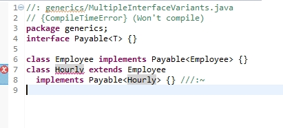
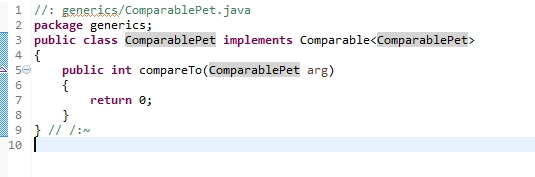
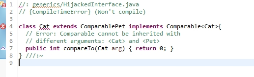

# 1.java一个类不能实现同一泛型接口的两种变体

例子一



例子二





例子三


例子四

~~~java
public interface onFinishListener<T>{
void setList(List<T> datas);
void showMessage(String msg)；
}
 public DatasActivity extends BaseActivity implement onFinishListener<Bean1>,onFinishListener<Bean2>{
 }
~~~

java的规范，thinking in java中说了。

和java实现泛型的方式有关，java采用的是编译期的直接替换。这意味着可能出现相同的方法有两个参数一样的重载，这是不合法的。

2.

# [volatile和synchronized的区别](https://www.cnblogs.com/kaleidoscope/p/9506018.html)

### volatile和synchronized特点

首先需要理解线程安全的两个方面：**执行控制**和**内存可见**。

**执行控制**的目的是控制代码执行（顺序）及是否可以并发执行。

**内存可见**控制的是线程执行结果在内存中对其它线程的可见性。根据[Java内存模型](https://www.cnblogs.com/kaleidoscope/p/9505829.html)的实现，线程在具体执行时，会先拷贝主存数据到线程本地（CPU缓存），操作完成后再把结果从线程本地刷到主存。

`synchronized`关键字解决的是执行控制的问题，它会阻止其它线程获取当前对象的监控锁，这样就使得当前对象中被`synchronized`关键字保护的代码块无法被其它线程访问，也就无法并发执行。更重要的是，`synchronized`还会创建一个**内存屏障**，内存屏障指令保证了所有CPU操作结果都会直接刷到主存中，从而保证了操作的内存可见性，同时也使得先获得这个锁的线程的所有操作，都**happens-before**于随后获得这个锁的线程的操作。

`volatile`关键字解决的是内存可见性的问题，会使得所有对`volatile`变量的读写都会直接刷到主存，即保证了变量的可见性。这样就能满足一些对变量可见性有要求而对读取顺序没有要求的需求。

使用`volatile`关键字仅能实现对原始变量(如boolen、 short 、int 、long等)操作的原子性，但需要特别注意， `volatile`不能保证复合操作的原子性，即使只是`i++`，实际上也是由多个原子操作组成：`read i; inc; write i`，假如多个线程同时执行`i++`，`volatile`只能保证他们操作的`i`是同一块内存，但依然可能出现写入脏数据的情况。

在Java 5提供了原子数据类型`atomic wrapper classes`，对它们的`increase`之类的操作都是原子操作，不需要使用`sychronized`关键字。

对于volatile关键字，当且仅当满足以下所有条件时可使用：

> \1. 对变量的写入操作不依赖变量的当前值，或者你能确保只有单个线程更新变量的值。
> \2. 该变量没有包含在具有其他变量的不变式中。

 

### volatile和synchronized的区别

- volatile本质是在告诉jvm当前变量在寄存器（工作内存）中的值是不确定的，需要从主存中读取； synchronized则是锁定当前变量，只有当前线程可以访问该变量，其他线程被阻塞住。
- volatile仅能使用在变量级别；synchronized则可以使用在变量、方法、和类级别的
- volatile仅能实现变量的修改可见性，不能保证原子性；而synchronized则可以保证变量的修改可见性和原子性
- volatile不会造成线程的阻塞；synchronized可能会造成线程的阻塞。
- volatile标记的变量不会被编译器优化；synchronized标记的变量可以被编译器优化

# Linux进程地址空间和进程的内存分布


[cl_linux](https://me.csdn.net/cl_linux) 2018-05-15 20:13:18  12039  收藏 32

分类专栏： [linux](https://blog.csdn.net/cl_linux/category_7666756.html) 文章标签： [进程](https://www.csdn.net/gather_25/MtTaEg0sMDM5MjktYmxvZwO0O0OO0O0O.html)[内存空间](https://so.csdn.net/so/search/s.do?q=内存空间&t=blog&o=vip&s=&l=&f=&viparticle=)

本文为转载的！！！ 

我只是为了加强自己的记忆，便于查看资料，才转载的。如有不妥，请原作者联系我，我删除。

原网址为：https://blog.csdn.net/yusiguyuan/article/details/45155035


## 一、 进程空间分布概述

  对于一个进程，其空间分布如下图所示：

​                   


**程序段(Text):**程序代码在内存中的映射，存放函数体的二进制代码。

**初始化过的数据(Data):**在程序运行初已经对变量进行初始化的数据。

**未初始化过的数据(BSS):**在程序运行初未对变量进行初始化的数据。

**栈 (Stack):**存储局部、临时变量，函数调用时，存储函数的返回指针，用于控制函数的调用和返回。在程序块开始时自动分配内存,结束时自动释放内存，其操作方式类似于数据结构中的栈。

**堆 (Heap):**存储动态内存分配,需要程序员手工分配,手工释放.注意它与数据结构中的堆是两回事，分配方式类似于链表。


**注：**

- 1.Text, BSS, Data段在编译时已经决定了进程将占用多少VM。可以通过size，知道这些信息：

- 2.正常情况下，Linux进程不能对用来存放程序代码的内存区域执行写操作，即程序代码是以只读的方式加载到内存中，但它可以被多个进程安全的共享。

## **二  内核空间和用户空间**

​    Linux的虚拟地址空间范围为0～4G，Linux内核将这4G字节的空间分为两部分，将最高的1G字节（从虚拟地址0xC0000000到0xFFFFFFFF）供内核使用，称为“内核空间”。而将较低的3G字节（从虚拟地址0x00000000到0xBFFFFFFF）供各个进程使用，称为“用户空间。因为每个进程可以通过系统调用进入内核，因此，Linux内核由系统内的所有进程共享。于是，从具体进程的角度来看，每个进程可以拥有4G字节的虚拟空间。

  Linux使用两级保护机制：0级供内核使用，3级供用户程序使用，每个进程有各自的私有用户空间（0～3G），这个空间对系统中的其他进程是不可见的，最高的1GB字节虚拟内核空间则为所有进程以及内核所共享。
  内核空间中存放的是内核代码和数据，而进程的用户空间中存放的是用户程序的代码和数据。不管是内核空间还是用户空间，它们都处于虚拟空间中。 虽然内核空间占据了每个虚拟空间中的最高1GB字节，但映射到物理内存却总是从最低地址（0x00000000），另外，使用虚拟地址可以很好的保护内核空间被用户空间破坏，虚拟地址到物理地址转换过程有操作系统和CPU共同完成(操作系统为CPU设置好页表，CPU通过MMU单元进行地址转换)。

   

​    **注**：多任务操作系统中的每一个进程都运行在一个属于它自己的内存沙盒中，这个沙盒就是虚拟地址空间（virtual address space），在32位模式下，它总是一个4GB的内存地址块。这些虚拟地址通过页表（page table）映射到物理内存，页表由操作系统维护并被处理器引用。每个进程都拥有一套属于它自己的页表。

 进程内存空间分布如下图所示：

​              


   通常32位Linux内核地址空间划分0~3G为用户空间，3~4G为内核空间

   **注**: 1.这里是32位内核地址空间划分，64位内核地址空间划分是不同的

​     2.现代的操作系统都处于32位保护模式下。每个进程一般都能寻址4G的物理空间。但是我们的物理内存一般都是几百M，进程怎么能获得4G 的物理空间呢？这就是使用了虚拟地址的好处，通常我们使用一种叫做虚拟内存的技术来实现，因为可以使用硬盘中的一部分来当作内存使用 。


 

​    Linux系统对自身进行了划分，一部分核心软件独立于普通应用程序，运行在较高的特权级别上，它们驻留在被保护的内存空间上，拥有访问硬件设备的所有权限，Linux将此称为内核空间。
​    相对地，应用程序则是在“用户空间”中运行。运行在用户空间的应用程序只能看到允许它们使用的部分系统资源，并且不能使用某些特定的系统功能，也不能直接访问内核空间和硬件设备，以及其他一些具体的使用限制。
​    将用户空间和内核空间置于这种非对称访问机制下有很好的安全性，能有效抵御恶意用户的窥探，也能防止质量低劣的用户程序的侵害，从而使系统运行得更稳定可靠。

​      内核空间在页表中拥有较高的特权级（ring2或以下），因此只要用户态的程序试图访问这些页，就会导致一个页错误（page fault）。在Linux中，内核空间是持续存在的，并且在所有进程中都映射到同样的物理内存，内核代码和数据总是可寻址的，随时准备处理中断和系统调用。与之相反，用户模式地址空间的映射随着进程切换的发生而不断的变化，如下图所示：

​                      

   上图中蓝色区域表示映射到物理内存的虚拟地址，而白色区域表示未映射的部分。可以看出，Firefox使用了相当多的虚拟地址空间，因为它占用内存较多。

##  **三  进程内存布局**

​    Linux进程标准的内存段布局，如下图所示，地址空间中的各个条带对应于不同的内存段（memory segment），如：堆、栈之类的。

​                

​                         q

 

​     **注**：这些段只是简单的虚拟内存地址空间范围，与Intel处理器的段没有任何关系。

   几乎每个进程的虚拟地址空间中各段的分布都与上图完全一致，这就给远程发掘程序漏洞的人打开了方便之门。一个发掘过程往往需要引用绝对内存地址：栈地址，库函数地址等。远程攻击者必须依赖地址空间分布的一致性，来探索出这些地址。如果让他们猜个正着，那么有人就会被整了。因此，地址空间的随机排布方式便逐渐流行起来，Linux通过对栈、内存映射段、堆的起始地址加上随机的偏移量来打乱布局。但不幸的是，32位地址空间相当紧凑，这给随机化所留下的空间不大，削弱了这种技巧的效果。

### **栈**

   进程地址空间中最顶部的段是栈，大多数编程语言将之用于存储函数参数和局部变量。调用一个方法或函数会将一个新的栈帧（stack frame）压入到栈中，这个栈帧会在函数返回时被清理掉。由于栈中数据严格的遵守FIFO的顺序，这个简单的设计意味着不必使用复杂的数据结构来追踪栈中的内容，只需要一个简单的指针指向栈的顶端即可，因此压栈（pushing）和退栈（popping）过程非常迅速、准确。进程中的每一个线程都有属于自己的栈。

   通过不断向栈中压入数据，超出其容量就会耗尽栈所对应的内存区域，这将触发一个页故障（page fault），而被Linux的expand_stack()处理，它会调用acct_stack_growth()来检查是否还有合适的地方用于栈的增长。如果栈的大小低于RLIMIT_STACK（通常为8MB），那么一般情况下栈会被加长，程序继续执行，感觉不到发生了什么事情。这是一种将栈扩展到所需大小的常规机制。然而，如果达到了最大栈空间的大小，就会栈溢出（stack overflow），程序收到一个段错误（segmentation fault）。

   **注**:动态栈增长是唯一一种访问未映射内存区域而被允许的情形，其他任何对未映射内存区域的访问都会触发页错误，从而导致段错误。一些被映射的区域是只读的，因此企图写这些区域也会导致段错误。

### **内存映射段**   

   在栈的下方是内存映射段，内核将文件的内容直接映射到内存。任何应用程序都可以通过Linux的mmap()系统调用或者Windows的CreateFileMapping()/MapViewOfFile()请求这种映射。内存映射是一种方便高效的文件I/O方式，所以它被用来加载动态库。创建一个不对应于任何文件的匿名内存映射也是可能的，此方法用于存放程序的数据。在Linux中，如果你通过malloc()请求一大块内存，C运行库将会创建这样一个匿名映射而不是使用堆内存。“大块”意味着比MMAP_THRESHOLD还大，缺省128KB，可以通过mallocp()调整。

### **堆**

   与栈一样，堆用于运行时内存分配；但不同的是，堆用于存储那些生存期与函数调用无关的数据。大部分语言都提供了堆管理功能。在C语言中，堆分配的接口是malloc()函数。如果堆中有足够的空间来满足内存请求，它就可以被语言运行时库处理而不需要内核参与，否则，堆会被扩大，通过brk()系统调用来分配请求所需的内存块。堆管理是很复杂的，需要精细的算法来应付我们程序中杂乱的分配模式，优化速度和内存使用效率。处理一个堆请求所需的时间会大幅度的变动。实时系统通过特殊目的分配器来解决这个问题。堆在分配过程中可能会变得零零碎碎，如下图所示：

​             


​    一般由程序员分配释放， 若程序员不释放，程序结束时可能由OS回收 。注意它与数据结构中的堆是两回事，分配方式类似于链表。

​     

### **BBS和数据段**

   在C语言中，BSS和数据段保存的都是静态（全局）变量的内容。区别在于BSS保存的是未被初始化的静态变量内容，他们的值不是直接在程序的源码中设定的。BSS内存区域是匿名的，它不映射到任何文件。如果你写static intcntActiveUsers，则cntActiveUsers的内容就会保存到BSS中去。

   **数据段保存在源代码中已经初始化的静态变量的内容。数据段不是匿名的，它映射了一部分的程序二进制镜像，也就是源代码中指定了初始值的静态变量。**所以，如果你写static int cntActiveUsers=10，则cntActiveUsers的内容就保存在了数据段中，而且初始值是10。尽管数据段映射了一个文件，但它是一个私有内存映射，这意味着更改此处的内存不会影响被映射的文件。

   你可以通过阅读文件/proc/pid_of_process/maps来检验一个Linux进程中的内存区域。记住：一个段可能包含许多区域。比如，每个内存映射文件在mmap段中都有属于自己的区域，动态库拥有类似BSS和数据段的额外区域。有时人们提到“数据段”，指的是全部的数据段+BSS+堆。

   你还可以通过nm和objdump命令来察看二进制镜像，打印其中的符号，它们的地址，段等信息。最后需要指出的是，前文描述的虚拟地址布局在linux中是一种“灵活布局”，而且作为默认方式已经有些年头了，它假设我们有值RLIMT_STACK。但是，当没有该值得限制时，Linux退回到“经典布局”，如下图所示：

​                  


C语言程序实例分析如下所示：


[cpp][view plain](https://blog.csdn.net/yusiguyuan/article/details/45155035#) [copy](https://blog.csdn.net/yusiguyuan/article/details/45155035#)

~~~c
	 #include<stdio.h>  
	 #include <malloc.h>  
	   
	 void print(char *,int);  
	 int main()  
	{  
	      char *s1 = "abcde";  //"abcde"作为字符串常量存储在常量区 s1、s2、s5拥有相同的地址
	      char *s2 = "abcde";  
	      char s3[] = "abcd";  
	      long int *s4[100];  
	      char *s5 = "abcde";  
	      int a = 5;  
	      int b =6;//a,b在栈上，&a>&b地址反向增长  
	   
	     printf("variables address in main function: s1=%p  s2=%p s3=%p s4=%p s5=%p a=%p b=%p \n",   
	             s1,s2,s3,s4,s5,&a,&b); 
	     printf("variables address in processcall:n");  
         print("ddddddddd",5);//参数入栈从右至左进行,p先进栈,str后进 &p>&str  
	     printf("main=%p print=%p \n",main,print);  
	     //打印代码段中主函数和子函数的地址，编译时先编译的地址低，后编译的地址高main<print  
	 }  
 
	 void print(char *str,int p)  
	{  
	     char *s1 = "abcde";  //abcde在常量区，s1在栈上  
	     char *s2 = "abcde";  //abcde在常量区，s2在栈上 s2-s1=6可能等于0，编译器优化了相同的常量，只在内存保存一份  
	     //而&s1>&s2  
	     char s3[] = "abcdeee";//abcdeee在常量区，s3在栈上，数组保存的内容为abcdeee的一份拷贝  
	    long int *s4[100];  
	     char *s5 = "abcde";  
	     int a = 5;  
	     int b =6;  
	     int c;  
	     int d;           //a,b,c,d均在栈上，&a>&b>&c>&d地址反向增长  
	    char *q=str; 
	    int m=p;         
	    char *r=(char *)malloc(1);  
	    char *w=(char *)malloc(1) ;  // r<w 堆正向增长  
	  
	    printf("s1=%p s2=%p s3=%p s4=%p s5=%p a=%p b=%p c=%p d=%p str=%p q=%p p=%p m=%p r=%p w=%p \n",  
	            s1,s2,s3,s4,s5,&a,&b,&c,&d,&str,q,&p,&m,r,w); 
		/* 栈和堆是在程序运行时候动态分配的，局部变量均在栈上分配。
		    栈是反向增长的，地址递减；malloc等分配的内存空间在堆空间。堆是正向增长的，地址递增。  
			r,w变量在栈上(则&r>&w)，r,w所指内容在堆中(即r<w)。*/ 
	 }  
	 
~~~

**附录：**

栈与堆的区别

​      


# 内核页表和进程页表误区和使用

初学内核时，经常被“内核页表”和“进程页表”搞晕，不知道这到底是个啥东东，跟我们平时理解的页表有和关系。。
内核页表：即书上说的主内核页表，在内核中其实就是一段内存，存放在主内核页全局目录init_mm.pgd(swapper_pg_dir)中，硬件并不直接使用。
进程页表：每个进程自己的页表，放在进程自身的页目录task_struct.pgd中。
在保护模式下，从硬件角度看，其运行的基本对象为“进程”(或线程)，而寻址则依赖于“进程页表”，在进程调度而进行上下文切换时，会进行页表的切换：即将新进程的pgd(页目录)加载到CR3寄存器中。从这个角度看，其实是完全没有用到“内核页表”的，那么“内核页表”有什么用呢？跟“进程页表”有什么关系呢？

1、内核页表中的内容为所有进程共享，每个进程都有自己的“进程页表”，“进程页表”中映射的线性地址包括两部分：

- 用户态
- 内核态

其中，**内核态地址对应的相关页表项，**对于**所有进程来说都是相同的**(因为内核空间对所有进程来说都是共享的)，而**这部分页表内容其实就来源于<u>“内核页表</u>”**，即每个进程的“进程页表”中内核态地址相关的页表项都是“内核页表”的一个拷贝。
2、“内核页表”由内核自己维护并更新，在vmalloc区发生page fault时，将“内核页表”同步到“进程页表”中。以32位系统为例，内核页表主要包含两部分：

- 线性映射区

- vmalloc区

其中，线性映射区即通过TASK_SIZE偏移进行映射的区域，对32系统来说就是0-896M这部分区域，映射对应的虚拟地址区域为TASK_SIZE-TASK_SIZE+896M。这部分区域在内核初始化时就已经完成映射，并创建好相应的页表，即这部分虚拟内存区域不会发生page fault。
vmalloc区，为896M-896M+128M，这部分区域用于映射高端内存，有三种映射方式：vmalloc、固定、临时，这里就不像述了。。
以vmalloc为例(最常使用)，这部分区域对应的线性地址在内核使用vmalloc分配内存时，其实就已经分配了相应的物理内存，并做了相应的映射，建立了相应的页表项，但相关页表项仅写入了“内核页表”，并没有实时更新到“进程页表中”，内核在这里使用了“延迟更新”的策略，将“进程页表”真正更新推迟到第一次访问相关线性地址，发生page fault时，此时在page fault的处理流程中进行“进程页表”的更

# 缺页中断完成后，系统会更新页表还是块表呢？为什么？ 

页表：http://www.cnblogs.com/hzxscyq/p/5373760.html
地址转换： https://blog.csdn.net/ZHYFXY/article/details/70157248

- 简而言之，就是CPU先从缓存（快表）读取页表项，读不到则到页表中去找，找不到触发缺页中断来加载，加载完存到页表后同时更新缓存（快表）。

- 先后顺序是先更新页表再tlb，下面回答你的问题，系统在有缺页中断的情况下，更新页表也算做在缺页中断这个过程中的，这一点你看一下书上的地址变换过程就有了，所以缺页中断完成后就只有更新快表tlb这一个过程了

# [全面理解Java内存模型](https://www.cnblogs.com/kaleidoscope/p/9505829.html)

https://www.cnblogs.com/kaleidoscope/p/9505829.html

Java内存模型即Java Memory Model，简称JMM。JMM定义了Java 虚拟机(JVM)在计算机内存(RAM)中的工作方式。JVM是整个计算机虚拟模型，所以JMM是隶属于JVM的。

如果我们要想深入了解Java并发编程，就要先理解好Java内存模型。Java内存模型定义了多线程之间共享变量的可见性以及如何在需要的时候对共享变量进行同步。原始的Java内存模型效率并不是很理想，因此Java1.5版本对其进行了重构，现在的Java8仍沿用了Java1.5的版本。

 

## 关于并发编程

在并发编程领域，有两个关键问题：线程之间的通信和同步。

 

### 线程之间的通信

线程的通信是指线程之间以何种机制来交换信息。在命令式编程中，线程之间的通信机制有两种共享内存和消息传递。

在共享内存的并发模型里，线程之间共享程序的公共状态，线程之间通过写-读内存中的公共状态来隐式进行通信，典型的共享内存通信方式就是通过共享对象进行通信。

在消息传递的并发模型里，线程之间没有公共状态，线程之间必须通过明确的发送消息来显式进行通信，在java中典型的消息传递方式就是wait()和notify()。

关于Java线程之间的通信，可以参考[线程之间的通信（thread signal）](https://blog.csdn.net/suifeng3051/article/details/：http://blog.csdn.net/suifeng3051/article/details/51863010?locationNum=2)。

 

### 线程之间的同步

同步是指程序用于控制不同线程之间操作发生相对顺序的机制。

在共享内存并发模型里，同步是显式进行的。程序员必须显式指定某个方法或某段代码需要在线程之间互斥执行。

在消息传递的并发模型里，由于消息的发送必须在消息的接收之前，因此同步是隐式进行的。

 

### Java的并发采用的是共享内存模型

Java线程之间的通信总是隐式进行，整个通信过程对程序员完全透明。如果编写多线程程序的Java程序员不理解隐式进行的线程之间通信的工作机制，很可能会遇到各种奇怪的内存可见性问题。

 

### Java内存模型

上面讲到了Java线程之间的通信采用的是过共享内存模型，这里提到的共享内存模型指的就是Java内存模型(简称JMM)，JMM决定一个线程对共享变量的写入何时对另一个线程可见。从抽象的角度来看，JMM定义了线程和主内存之间的抽象关系：线程之间的共享变量存储在主内存（main memory）中，每个线程都有一个私有的本地内存（local memory），本地内存中存储了该线程以读/写共享变量的副本。本地内存是JMM的一个抽象概念，并不真实存在。它涵盖了缓存，写缓冲区，寄存器以及其他的硬件和编译器优化。


从上图来看，线程A与线程B之间如要通信的话，必须要经历下面2个步骤：

\1. 首先，线程A把本地内存A中更新过的共享变量刷新到主内存中去。
\2. 然后，线程B到主内存中去读取线程A之前已更新过的共享变量。

 

下面通过示意图来说明这两个步骤： 


如上图所示，本地内存A和B有主内存中共享变量x的副本。假设初始时，这三个内存中的x值都为0。线程A在执行时，把更新后的x值（假设值为1）临时存放在自己的本地内存A中。当线程A和线程B需要通信时，线程A首先会把自己本地内存中修改后的x值刷新到主内存中，此时主内存中的x值变为了1。随后，线程B到主内存中去读取线程A更新后的x值，此时线程B的本地内存的x值也变为了1。

从整体来看，这两个步骤实质上是线程A在向线程B发送消息，而且这个通信过程必须要经过主内存。JMM通过控制主内存与每个线程的本地内存之间的交互，来为java程序员提供内存可见性保证。

上面也说到了，Java内存模型只是一个抽象概念，那么它在Java中具体是怎么工作的呢？为了更好的理解上Java内存模型工作方式，下面就JVM对Java内存模型的实现、硬件内存模型及它们之间的桥接做详细介绍。

 

### JVM对Java内存模型的实现

在JVM内部，Java内存模型把内存分成了两部分：线程栈区和堆区，下图展示了Java内存模型在JVM中的逻辑视图： 
 
JVM中运行的每个线程都拥有自己的线程栈，线程栈包含了当前线程执行的方法调用相关信息，我们也把它称作调用栈。随着代码的不断执行，调用栈会不断变化。

线程栈还包含了当前方法的所有本地变量信息。一个线程只能读取自己的线程栈，也就是说，线程中的本地变量对其它线程是不可见的。即使两个线程执行的是同一段代码，它们也会各自在自己的线程栈中创建本地变量，因此，每个线程中的本地变量都会有自己的版本。

所有原始类型(boolean,byte,short,char,int,long,float,double)的本地变量都直接保存在线程栈当中，对于它们的值各个线程之间都是独立的。对于原始类型的本地变量，一个线程可以传递一个副本给另一个线程，当它们之间是无法共享的。

堆区包含了Java应用创建的所有对象信息，不管对象是哪个线程创建的，其中的对象包括原始类型的封装类（如Byte、Integer、Long等等）。不管对象是属于一个成员变量还是方法中的本地变量，它都会被存储在堆区。

下图展示了调用栈和本地变量都存储在栈区，对象都存储在堆区： 
 
一个本地变量如果是原始类型，那么它会被完全存储到栈区。 
一个本地变量也有可能是一个对象的引用，这种情况下，这个本地引用会被存储到栈中，但是对象本身仍然存储在堆区。

对于一个对象的成员方法，这些方法中包含本地变量，仍需要存储在栈区，即使它们所属的对象在堆区。 
对于一个对象的成员变量，不管它是原始类型还是包装类型，都会被存储到堆区。

Static类型的变量以及类本身相关信息都会随着类本身存储在堆区。

堆中的对象可以被多线程共享。如果一个线程获得一个对象的应用，它便可访问这个对象的成员变量。如果两个线程同时调用了同一个对象的同一个方法，那么这两个线程便可同时访问这个对象的成员变量，但是对于本地变量，每个线程都会拷贝一份到自己的线程栈中。

下图展示了上面描述的过程: 


### 硬件内存架构

不管是什么内存模型，最终还是运行在计算机硬件上的，所以我们有必要了解计算机硬件内存架构，下图就简单描述了当代计算机硬件内存架构： 


现代计算机一般都有2个以上CPU，而且每个CPU还有可能包含多个核心。因此，如果我们的应用是多线程的话，这些线程可能会在各个CPU核心中并行运行。

在CPU内部有一组CPU寄存器，也就是CPU的储存器。CPU操作寄存器的速度要比操作计算机主存快的多。在主存和CPU寄存器之间还存在一个CPU缓存，CPU操作CPU缓存的速度快于主存但慢于CPU寄存器。某些CPU可能有多个缓存层（一级缓存和二级缓存）。计算机的主存也称作RAM，所有的CPU都能够访问主存，而且主存比上面提到的缓存和寄存器大很多。

当一个CPU需要访问主存时，会先读取一部分主存数据到CPU缓存，进而在读取CPU缓存到寄存器。当CPU需要写数据到主存时，同样会先flush寄存器到CPU缓存，然后再在某些节点把缓存数据flush到主存。

 

### Java内存模型和硬件架构之间的桥接

正如上面讲到的，Java内存模型和硬件内存架构并不一致。硬件内存架构中并没有区分栈和堆，从硬件上看，不管是栈还是堆，大部分数据都会存到主存中，当然一部分栈和堆的数据也有可能会存到CPU寄存器中，如下图所示，Java内存模型和计算机硬件内存架构是一个交叉关系： 
 

当对象和变量存储到计算机的各个内存区域时，必然会面临一些问题，其中最主要的两个问题是：

\1. 共享对象对各个线程的可见性
\2. 共享对象的竞争现象

### 共享对象的可见性

当多个线程同时操作同一个共享对象时，如果没有合理的使用volatile和synchronization关键字，一个线程对共享对象的更新有可能导致其它线程不可见。

想象一下我们的共享对象存储在主存，一个CPU中的线程读取主存数据到CPU缓存，然后对共享对象做了更改，但CPU缓存中的更改后的对象还没有flush到主存，此时线程对共享对象的更改对其它CPU中的线程是不可见的。最终就是每个线程最终都会拷贝共享对象，而且拷贝的对象位于不同的CPU缓存中。

下图展示了上面描述的过程。左边CPU中运行的线程从主存中拷贝共享对象obj到它的CPU缓存，把对象obj的count变量改为2。但这个变更对运行在右边CPU中的线程不可见，因为这个更改还没有flush到主存中： 
 
要解决共享对象可见性这个问题，我们可以使用java volatile关键字。 Java’s volatile keyword. volatile 关键字可以保证变量会直接从主存读取，而对变量的更新也会直接写到主存。volatile原理是基于CPU内存屏障指令实现的，后面会讲到。

#### 竞争现象

如果多个线程共享一个对象，如果它们同时修改这个共享对象，这就产生了竞争现象。

如下图所示，线程A和线程B共享一个对象obj。假设线程A从主存读取Obj.count变量到自己的CPU缓存，同时，线程B也读取了Obj.count变量到它的CPU缓存，并且这两个线程都对Obj.count做了加1操作。此时，Obj.count加1操作被执行了两次，不过都在不同的CPU缓存中。

如果这两个加1操作是串行执行的，那么Obj.count变量便会在原始值上加2，最终主存中的Obj.count的值会是3。然而下图中两个加1操作是并行的，不管是线程A还是线程B先flush计算结果到主存，最终主存中的Obj.count只会增加1次变成2，尽管一共有两次加1操作。 


要解决上面的问题我们可以使用java synchronized代码块。synchronized代码块可以保证同一个时刻只能有一个线程进入代码竞争区，synchronized代码块也能保证代码块中所有变量都将会从主存中读，当线程退出代码块时，对所有变量的更新将会flush到主存，不管这些变量是不是volatile类型的。

 

#### volatile和 synchronized区别

详细请见 [volatile和synchronized的区别](http://blog.csdn.net/suifeng3051/article/details/52611233)


## 支撑Java内存模型的基础原理

### 指令重排序

在执行程序时，为了提高性能，编译器和处理器会对指令做重排序。但是，JMM确保在不同的编译器和不同的处理器平台之上，通过插入特定类型的`Memory Barrier`来禁止特定类型的编译器重排序和处理器重排序，为上层提供一致的内存可见性保证。

1. 编译器优化重排序：编译器在不改变单线程程序语义的前提下，可以重新安排语句的执行顺序。
2. 指令级并行的重排序：如果不存在数据依赖性，处理器可以改变语句对应机器指令的执行顺序。
3. 内存系统的重排序：处理器使用缓存和读写缓冲区，这使得加载和存储操作看上去可能是在乱序执行。

### 数据依赖性

如果两个操作访问同一个变量，其中一个为写操作，此时这两个操作之间存在数据依赖性。 
编译器和处理器不会改变存在数据依赖性关系的两个操作的执行顺序，即不会重排序。

 

### **as-if-serial**

不管怎么重排序，单线程下的执行结果不能被改变，编译器、runtime和处理器都必须遵守as-if-serial语义。

 

### 内存屏障（Memory Barrier ）

上面讲到了，通过内存屏障可以禁止特定类型处理器的重排序，从而让程序按我们预想的流程去执行。内存屏障，又称内存栅栏，是一个CPU指令，基本上它是一条这样的指令：

1. 保证特定操作的执行顺序。
2. 影响某些数据（或则是某条指令的执行结果）的内存可见性。

编译器和CPU能够重排序指令，保证最终相同的结果，尝试优化性能。插入一条Memory Barrier会告诉编译器和CPU：不管什么指令都不能和这条Memory Barrier指令重排序。

Memory Barrier所做的另外一件事是强制刷出各种CPU cache，如一个`Write-Barrier`（写入屏障）将刷出所有在Barrier之前写入 cache 的数据，因此，任何CPU上的线程都能读取到这些数据的最新版本。

这和java有什么关系？上面java内存模型中讲到的volatile是基于Memory Barrier实现的。

如果一个变量是`volatile`修饰的，JMM会在写入这个字段之后插进一个`Write-Barrier`指令，并在读这个字段之前插入一个`Read-Barrier`指令。这意味着，如果写入一个`volatile`变量，就可以保证：

1. 一个线程写入变量a后，任何线程访问该变量都会拿到最新值。
2. 在写入变量a之前的写入操作，其更新的数据对于其他线程也是可见的。因为Memory Barrier会刷出cache中的所有先前的写入。

### happens-before

从jdk5开始，java使用新的JSR-133内存模型，基于happens-before的概念来阐述操作之间的内存可见性。

在JMM中，如果一个操作的执行结果需要对另一个操作可见，那么这两个操作之间必须要存在happens-before关系，这个的两个操作既可以在同一个线程，也可以在不同的两个线程中。

与程序员密切相关的happens-before规则如下：

1. 程序顺序规则：一个线程中的每个操作，happens-before于该线程中任意的后续操作。
2. 监视器锁规则：对一个锁的解锁操作，happens-before于随后对这个锁的加锁操作。
3. volatile域规则：对一个volatile域的写操作，happens-before于任意线程后续对这个volatile域的读。
4. 传递性规则：如果 A happens-before B，且 B happens-before C，那么A happens-before C。

注意：两个操作之间具有happens-before关系，并不意味前一个操作必须要在后一个操作之前执行！仅仅要求前一个操作的执行结果，对于后一个操作是可见的，且前一个操作按顺序排在后一个操作之前。

# 内存管理

https://www.csdn.net/gather_2d/MtjaYg2sMDk2NjQtYmxvZwO0O0OO0O0O.html

## 内存基础知识

用于存放程序。程序执行前需要先放到内存中才能被CPU处理 – 缓和CPU与硬盘之间的速度矛盾。

内存地址从0开始，每个地址对应一个存储单元
按字节编制：每个存储单元大小为1字节，即1B(8个二进制位)

## 装入的三种方式

将指令的逻辑地址转换为物理。确定物理地址

### 绝对装入

在编译时，如果知道程序将要放到内存中的哪个位置，编译程序将产生绝对地址的目标代码。装入程序按照装入模块中的地址，将程序和数据装入内存。

适用于单道程序环境

### 可重定位装入

静态重定位：编译、链接后的装入模块的地址都是从0开始的，指令中使用的地址、数据存放的地址都是相对于起始地址而言的逻辑地址。可根据内存的当前情况，将装入模块装入到内存的适当位置。装入时对地址进行重定位，将逻辑地址转变为物理地址(地址变换是在装入时一次完成)。
地址变换在装入目标模块时一次完成，进程装入内存后不能移动

#### 早期多道批处理阶段

特点：


一个作业装入内存时候，必须分配其要求的全部内存空间，如果没有足够的内存，就不能装入该作业。


程序运行期间，无法移动，无法再申请内存空间。

### 动态运行时装入

动态重定位。编译，链接后的装入模块都从0开始。装入程序把装入模块装入内存后，并不会立即把逻辑地址转换为物理地址，而是吧地址转换推迟到程序真正要执行时才进行。因此装入内存后所有的地址仍然为逻辑地址。这种方式需要重定位寄存器的支持。

#### 现代操作系统

重定位寄存器：存放模块的起始地址

采用动态重定位时允许程序在内存中发生移动。
特点

可将程序分配到不连续的存储区中。
运行前只需要装入部分代码即可投入运行，在程序运行期间，根据需要动态申请分配内存。
便于程序段的共享，可向用户提供比存储空间大的地址空间。

## 程序运行过程

编辑->编译->链接->装入->运行

## 链接的3种方式

确定逻辑地址

### 静态链接

在程序运行之前，先将各目标模块以及他们所需要的库函数链接成一个可执行模块(装入模块)，之后不再拆开。

### 装入时动态链接

将各目标模块装入内存时，边装入边链接的链接方式。

### 运行时动态链接

在程序执行中需要该目标模块时，才对它进行链接。优点为便于修改和更新，便于实现对目标模块的共享。

## 内存管理概念

### 内存管理任务

内存空间的分配与回收
提供某种技术从逻辑上对内存空间进行扩充(实现虚拟性)
负责地址转换，逻辑地址转换到物理地址
提供内存保护功能。保证各进程在各自存储空间你内运行，互不干扰。

内存保护的两种方法：

设置一对上、下限寄存器存放进程的上下限地址。进程的指令要访问某个地址时，CPU检查是否越界。
采用重定位寄存器(基址寄存器)和界地址寄存器(限长寄存器)进行越界检查。重定位寄存器中存放的是进程的起始物理地址。界地址寄存器中存放的是进程的最大逻辑地址。

### 覆盖和交换技术

覆盖是在同一个程序进程中；交换是在不同作业，进程之间的。

#### 覆盖技术

用于解决程序大小超过物理内存总和的问题
*思想：*将程序分为若干个段。常用的段常驻内存，不常用的段在需要时调入内存。

内存中分为一个固定区和若干个覆盖区。
需要常驻内存的段放在固定区中，调入后就不再调出(除非运行结束)
不常用的段放在覆盖区，需要时调入内存，用不到时候调出内存。
特点

必须由程序员声明覆盖结构，操作系统完成自动覆盖。
对用户不透明，增加用户编程负担。

#### 交换技术

内存空间紧张时，系统将内存的某些进程暂时换出外存，把外存中某些已具备运行条件的进程换入内存(进程在内存与磁盘间动态调度)

暂时换出外存等待的进程状态为挂起状态

被换出的进程存在外存的位置

具有对换功能的操作系统中，通常把磁盘空间分为文件区和对换区两部分。文件区主要用于存放文件，主要追求存储空间的利用率，因此对文件区空间采用离散分配方式
对换区空间只占磁盘空间的小部分，被换出的进程数据就存放在对换区。由于对换的速度直接影响到系统的整体速度，因此对换区空间主要追求换入换出速度，因此对换区采用连续分配方式。
**对换区的I/O速度比文件区的更快**


在何时交换出进程

通常在许多进程运行且内存吃紧时进行，而系统负荷降就暂停。例如：在发现许多进程运行时时常发生缺页，就说明内存紧张，此时可换出一些进程：如果缺页率明显下降，就可以暂停换出。

应该换出哪些进程

优先换出 阻塞进程;优先级较低的进程；考虑内存驻留时间

**PCB常驻内存，不会被换出外存**

### 连续分配管理方式

指为用户分配的必须是一个连续的内存空间。

#### 单一连续分配

系统被分为系统区和用户区。
系统区通常位于内存的低址部分，用于存放操作系统相关数据。
用户区用于存放用户进程相关数据
内存中仅有一道用户程序用户程序独占整个用户区空间。

特点

实现简单，无外部碎片，可采用覆盖技术扩充内存；不一定需要采取内存保护。
只能用于单用户、单任务的操作系统中。
有内部碎片，存储器利用率极低。

内部碎片：分配给某进程的内存区域中，如果有某些部分没有用上，即为内部碎片

#### 固定分区分配

将整个用户空间划分为若干个固定大小的分区，在每个分区中只装入一道作业，这样就形成了最早的一种可运行多道程序的内存管理方式。
分区大小：等或不等

特点

分区大小相等：缺乏灵活性，但是适合用一台计算机控制多个相同对象的场合
分区大小不等：增加了灵活性，可以满足不同大小的进程需求。
实现简单，无外部碎片
用户程序过大时，可能所有分区都不能满足要求，此时需要采用覆盖技术解决，但是会降低性能
<u>会产生内部碎片，内存利用率低。</u>

操作系统通过建立分区说明表，来实现各个分区的分配与回收。每个表项对应一个分区，通常按分区大小排列。每个表项包括对应分区的大小、起始地址、状态(是否已经分配)

#### 动态分区分配

动态分区分配又称为可变分区分配。该分配方式不会预先划分内存区域，而是在进程装入内存时，根据进程大小动态地建立分区，并使分区的大小刚好适合进程的需要。因此系统分区的大小和数目是可变的。
<u>仅有外部碎片</u>

采用何种数据结构记录内存的使用情况
空闲分区表
每个空闲分区对应一个表项。表项中包含分区号，大小起始地址等信息。


空闲分区链
每个分区的起始和末尾部分分别设置前向指针和后向指针。其实部分处还可记录分区大小等信息。


选择何种方式进程空闲区间分配？

- 按照一定的动态分区分配算法，从空闲分区表或空闲分区链中选出一个分区分配给该作业。

如何进程分区的分配与回收操作？

- 若采用空闲分区表
  各表项顺序不一定按照地址递增顺序排列，具体的排列方法需要根据动态分配算法来确定。
  回收后，若有空闲分区是相邻的，则合并；若无，则新增一个空闲分区。

  

  

##### 内部碎片和外部碎片

内部碎片：分配给某进程的内存区域中，若某些部分没用上而出现的。
外部碎片：内存中某些空闲分区太小而难以利用。
外部碎片可通过紧凑技术来解决。

##### 动态分区分配算法

###### 首次适应算法(First Fit)

每次都从低地址开始查找，找到第一个能满足大小的空闲区域。

实现：空闲分区以地址递增的次序排列。每次分配内存时顺序查找空闲分区链，找到大小能满足要求的第一个空闲分区。

###### 最佳适应算法(Bset Fit)

由于动态分区分配时一种连续分配方式，为各进程分配的空间必须是连续的一整片区域。因此为保证大进程到来时由连续的大片空间，可以竟可能有连续的大片空间，可以尽可能多地留下大片的空闲区。优先使用更小的空闲区。

实现：空闲分区按容量递增次序链接。每次分配内存时顺序查找空闲分区链，找到大小能满足要求的第一个空闲分区。
每次选取最小的分区进行分配，会留下越来越多难以利用的很小的内存块。因此这种方法会产生很多外部碎片。

###### 最坏适应算法(Worst Fit)

最大适应算法
每次分配时优先使用最大的连续空闲区，这样分配后剩余的空闲区就不会太小，更方便使用。

实现：空闲分区按容量递减次序链接。每次分配内存时顺序查找空闲分区链，找到大小能满足要求的第一个空闲分区。
特点：每次选取最大的分区进行分配，若之后有大进程到达则没有内存分区可用。

###### 邻近适应算法(Next Fit)

每次查找都从上次查找结束位置开始，减少查找和低址部分出现小空闲分区的问题。
对首次适应算法的改进

实现：空闲分区以地址递增的顺序排列(可排成一个循环链表)。每次分配内存时从上次查找结束位置开始查找空闲分区链，找到第一个能满足大小的空闲分区。
特点：导致高地址部分的大分区更可能被使用，划分为小分区，从而导致无大分区可用。

### 非连续分配管理方式

#### 基本分页存储管理

操作系统以页框为单位为各个进程分配内存空间。进程的每个页面分别放入一个页框中。也就是说，进程的页面与页框号有一一对应关系。

将内存空间分为一个个大小相等的分区(如每个分区4kB)，每个分区就是一个页框
页框=页帧=内存块=物理块=物理页面。
每个页框的编号为页框号
页框号=页帧号=内存块号=物理块号
页框号从0开始
将进程的逻辑地址空间也分为与页框相等的一个个部分，将每个部分称为一个页或者页面。每个页面也有一个编号，即页号。页号也从0开始。
<u>进程的是页，内存是页框</u>


各个页面不必连续存放，可以放到不相邻的各个页框中。
**页表**

为了能知道进程的每个页面在内存中存放的位置，操作系统要为每个进程建立一张页表
<u>页表通常存在PCB中</u>

- 一个进程对应一张页表
  进程的每个页面对应一个页表项
  每个页表项由页号和块号组成。
  页表记录进程页面和实际存放的内存块之间的映射关系

- 页面大小的选择

  和目前计算机的物理内存大小有关：2n。
  较小的页面，减小内碎片，但加大页表的长度，从而形成新的开销并增加换入、换出的开销；
  较大的页面，减小页表的长度，加大内碎片；管理开销小，交换时对外存I/O效率高。
  两者的折中。

每个页表项占多少字节
内存块数量->页表项中块号至少占多少字节


只记录的内存块号，而不是内存块的起始地址。
J号内存块的起始地址 = J * 内存块大小
<u>页表项连续存放，因此页号是可以隐含的，不占存储空间。</u>


如何实现地址的转换

- 虽然进程的各个页面是离散存放的，但是页面内部时连续存放的。

若要访问逻辑地址A，则：

- 确定逻辑地址A对应的页号 P
- 找到P号页面在内存中的起始地址(需要查页表)
- 确定逻辑地址A的页内偏移量 W

**逻辑地址A 对应的物理地址 = P号页面在内存中的起始地址 + 页内偏移量 W**
如何确定一个逻辑地址对应的页号、页内偏移量
Eg：在某计算机系统中，页面大小是50B。某进程逻辑地址空间大小的是200B，则逻辑地址110 对应的页号，页内偏移量是多少。
页号 = 逻辑地址/页面长度 取整
偏移量 = 逻辑地址%页面长度 取余


在计算机内部，地址使用二进制表示。若页面大小刚好是2的整数幂，则计算机硬件可以很快速的吧逻辑地址拆分成(页号，页内偏移量)


结论：若每个页面大小为2KB,用二进制数表示逻辑地址，则末尾K位即为页内偏移量，其余部分就是页号。


结论：如果页面大小刚好是2的整数次幂，则只需要把页表中记录的物理块号拼接上页内偏移量就可得到对应的物理地址。
页面大小取2的整数次幂的好处

- 逻辑地址的拆分更加迅速。
- 物理地址的计算更加迅速。

逻辑地址结构

- 分页存储管理的逻辑地址结构如下所示：

  


地址结构包含两个部分：前一部分为页号，后一部分为页面偏移量。在上图的例子中，地址长度为32位，其中0-11位为页内偏移量，或称页内地址；12-31位为页号。
若有K位表示页内偏移量，则说明该系统中一个页面的大小是2K个内存单元。
若有M为表示页号，则说明在系统中，一个进程最多允许有2M个页面。
页面大小<>页面偏移量位数->逻辑地址结构


地址变换机构

- 借助进程的页表将逻辑地址转换为物理地址

- 通常会在系统中设置一个页表寄存器PTR，存放页表在内存中的起始地址F和页表长度M。进程未执行时，页表的始址和页表长度放在进程控制块PCB中，当进程被调度时，操作系统内核会把他们放到页表寄存器中。

  

  

页面大小是2的整数幂
设页面大小为L，逻辑地址A到物理地址E的转变过程如下：


计算页号P和页内偏移量W


合法性检查。比较页号P和页表长度M。若P>=M则产生越界中断，否则继续执行
页号从0开始，而页表长度至少为1，因此P=M时也会越界


页表中页号对应的页表项地址 = 页表起始地址F+页号P X 页表项长度，取出该页表项内容b，即为内存块号。
*页表长度：*该页表中共有几个页表项，即共有多少页；
*页表项长度：*指每个页表项占多大的存储空间；
*页面大小：*指一个页面占多大存储空间。


计算 E = b*L + W
若内存块号、页面偏移量是用二进制表示，那么把二者拼接起来就是就是最终物理地址。


分页存储管理中，只要确定了每个页面的大小，逻辑地址机构就确定了。因此，页式管理中地址是一维的。即，只要给出逻辑地址，就可以算出页号，页面偏移量两个部分。
每个页表项的长度是相同的，页号是隐含的
**进程页通常是装在连续的内存块中**

****


结论：理论上，页表项长度为3B即可表示内存块号的范围，但是，为了方便页表的查询，常常会让一个页表项占更多的字节，使得每个页面恰好可以装得下整数个页表项
**地址变换过程中：访问内存2次，一次查页表，一次访问目标内存单元。**
**具有快表的地址变换机构**

- 快表(TLB)，联想寄存器,是一种访问速度比内存快很多的高速缓存(cacheTLB非内存)，是用来存放最近访问的页表项的副本，可以加速地址变换的速度。与此对应，内存中的页表常称为**慢表**。

  

  


地址变换过程


CPU给出逻辑地址，由某个硬件算得页号、页内偏移量，将页号与快表中所有的页号进行比较。

如果找到匹配的页号，说明要访问的页表项目在快表中有副本，则直接从中取出该页对应的内存块号，再将内存块号和页内偏移量拼接形成物理地址。最后，访问该物理地址对应的内存单元。因此，若快表命中，访问某个逻辑地址只需1次访存。
若快表未命中，则访问某个逻辑地址需要2次访存。(找到页表项后，同时将其存入快表，以便后面可能的再次访问。但若快表已满，则必须按照一定的算法对旧的页表项进行替换)。


TLB和普通Cache的区别 – TLB中只有页表项的副本，而普通Cache中可能会有其他各种数据的副本
两级页表
单级页表的问题

- 
- 页表必须连续存放，当页表很大时，需要占用很多个连续的页框。
- 根据局部性原理，没有必要让整个页表常驻内存。

两级页表的原理、地址结构

- 32位逻辑地址空间，页表项大小为4B，页面大小为4KB，则页内地址占12位。

单级页表
[外链图片转存失败,源站可能有防盗链机制,建议将图片保存下来直接上传(img-kc0Q5D9O-1598497299593)(D:\StudyData\Notes[其他]计算机通用知识\OSpics\image-20200819213033697.png)]
双级页表


地址变换

- 按照地址结构将逻辑地址拆分为3部分
- 从PCB中读出页目录表始址，再根据一级页号查页目录表，找到下一级页表在内存中的存放位置
- 根据二级页号查表，找到最终想访问的内存块号
- 结合页内偏移量得到物理地址
- 
- 

解决单级页表问题

- 在页表项中加一个标志位，用于标识该页面是否已经调入内存。

若想访问的页面不在内存中，则产生缺页中断(内中断)，然后将目标页面从外存调入内存。
总结

- 若采用多级页表机制。各级页表的大小不能超过一个页面。


两级页表的访存次数分析(假设无快表机制)

- 第一次访存：访问内存中的页目录表
- 第二次访存：访问内存中的二级页表
- 第三次访存：访问目标内存单元
- n级页表(无快表)访存次数为n+1次

#### 基本分段存储管理方式

- 进程的地址空间：按照程序自身逻辑关系划分为若干个段，每个段有一个段名，每段从0开始编址。

内存分配规则：以段为单位进程分配，每个段再内存中占据连续空间，但各段之间可以不相邻
用户编程更加方便，程序可读性更高
**分段**

- 分段系统的逻辑地址由段号和段内地址组成。
- 
- 

段号的位数决定了每个进程最多可以分成几个段，段内地址位数决定了每个段的最大长度为多少
**段表**

- 为保证程序能正常运行，就必须能从屋里内存中找到各个逻辑段的存放位置。为此，需为每个进程建立一张段映射表，简称段表。
- 
- 


每个段对应一个段表项，其中记录了该段在内存中的起始位置和段的长度。
每个段表项的长度相同。段号是可以隐含的，不占存储空间


地址变换过程


#### 分段分页管理的对比

##### 页段的区别

- 页是信息的物理单位。分页的主要目的是为了实现离散分配，提高内存利用率。分页仅仅是系统管理上的需要，完全是系统行为，对用户是不可见的。
- 段是信息的逻辑单位。分段的主要目的是更好地满足用户需求。一个段通常包含着一组属于一个逻辑模块的信息。分段对用户可见的，用户编程时需要显式地给出段名。

##### 页段的地址空间

- 页的大小是固定的且由系统决定。段的长度却不固定，决定于用户编写的程序。
- 分页的用户进程地址空间是一维的，程序员仅需要给出一个记忆符就可表示一个地址。
- 分段的用户进程地址空间是二维的，程序员需要给出段名和段内地址。
- 分段更容易实现信息共享的保护。
  纯代码或可重入代码(不属于临界资源)，这样的代码可以共享。可修改代码不可共享。

##### 访问内存次数

###### 分页(单级页表)：两次访存

- 第一次 - 查内存中的页表；第二次 - 访问目标内存单元。

###### 分段：两次访存

- 第一次 - 查内存中的段表；第二次 - 访问目标内存单元。

引入快表机构，将近期访问的段表项放到快表中，可以减少一次访问，加快地址变换速度。

#### 段页式管理方式

分页、分段管理中的优缺点


分段+分页的结合 – 段页式管理方式

- 先分段再分页，产生内部碎片
- 分段面向用户，分页面向OS
- 
- 

**段表、页表**
逻辑地址结构

- 由段号，页号，页内地址组成。
- 
- 

段式存储中，段内地址再拆分为页号。
段号位数决定每个进程最多分成几段；页号位数决定每个段最大多少页；
页内偏移量决定了页面大小，内存块大小。
**分段对用户是可见的**，程序员编程时需要显式地给出段号，段内地址。
**分页对用户是不可见的**。系统根据段内地址自动划分页号和页内偏移量。
段页式管理的地址结构是二维的。
每个段对应一个段表项，每个段表项由段号，页表长度，页表存放块号(页表起始地址)组成。
每个段表项长度相等。段号是隐含的。
一个进程对应一个段表，但是可能对应多个页表
地址变换


也可引入快表机制，用段号和页号作为查询快表的关键字。若快表命中则仅需要一次访存。

# 虚拟内存

- 在传统存储管理方式的基础上引入交换，覆盖技术，使得内存利用率有所提高，并且能从逻辑上扩充内存容量。

## 虚拟内存的基本概念

传统存储管理方式的特征，缺点

- 很多暂时用不到的数据也会长期占用内存，导致内存利用率不高

*一次性：*作业必须一次性全部装入内存后才能开始运行。
问题：

- 作业很大时，不能全部装入内存，导致大作业无法运行；
  当大量作业要求运行时，由于内存无法容纳所有作业，因此只有少量作业能运行，导致多道程序并发度下降。

驻留性：一旦作业被装入内存，就会一直驻留在内存中，直至作业运行结束。
事实上，一个时间段内，只需要访问作业的一小部分数据即可正常运行，导致内存中会驻留大量的，暂时不用的数据。

### 局部性原理

- *时间局部性：*如果执行了程序中的某条指令，那么不久后这条指令就很有可能再次执行；如果某个数据被访问过，不久后该数据可能再次被访问。
- *空间局部性：*一旦程序访问了某个存储单元，不久之后，其附近的存储单元也有可能被访问。(很多数据在内存中连续存放，并且程序的指令也是顺序地在内存中存放的)。

### 虚拟内存的定义和特征

基于局部性原理，在程序装入时，可以将程序中很快会用到的部分装入内存，暂时用不到的部分留在外存，就可以让程序开始执行。
在操作系统的管理下，在用户看来似乎有一个比实际内存大的多的内存，即虚拟内存

在程序执行过程中，当访问的信息不在内存时，由操作系统负责将所需的信息从外存调入内存，然后继续执行程序。
若内存不足，有草错系统负责将内存中暂时用不到的信息换出到外存。
操作系统的虚拟性，实际的物理内存大小没有变，知识在逻辑上进行了扩充


### 虚拟内存的特征

- 多次性：无需在作业运行时一次性全部装入内存，而是允许被分成多次调入内存。
- 对换性：在作业运行时无需一直常驻内存，而是允许在作业运行过程中，将作业换出、换入。
- 虚拟性：在逻辑上扩充了内存的容量，使用户看到的内存容量，远大于实际的容量。
- 离散性：进程的物理地址空间不连续。

虚拟内存的实现方法

- 虚拟内存的实现需要建立在离散分配的管理方式的基础上。
- 

**与传统非连续分配存储管理的主要区别**：
在程序执行过程中，当所访问的信息不在内存时，由操作系统负责将所需信息从外存调入内存，然后继续执行程序。
若内存空间不足，由操作系统负责将内存中暂时不用的信息换出到外存。
**需要新增功能**：请求调页(需要的从外存调入)
							页面置换(暂时不用的调出)
引入虚拟内存好处：
可在较小的可用内存中执行较大的用户进程；
可在内存中容纳更多进程并发执行；
不必影响编程时的程序结构（与覆盖技术比较）
提供给用户可用的虚拟内存空间通常大于物理内存(real memory)

### 请求分页存储管理方式

#### 请求分页与基本分页的区别：

程序执行过程中，当访问的信息不在内存时，由操作系统负责将所需的信息从外存调入内存，然后执行程序。
内存空间不足时，由操作系统负责将内存中暂时不用的信息换出到外存。

#### 页表机制

为了实现请求调页，操作系统需要知道页面是否调入内存；若无则需要知道其在外存位置
为了实现页面置换，操作系统需要通过某些指标决定换出哪个页面，有的页面没有修改过，就不用再浪费时间写回外存。有的页面修改过，则需要将外存的旧数据覆盖。因此，操作系统需要记录各个页面是否被修改的信息。

请求分页页表新增4个标志位


#### 缺页中断机构

缺页中断是因为当前执行的指令想要访存的目标页面未调入内存而产生的，因此属于内中断。

在请求分页系统中，每当要访问的页面不存在时，便产生一个缺页中断，然后由操作系统的缺页中断处理程序处理中断。
此时缺页的进程阻塞，放入阻塞队列，调页完成后再将其唤醒，放回就绪队列。
若内存中有空闲块，则为进程分配一个空闲块，将所缺页面装入该块，并将所缺页面装入该块，并修改页表中对应的页表项。
若内存中没有内存块，则由页面置换算法选择一个页面淘汰，若该页面在内存期间被修改过，则要将其写回外存。未修改过的页面不用写回外存。
缺页中断可能在指令执行期间就产生并且处理，而不一定是在一条指令执行完毕之后。
缺页调入后，重新执行被中断的指令。

地址变换机构
新增步骤

请求调页：查看页表项时，查看该页是否在内存中；
页面置换：需要调入页面，但无空闲块时，调出某一页再调入；
页面进行调入调出，或被访问时，需要修改请求页表中新增的表项。


只有写指令才需要修改修改位。并且，一般只有需要修改快表中数据，只有要将快表项删除时才需要写回内存中的慢表，这样可以减少访存次数。


和普通的中断处理相同，缺页中断处理仍然需要保留CPU现场。


使用页面置换算法决定，需要换出哪个页面。


换出换入页面都需要启动慢速I/O。可见若换出换入太频繁，会有很大开销。


页面调入后，需要修改慢表，也需要将表项复制到快表中


具有快表机制的请求分页系统中，访问一个逻辑地址时，若发生缺页，则地址变换步骤是：
查快表(未命中)  ---- 查慢表(发现未调入内存) ---- 调页 (调入内存的页面对应的表项会直接加入快表) ---- 查快表(命中) ---- 访问目标内存单元
页面置换算法

页面的换入换出需要磁盘I/O,会有较大的开销，因此好的页面置换算法应该追求更少的缺页率

最佳置换算法(OPT)

每次选择淘汰的页面将是以后永远不使用，或在最长时间内不再被访问的页面，从而保证最低的缺页率。
实际无法实现


缺页中断发生9次，页面置换发生6次
缺页时候未必页面置换，只有内存块满的时候才进行置换，否则就只是缺页
缺页率 = 缺页次数/总访问页面次数
从前向后数，最后出现的页号就是需要换出的
先进先出置换算法(FIFO)

每次选择淘汰的页面是最早进入内存的页面；算法性能差

实现：把调入内存的页面根据调入的先后顺序排成一个队列，需要换出页面时选择队头页面即可。队列的最大程度取决于系统为进程分配了多少个内存块。

FIFO 会出现Belady异常 – 当为进程分配的物理块数目增大时，缺页次数不减反增的异常现象。
Belady现象的原因
FIFO算法的置换特征与进程访问内存的动态特征是矛盾的，即被置换的页面并不是进程不会访问的。
最近最久未使用置换算法(LRU)

每次淘汰的页面是最近最久为使用的页面
算法实现需要专门的硬件实现。性能好，实现困难，开销大。
需要移位寄存器

做题时，从当前往前找，当前块中最后一个出现的即为要替换的页面
实现方法：赋予每个页面对应的页表项中，用访问字段记录该页面自上次被访问以来所经历的时间t；当需要淘汰一个页面时，选择现有的页面中t值最大的，即最近最久未使用的页面。

时钟置换算法(CLOCK)

性能和开销比较均衡的算法，被称为CLOCK或者(NRU)算法。(Not Recent Used)

实现：为每个页面设置一个访问位，再将内存中的页面都通过链接指针链接成一个循环队列。当某页被访问时，其访问位为1。当需要淘汰一个页面时，只需检查页的访问位。如果是0，就选择该页换出；如果是1，则将这些页面的访问位一次置0后，再进行第二轮扫描(第二轮中一定有访问位为0的页面，因此简单CLOCK算法选择淘汰一个页面最多会经过两轮扫描)

改进型时钟置换算法

除了考虑最近页面是否有无被访问过外，操作系统还应考虑页面有无被修改过。在其他条件都相同时，应该优先淘汰修改过的页面，避免I/O操作。

修改位 = 0 表示页面没有被修改过；
修改位 = 1 表示页面被修改过。
以*(访问位，修改位)*的形式表示各页面的状态。如(1,1)表示某个页面被修改且被访问过。
算法规则：将所有可能被置换的页面排成一个循环队列
第一轮：从当前位置开始扫描到第一个(0,0)的帧用于替换。本轮扫描不修改任何标志位。
最近未被访问或修改
第二轮：若第一轮扫描失败，则重新扫描，查找第一个(0,1)的帧用于替换。本轮将所有扫描过的帧的访问位置为0；
最近未被访问，但被修改过的页面
第三轮：若第二轮失败，则重新扫描，查找第一个(0,0)的帧用于替换。本轮扫描不修改任何标志位。
最近未被访问或修改
第四轮：若第三轮失败，则重新扫描，查找第一个(0,1)的帧用于替换。
最近未被访问，但被修改过的页面
由于第二问已经将所有帧的访问位设为0，因此经过第三轮，第四轮扫描必然有帧被选中。
因此，改进式CLOCK置换算法选择一个淘汰页面最多会进行四轮扫描。
页面分配策略
为每个进程分配内存时，涉及三个问题：

最小物理块数的确定
物理块的分配策略
物理块的分配算法

目的：减少缺页中断。
驻留集

请求分页存储管理中给进程分配物理块的集合

在采用了虚拟存储技术的系统中，驻留集大小一般小于进程的总大小。
若驻留集太小，会导致缺页频繁，系统要花大量时间的来处理缺页，实际用于进程推进的时间很少；驻留集太大，会导致多道程序并发度下降，资源利用率降低。所以应该选择合适的驻留集大小。
页面分配，置换策略
*固定分配：*操作系统为每个进程分配一组固定数目的物理块，在进程运行期间不再改变。即，驻留集大小不变。
*可变分配：*先为每个进程分配一定数目的物理块，在进程运行期间，可根据情况做适当的增加或减少，驻留集大小可变。
*局部置换：*发生缺页时只能选择进程自己的物理换进行置换；
*全局置换：*可将操作系统保留的空闲物理块分配给缺页进程，也可以将别的进程持有的物理块置换到外存，再分配给缺页进程。意味着一个进程所拥有的物理块数量必然改变

组合：
无固定分配，全局置换
固定分配局部置换：

系统为每个进程分配数量一定的物理块，在整个运行期间都不改变。若进程在运行中发生缺页，则只能从该进程在内存中的页面选出一页并换出，然后再调入需要的页面。

缺点：难以在开始时为每个进程确定分配多少个物理块才合适。
可变分配全局置换

刚开始会为每个进程分配一定数目的物理块。操作系统会保持一个空闲物理块队列。当某进程缺页时，从空闲物理块中取出一块分配给该进程；若已无空闲物理块，则可选择一个未锁定的页面换出外存。
仅当空闲物理块用完时，系统才选择一个未锁定的页面调出。被选择调出的页可能是系统中任何一个进程中的页，因此这个被选中的进程拥有的物理块会减少，缺页链率会增加。

系统会锁定一些页面，这些页面中的内容不能置换出外存
会有不公平
可变分配局部置换

刚开始为每个进程分配一定数量的物理块。当某进程发生缺页时，只允许从该进程自己的物理块中选出一个进行换出外存。如果进程在运行中频繁地缺页，系统会为该进程多分配几个物理块，直至该进程缺页率趋势适当程度；反之，如果进程在运行中缺页率特别低，则可适当减少分配给该进程的物理块。

统计进程的缺页中断率系统会有开销
区别

可变分配全局置换：有缺页就给分配新物理块
可变分配局部置换：要根据缺页的频率来动态增加或减少进程物理块

调入页面时机


预调页策略：根据局部性原理，一次调入若干相邻的页面可能比一次调入一个页面更高效。但如果提前调入的页面中大多数都没被访问过，则又是低效的。
因此可预测不久后可能访问到的页面，将它们预先调入内存。但是预测成功率不高。主要用于进程的首次调入，由程序员指出应该先调入哪些部分。
运行前调入


请求调页原则：进程在运行期间发现缺页时才将所缺页面调入内存。由这种策略调入的页面一定会被访问到，但由于每次只能调入一页，而每次调页都要磁盘I/O操作，因此I/O开销较大。
运行时调入


从何处调页


系统拥有足够的对换区空间：页面的调入、调出都是在内存与对换区之间进行。这样可以保证页面的调入，调出速度很快。在进程运行前，需将进程相关的数据从文件区复制到对换区。
系统缺少足够的对换区空间：凡是不会被修改的数据都直接从文件区调入，由于这些页面不会被修改，因此换出时不必写回磁盘，下次需要时再从文件区调入即可。对于可能被修改的部分，换出时需写回磁盘对换区，下次需要时再从对换区调入。


UNIX方式：运行之前进程有关的数据文件全部放在文件区，故未使用过的页面，都可以从文件区调入。若被使用过的页面需要换出，则写回对换区，下次需要时从对换区调入。

抖动现象

刚刚换出的页面马上要换入内存，刚刚换入的页面马上要换出外存，这种频繁的页面调度行为称为抖动。

**产生抖动的原因：**进程频繁访问的页面数目高于可用的物理块数(分配给进程的物理块不足)
抖动的预防
（1）CPU调度程序中引入工作集算法。保证为每个进程分配的物理页框数能包括该进程当前的局部性。
（2）挂起若干进程
（3）采用局部置换策略，可以把抖动局限在较小的范围。但某进程发生抖动，会长时间处于磁盘I/O等待队列中，使其他进程的缺页中断处理时间加长。
（4）L=S 准则
Denning在1980年提出，用于调整多道程序度，使产生缺页的时间（L）等于系统处理进程缺页的平均时间（S）。理论和实践表明，此时CPU利用率最好。
解决抖动并不是分配给每个进程的页框越多越好。因为每个进程都有当前的局部性，分配给它的页框只要能包括它当前的局部性就是最佳的，即工作集
工作集

为了研究该为每个进程分配多少物理块，提出工作集概念。
在某段时间间隔内，进程实际访问页面的集合。

操作系统会根据窗口尺寸来算出工作集。
工作集大小可能小于窗口尺寸，实际应用中，操作系统可以统计进程的工作集大小，根据工作集大小给进程分配若干内存块。

```

```