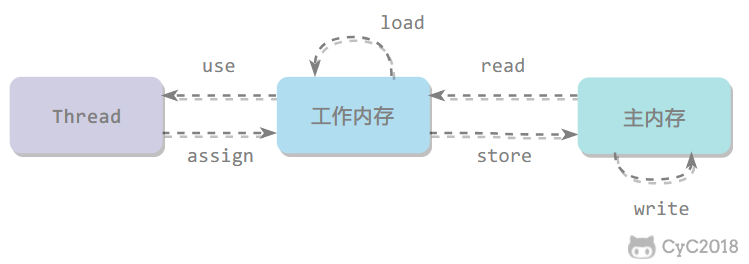
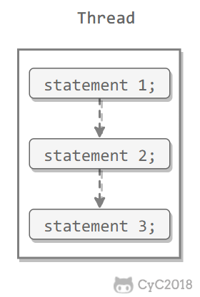
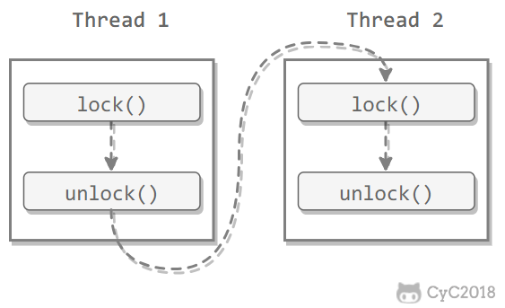
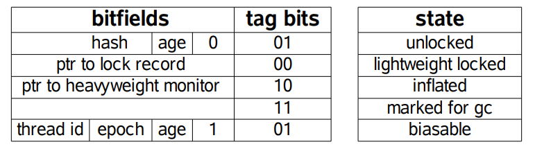
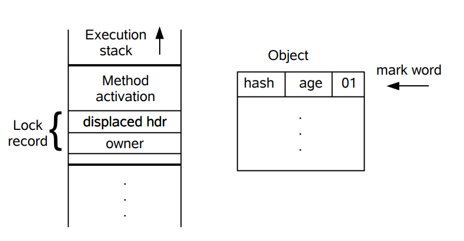
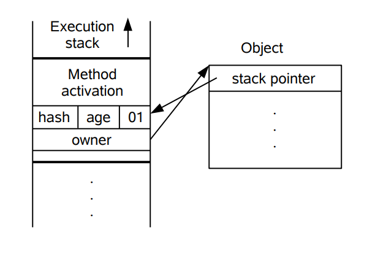

[TOC]


# 一、线程状态转换

     

## 新建（New）

创建后尚未启动。

## 可运行（Runnable）

可能正在运行，也可能正在等待 CPU 时间片。

包含了操作系统线程状态中的 Running 和 Ready。

## 阻塞（Blocked）

等待获取一个排它锁，如果其线程释放了锁就会结束此状态。

## 无限期等待（Waiting）

等待其它线程显式地唤醒，否则不会被分配 CPU 时间片。

| 进入方法 | 退出方法 |
| --- | --- |
| 没有设置 Timeout 参数的 Object.wait() 方法 | Object.notify() / Object.notifyAll() |
| 没有设置 Timeout 参数的 Thread.join() 方法 | 被调用的线程执行完毕 |
| LockSupport.park() 方法 | LockSupport.unpark(Thread) |

## 限期等待（Timed Waiting）

无需等待其它线程显式地唤醒，在一定时间之后会被系统自动唤醒。

调用 Thread.sleep() 方法使线程进入限期等待状态时，常常用“使一个线程睡眠”进行描述。

调用 Object.wait() 方法使线程进入限期等待或者无限期等待时，常常用“挂起一个线程”进行描述。

睡眠和挂起是用来描述行为，而阻塞和等待用来描述状态。

阻塞和等待的区别在于，阻塞是被动的，它是在等待获取一个排它锁。而等待是主动的，通过调用 Thread.sleep() 和 Object.wait() 等方法进入。

| 进入方法 | 退出方法 |
| --- | --- |
| Thread.sleep() 方法 | 时间结束 |
| 设置了 Timeout 参数的 Object.wait() 方法 | 时间结束 / Object.notify() / Object.notifyAll()  |
| 设置了 Timeout 参数的 Thread.join() 方法 | 时间结束 / 被调用的线程执行完毕 |
| LockSupport.parkNanos() 方法 | LockSupport.unpark(Thread) |
| LockSupport.parkUntil() 方法 | LockSupport.unpark(Thread) |

## 死亡（Terminated）

可以是线程结束任务之后自己结束，或者产生了异常而结束。

# 二、使用线程

有三种使用线程的方法：

- 实现 Runnable 接口；
- 实现 Callable 接口；
- 继承 Thread 类。

实现 Runnable 和 Callable 接口的类只能当做一个可以在线程中运行的任务，不是真正意义上的线程，因此最后还需要通过 Thread 来调用。可以说任务是通过线程驱动从而执行的。

## 实现 Runnable 接口

需要实现 run() 方法。

通过 Thread 调用 start() 方法来启动线程。

```java
public class MyRunnable implements Runnable {
    public void run() {
        // ...
    }
}
```

```java
public static void main(String[] args) {
    MyRunnable instance = new MyRunnable();
    Thread thread = new Thread(instance);
    thread.start();
}
```

## 实现 Callable 接口

与 Runnable 相比，Callable 可以有返回值，返回值通过 FutureTask 进行封装。

```java
public class MyCallable implements Callable<Integer> {
    public Integer call() {
        return 123;
    }
}
```

```java
public static void main(String[] args) throws ExecutionException, InterruptedException {
    MyCallable mc = new MyCallable();
    FutureTask<Integer> ft = new FutureTask<>(mc);
    Thread thread = new Thread(ft);
    thread.start();
    System.out.println(ft.get());
}
```

## 继承 Thread 类

同样也是需要实现 run() 方法，因为 Thread 类也实现了 Runable 接口。

当调用 start() 方法启动一个线程时，虚拟机会将该线程放入就绪队列中等待被调度，当一个线程被调度时会执行该线程的 run() 方法。

```java
public class MyThread extends Thread {
    public void run() {
        // ...
    }
}
```

```java
public static void main(String[] args) {
    MyThread mt = new MyThread();
    mt.start();
}
```

## 实现接口 VS 继承 Thread

实现接口会更好一些，因为：

- Java 不支持多重继承，因此继承了 Thread 类就无法继承其它类，但是可以实现多个接口；
- 类可能只要求可执行就行，继承整个 Thread 类开销过大。

# 三、基础线程机制

## Executor

Executor 管理多个异步任务的执行，而无需程序员显式地管理线程的生命周期。这里的异步是指多个任务的执行互不干扰，不需要进行同步操作。

主要有三种 Executor：

- CachedThreadPool：一个任务创建一个线程；
- FixedThreadPool：所有任务只能使用固定大小的线程；
- SingleThreadExecutor：相当于大小为 1 的 FixedThreadPool。

```java
public static void main(String[] args) {
    ExecutorService executorService = Executors.newCachedThreadPool();
    for (int i = 0; i < 5; i++) {
        executorService.execute(new MyRunnable());
    }
    executorService.shutdown();
}
```

## Daemon

守护线程是程序运行时在后台提供服务的线程，不属于程序中不可或缺的部分。

当所有非守护线程结束时，程序也就终止，同时会杀死所有守护线程。

main() 属于非守护线程。

使用 setDaemon() 方法将一个线程设置为守护线程。

```java
public static void main(String[] args) {
    Thread thread = new Thread(new MyRunnable());
    thread.setDaemon(true);
}
```

## sleep()

Thread.sleep(millisec) 方法会休眠当前正在执行的线程，millisec 单位为毫秒。

sleep() 可能会抛出 InterruptedException，因为异常不能跨线程传播回 main() 中，因此必须在本地进行处理。线程中抛出的其它异常也同样需要在本地进行处理。

```java
public void run() {
    try {
        Thread.sleep(3000);
    } catch (InterruptedException e) {
        e.printStackTrace();
    }
}
```

## yield()

对静态方法 Thread.yield() 的调用声明了当前线程已经完成了生命周期中最重要的部分，可以切换给其它线程来执行。该方法只是对线程调度器的一个建议，而且也只是建议具有相同优先级的其它线程可以运行。

```java
public void run() {
    Thread.yield();
}
```

# 四、中断

一个线程执行完毕之后会自动结束，如果在运行过程中发生异常也会提前结束。

## InterruptedException

<u>通过调用一个线程的 interrupt() 来中断该线程</u>，<u>如果该线程处于阻塞、限期等待或者无限期等待状态(sleep\wait\join)，那么就会抛出 InterruptedException，从而提前结束该线程</u>。<u>但是不能中断 I/O 阻塞和 synchronized 锁阻塞</u>。

对于以下代码，在 main() 中启动一个线程之后再中断它，由于线程中调用了 Thread.sleep() 方法，因此会抛出一个 InterruptedException，从而提前结束线程，不执行之后的语句。

```java
public class InterruptExample {

    private static class MyThread1 extends Thread {
        @Override
        public void run() {
            try {
                Thread.sleep(2000);
                System.out.println("Thread run");
            } catch (InterruptedException e) {
                e.printStackTrace();
            }
        }
    }
}
```

```java
public static void main(String[] args) throws InterruptedException {
    Thread thread1 = new MyThread1();
    thread1.start();
    thread1.interrupt();
    System.out.println("Main run");
}
```

```html
Main run
java.lang.InterruptedException: sleep interrupted
    at java.lang.Thread.sleep(Native Method)
    at InterruptExample.lambda$main$0(InterruptExample.java:5)
    at InterruptExample$$Lambda$1/713338599.run(Unknown Source)
    at java.lang.Thread.run(Thread.java:745)
```

## interrupted()

如果一个线程的 run() 方法执行一个无限循环，并且没有执行 sleep() 、wait()、join()等会抛出 InterruptedException 的操作，那么调用线程的 interrupt() 方法就无法使线程提前结束。

但是调用 interrupt() 方法会设置线程的中断标记，此时调用 interrupted() 方法会返回 true。因此可以在循环体中使用 interrupted() 方法来判断线程是否处于中断状态，从而提前结束线程。

```java
public class InterruptExample {

    private static class MyThread2 extends Thread {
        @Override
        public void run() {
            while (!interrupted()) {
                // ..
            }
            System.out.println("Thread end");
        }
    }
}
```

```java
public static void main(String[] args) throws InterruptedException {
    Thread thread2 = new MyThread2();
    thread2.start();
    thread2.interrupt();
}
```

```html
Thread end
```

## Executor 的中断操作

<u>调用 Executor 的 shutdown() 方法会等待线程都执行完毕之后再关闭，但是如果调用的是 shutdownNow() 方法，则相当于调用每个线程的 interrupt() 方法。</u>

以下使用 Lambda 创建线程，相当于创建了一个匿名内部线程。

```java
public static void main(String[] args) {
    ExecutorService executorService = Executors.newCachedThreadPool();
    executorService.execute(() -> {
        try {
            Thread.sleep(2000);
            System.out.println("Thread run");
        } catch (InterruptedException e) {
            e.printStackTrace();
        }
    });
    executorService.shutdownNow();
    System.out.println("Main run");
}
```

```html
Main run
java.lang.InterruptedException: sleep interrupted
    at java.lang.Thread.sleep(Native Method)
    at ExecutorInterruptExample.lambda$main$0(ExecutorInterruptExample.java:9)
    at ExecutorInterruptExample$$Lambda$1/1160460865.run(Unknown Source)
    at java.util.concurrent.ThreadPoolExecutor.runWorker(ThreadPoolExecutor.java:1142)
    at java.util.concurrent.ThreadPoolExecutor$Worker.run(ThreadPoolExecutor.java:617)
    at java.lang.Thread.run(Thread.java:745)
```

如果只想中断 Executor 中的一个线程，可以通过使用 submit() 方法来提交一个线程，它会返回一个 Future<?> 对象，通过调用该对象的 cancel(true) 方法就可以中断线程。

```java
Future<?> future = executorService.submit(() -> {
    // ..
});
future.cancel(true);
```

# 五、互斥同步

Java 提供了两种锁机制来控制多个线程对共享资源的互斥访问，第一个是 JVM 实现的 synchronized，而另一个是 JDK 实现的 ReentrantLock。

## synchronized

**是可重入锁，不可中断**

# synchronized的几种加锁方式

### 1、修饰普通方法（锁住的是当前实例对象）

- 同一个实例调用会阻塞
- 不同实例调用不会阻塞

### 2、同步代码块传参this（锁住的是当前实例对象）

- 同一个实例调用会阻塞
- 不同实例调用不会阻塞

### 3、同步代码块传参变量对象 （锁住的是变量对象）

- 同一个属性对象才会实现同步

### 4、同步代码块传参class对象（全局锁）

-  所有调用该方法的线程都会实现同步

### 5、修饰静态方法（全局锁）

- 所有调用该方法的线程都会实现同步

**1. 同步一个代码块** 

```java
public void func() {
    synchronized (this) {
        // ...
    }
}
```

<mark>它只作用于同一个对象，如果调用两个对象上的同步代码块，就不会进行同步。</mark>

对于以下代码，使用 ExecutorService 执行了两个线程，由于调用的是同一个对象的同步代码块，因此这两个线程会进行同步，当一个线程进入同步语句块时，另一个线程就必须等待。

```java
public class SynchronizedExample {

    public void func1() {
        synchronized (this) {
            for (int i = 0; i < 10; i++) {
                System.out.print(i + " ");
            }
        }
    }
}
```

```java
public static void main(String[] args) {
    SynchronizedExample e1 = new SynchronizedExample();
    ExecutorService executorService = Executors.newCachedThreadPool();
    executorService.execute(() -> e1.func1());
    executorService.execute(() -> e1.func1());
}
```

```html
0 1 2 3 4 5 6 7 8 9 0 1 2 3 4 5 6 7 8 9
```

对于以下代码，两个线程调用了不同对象的同步代码块，因此这两个线程就不需要同步。从输出结果可以看出，两个线程交叉执行。

```java
public static void main(String[] args) {
    SynchronizedExample e1 = new SynchronizedExample();
    SynchronizedExample e2 = new SynchronizedExample();
    ExecutorService executorService = Executors.newCachedThreadPool();
    executorService.execute(() -> e1.func1());
    executorService.execute(() -> e2.func1());
}
```

```html
0 0 1 1 2 2 3 3 4 4 5 5 6 6 7 7 8 8 9 9
```


**2. 同步一个方法** 

```java
public synchronized void func () {
    // ...
}
```

它和同步代码块一样，作用于同一个对象。

**3. 同步一个类** 

```java
public void func() {
    synchronized (SynchronizedExample.class) {
        // ...
    }
}
```

作用于整个类，也就是说两个线程调用同一个类的不同对象上的这种同步语句，也会进行同步。

```java
public class SynchronizedExample {

    public void func2() {
        synchronized (SynchronizedExample.class) {
            for (int i = 0; i < 10; i++) {
                System.out.print(i + " ");
            }
        }
    }
}
```

```java
public static void main(String[] args) {
    SynchronizedExample e1 = new SynchronizedExample();
    SynchronizedExample e2 = new SynchronizedExample();
    ExecutorService executorService = Executors.newCachedThreadPool();
    executorService.execute(() -> e1.func2());
    executorService.execute(() -> e2.func2());
}
```

```html
0 1 2 3 4 5 6 7 8 9 0 1 2 3 4 5 6 7 8 9
```

**4. 同步一个静态方法** 

```java
public synchronized static void fun() {
    // ...
}
```

作用于整个类。

### synchronize原理分析

synchronized的三种应用方式
一. 修饰实例方法，作用于当前实例加锁，进入同步代码前要获得当前实例的锁。

二. 修饰静态方法，作用于当前类对象加锁，进入同步代码前要获得当前类对象的锁。

三. 修饰代码块，指定加锁对象，对给定对象加锁，进入同步代码库前要获得给定对象。


synchronized的字节码指令
synchronized同步块使用了monitorenter和monitorexit指令实现同步，这两个指令，**本质上都是对一个对象的监视器(monitor)进行获取，这个过程是排他的，也就是说同一时刻只能有一个线程获取到由synchronized所保护对象的监视器**。

线程执行到monitorenter指令时，会尝试获取对象所对应的monitor所有权，也就是尝试获取对象的锁，而执行monitorexit，就是释放monitor的所有权。

### **synchronized的锁的原理**


**两个重要的概念：一个是对象头，另一个是monitor。**

#### Java对象头

在Hotspot虚拟机中，对象在内存中的布局分为三块区域：对象头（Mark Word、Class Metadata Address）、实例数据和对齐填充；Java对象头是实现synchronized的锁对象的基础。一般而言，synchronized使用的锁对象是存储在Java对象头里。它是轻量级锁和偏向锁的关键。

对象头是我们需要关注的重点，它是synchronized实现锁的基础，因为synchronized申请锁、上锁、释放锁都与对象头有关。对象头主要结构是由`Mark Word` 和 `Class Metadata Address` 组成，**其中`Mark Word`存储对象的hashCode、锁信息或分代年龄或GC标志等信息**，**`Class Metadata Address`是类型指针指向对象的类元数据，JVM通过该指针确定该对象是哪个类的实例**。

锁也分不同状态，JDK6之前只有两个状态：无锁、有锁（重量级锁），而在JDK6之后对synchronized进行了优化，新增了两种状态，总共就是四个状态：**无锁状态、偏向锁、轻量级锁、重量级锁**，其中无锁就是一种状态了。锁的类型和状态在对象头`Mark Word`中都有记录，在申请锁、锁升级等过程中JVM都需要读取对象的`Mark Word`数据。

每一个锁都对应一个monitor对象，在HotSpot虚拟机中它是由ObjectMonitor实现的（C++实现）。每个对象都存在着一个monitor与之关联，对象与其monitor之间的关系有存在多种实现方式，如monitor可以与对象一起创建销毁或当线程试图获取对象锁时自动生成，但当一个monitor被某个线程持有后，它便处于锁定状态。

~~~c
ObjectMonitor() {
    _header       = NULL;
    _count        = 0;  //锁计数器
    _waiters      = 0,
    _recursions   = 0;
    _object       = NULL;
    _owner        = NULL;
    _WaitSet      = NULL; //处于wait状态的线程，会被加入到_WaitSet
    _WaitSetLock  = 0 ;
    _Responsible  = NULL ;
    _succ         = NULL ;
    _cxq          = NULL ;
    FreeNext      = NULL ;
    _EntryList    = NULL ; //处于等待锁block状态的线程，会被加入到该列表
    _SpinFreq     = 0 ;
    _SpinClock    = 0 ;
    OwnerIsThread = 0 ;
  }
~~~

~~~markdown
该段摘自：https://blog.csdn.net/javazejian/article/details/72828483
  ObjectMonitor中有两个队列_WaitSet和_EntryList，用来保存ObjectWaiter对象列表(每个等待锁的线程都会被封装ObjectWaiter对象)，_owner指向持有ObjectMonitor对象的线程，当多个线程同时访问一段同步代码时，首先会进入_EntryList 集合，当线程获取到对象的monitor 后进入 _Owner 区域并把monitor中的owner变量设置为当前线程同时monitor中的计数器count加1，若线程调用 wait() 方法，将释放当前持有的monitor，owner变量恢复为null，count自减1，同时该线程进入 WaitSe t集合中等待被唤醒。若当前线程执行完毕也将释放monitor(锁)并复位变量的值，以便其他线程进入获取monitor(锁)。
  monitor对象存在于每个Java对象的对象头中(存储的指针的指向)，synchronized锁便是通过这种方式获取锁的，也是为什么Java中任意对象可以作为锁的原因，同时也是notify/notifyAll/wait等方法存在于顶级对象Object中的原因(关于这点稍后还会进行分析)
~~~


#### Mark Word

Mark Word用于存储对象自身的运行时数据，**如哈希码（HashCode）、GC分代年龄、锁状态标志、线程持有的**
**锁、偏向线程 ID、偏向时间戳**等等。**Java对象头一般占有两个机器码**（在32位虚拟机中，1个机器码等于4字节，
也就是32bit）。

Class Metadata Address
类型指针，即是对象指向它的类的元数据的指针，虚拟机通过这个指针来确定这个对象是哪个类的实例。

Array length
如果对象是一个Java数组，那在对象头中还必须有一块用于记录数组长度的数据。

Monitor
Monitor是一个同步工具，它内置于每一个Object对象中，相当于一个许可证。拿到许可证即可以进行操作，没有拿到则需要阻塞等待。

在hotspot虚拟机中，通过ObjectMonitor类来实现monitor。

synchronized锁的优化
jdk1.6以后对synchronized的锁进行了优化，引入了偏向锁、轻量级锁，锁的级别从低到高逐步升级：

**无锁->偏向锁->轻量级锁->重量级锁**

**自旋锁与自适应自旋**
线程的挂起和恢复会极大的影响开销。并且jdk官方人员发现，很多线程在等待锁的时候，在很短的一段时间就获得了锁，所以它们在线程等待的时候，并不需要把线程挂起，而是让他无目的的循环，一般设置10次。这样就避免了线程切换的开销，极大的提升了性能。

而适应性自旋，是赋予了自旋一种学习能力，它并不固定自旋10次一下。他可以根据它前面线程的自旋情况，从而调整它的自旋，甚至是不经过自旋而直接挂起。

**锁消除**
对不会存在线程安全的锁进行消除。

**锁粗化**
如果jvm检测到有一串零碎的操作都对同一个对象加锁，将会把锁粗化到整个操作外部，如循环体。

**偏向锁**
多数情况下，锁不仅不存在多线程竞争，而且总是由同一线程多次获得，为了让其获得锁的代价更低而引入了偏向锁。

当一个线程访问同步块并获取锁时，会在对象头和栈帧中的锁记录里存储锁偏向的线程ID，以后该线程在进入和退出同步块时不需要进行CAS操作来加锁和解锁，只需简单地测试一下对象头的Mark Word里是否存储着指向当前线程的偏向锁。

如果测试成功，表示线程已经获得了锁。

如果测试失败，则需要再测试一下Mark Word中偏向锁的标识是否设置成01（表示当前是偏向锁）。

如果没有设置，则使用CAS竞争锁。

如果设置了，则尝试使用CAS将对象头的偏向锁指向当前线程。

**轻量级锁**
引入轻量级锁的主要目的是在多线程竞争不激烈的情况下，通过CAS竞争锁，减少传统的重量级锁使用操作系统互斥量产生的性能消耗。

**重量级锁**
重量级锁通过对象内部的监视器（monitor）实现，其中monitor的本质是依赖于底层操作系统的Mutex Lock实现，操作系统实现线程之间的切换需要从用户态到内核态的切换，切换成本非常高。

**锁升级**
偏向锁升级轻量级锁：当一个对象持有偏向锁，一旦第二个线程访问这个对象，如果产生竞争，偏向锁升级为轻量级锁。

轻量级锁升级重量级锁：一般两个线程对于同一个锁的操作都会错开，或者说稍微等待一下（自旋），另一个线程就会释放锁。但是当自旋超过一定的次数，或者一个线程在持有锁，一个在自旋，又有第三个来访时，轻量级**锁膨胀为重量级锁**，<u>重量级锁使除了拥有锁的线程以外的线程都阻塞，防止CPU空转</u>。

wait和notify的原理
调用wait方法，首先会获取监视器锁，获得成功以后，会让当前线程进入等待状态进入等待队列并且释放锁。

当其他线程调用notify后，会选择从等待队列中唤醒任意一个线程，而执行完notify方法以后，并不会立马唤醒线程，原因是当前的线程仍然持有这把锁，处于等待状态的线程无法获得锁。必须要等到当前的线程执行完按monitorexit指令以后，也就是锁被释放以后，处于等待队列中的线程就可以开始竞争锁了。

wait和notify为什么需要在synchronized里面？
wait方法的语义有两个，一个是释放当前的对象锁、另一个是使得当前线程进入阻塞队列，而这些操作都和监视器是相关的，所以wait必须要获得一个监视器锁。

而对于notify来说也是一样，它是唤醒一个线程，既然要去唤醒，首先得知道它在哪里，所以就必须要找到这个对象获取到这个对象的锁，然后到这个对象的等待队列中去唤醒一个线程。

## ReentrantLock

**是可重入锁，可中断**

ReentrantLock 是 java.util.concurrent（J.U.C）包中的锁。

```java
public class LockExample {

    private Lock lock = new ReentrantLock();

    public void func() {
        lock.lock();
        try {
            for (int i = 0; i < 10; i++) {
                System.out.print(i + " ");
            }
        } finally {
            lock.unlock(); // 确保释放锁，从而避免发生死锁。
        }
    }
}
```

```java
public static void main(String[] args) {
    LockExample lockExample = new LockExample();
    ExecutorService executorService = Executors.newCachedThreadPool();
    executorService.execute(() -> lockExample.func());
    executorService.execute(() -> lockExample.func());
}
```

```html
0 1 2 3 4 5 6 7 8 9 0 1 2 3 4 5 6 7 8 9
```


## 比较

**1. 锁的实现** 

synchronized 是 JVM 实现的，而 ReentrantLock 是 JDK 实现的。

**2. 性能** 

新版本 Java 对 synchronized 进行了很多优化，例如自旋锁等，synchronized 与 ReentrantLock 大致相同。

**3. 等待可中断** 

当持有锁的线程长期不释放锁的时候，正在等待的线程可以选择放弃等待，改为处理其他事情。

ReentrantLock 可中断，而 synchronized 不行。

**4. 公平锁** 

公平锁是指多个线程在等待同一个锁时，必须按照申请锁的时间顺序来依次获得锁。

synchronized 中的锁是非公平的，ReentrantLock 默认情况下也是非公平的，但是也可以是公平的。

**5. 锁绑定多个条件** 

一个 ReentrantLock 可以同时绑定多个 Condition 对象。

## 使用选择

除非需要使用 ReentrantLock 的高级功能，否则优先使用 synchronized。这是因为 synchronized 是 JVM 实现的一种锁机制，JVM 原生地支持它，而 ReentrantLock 不是所有的 JDK 版本都支持。并且使用 synchronized 不用担心没有释放锁而导致死锁问题，因为 JVM 会确保锁的释放。

# 六、线程之间的协作

当多个线程可以一起工作去解决某个问题时，如果某些部分必须在其它部分之前完成，那么就需要对线程进行协调。

## join()

在线程中调用另一个线程的 join() 方法，会将当前线程挂起，而不是忙等待，直到目标线程结束。

对于以下代码，虽然 b 线程先启动，但是因为在 b 线程中调用了 a 线程的 join() 方法，b 线程会等待 a 线程结束才继续执行，因此最后能够保证 a 线程的输出先于 b 线程的输出。

```java
public class JoinExample {

    private class A extends Thread {
        @Override
        public void run() {
            System.out.println("A");
        }
    }

    private class B extends Thread {

        private A a;

        B(A a) {
            this.a = a;
        }

        @Override
        public void run() {
            try {
                a.join();
            } catch (InterruptedException e) {
                e.printStackTrace();
            }
            System.out.println("B");
        }
    }

    public void test() {
        A a = new A();
        B b = new B(a);
        b.start();
        a.start();
    }
}
```

```java
public static void main(String[] args) {
    JoinExample example = new JoinExample();
    example.test();
}
```

```
A
B
```

## wait() notify() notifyAll()

调用 wait() 使得线程等待某个条件满足，线程在等待时会被挂起，当其他线程的运行使得这个条件满足时，其它线程会调用 notify() 或者 notifyAll() 来唤醒挂起的线程。

它们都属于 Object 的一部分，而不属于 Thread。

只能用在同步方法或者同步控制块中使用，否则会在运行时抛出 IllegalMonitorStateException。

使用 wait() 挂起期间，线程会释放锁。这是因为，如果没有释放锁，那么其它线程就无法进入对象的同步方法或者同步控制块中，那么就无法执行 notify() 或者 notifyAll() 来唤醒挂起的线程，造成死锁。

```java
public class WaitNotifyExample {

    public synchronized void before() {
        System.out.println("before");
        notifyAll();
    }

    public synchronized void after() {
        try {
            wait();
        } catch (InterruptedException e) {
            e.printStackTrace();
        }
        System.out.println("after");
    }
}
```

```java
public static void main(String[] args) {
    ExecutorService executorService = Executors.newCachedThreadPool();
    WaitNotifyExample example = new WaitNotifyExample();
    executorService.execute(() -> example.after());
    executorService.execute(() -> example.before());
}
```

```html
before
after
```

**wait() 和 sleep() 的区别** 

- wait() 是 Object 的方法，而 sleep() 是 Thread 的静态方法；
- wait() 会释放锁，sleep() 不会。

## await() signal() signalAll()

java.util.concurrent 类库中提供了 Condition 类来实现线程之间的协调，可以在 Condition 上调用 await() 方法使线程等待，其它线程调用 signal() 或 signalAll() 方法唤醒等待的线程。

相比于 wait() 这种等待方式，await() 可以指定等待的条件，因此更加灵活。

使用 Lock 来获取一个 Condition 对象。

```java
public class AwaitSignalExample {

    private Lock lock = new ReentrantLock();
    private Condition condition = lock.newCondition();

    public void before() {
        lock.lock();
        try {
            System.out.println("before");
            condition.signalAll();
        } finally {
            lock.unlock();
        }
    }

    public void after() {
        lock.lock();
        try {
            condition.await();
            System.out.println("after");
        } catch (InterruptedException e) {
            e.printStackTrace();
        } finally {
            lock.unlock();
        }
    }
}
```

```java
public static void main(String[] args) {
    ExecutorService executorService = Executors.newCachedThreadPool();
    AwaitSignalExample example = new AwaitSignalExample();
    executorService.execute(() -> example.after());
    executorService.execute(() -> example.before());
}
```

```html
before
after
```

# 七、J.U.C - AQS

java.util.concurrent（J.U.C）大大提高了并发性能，AQS 被认为是 J.U.C 的核心。

## CountDownLatch

用来控制一个线程等待多个线程。

维护了一个计数器 cnt，每次调用 countDown() 方法会让计数器的值减 1，减到 0 的时候，那些因为调用 await() 方法而在等待的线程就会被唤醒。

     

```java
public class CountdownLatchExample {

    public static void main(String[] args) throws InterruptedException {
        final int totalThread = 10;
        CountDownLatch countDownLatch = new CountDownLatch(totalThread);
        ExecutorService executorService = Executors.newCachedThreadPool();
        for (int i = 0; i < totalThread; i++) {
            executorService.execute(() -> {
                System.out.print("run..");
                countDownLatch.countDown();
            });
        }
        countDownLatch.await();
        System.out.println("end");
        executorService.shutdown();
    }
}
```

```html
run..run..run..run..run..run..run..run..run..run..end
```

## CyclicBarrier

用来控制多个线程互相等待，只有当多个线程都到达时，这些线程才会继续执行。

和 CountdownLatch 相似，都是通过维护计数器来实现的。线程执行 await() 方法之后计数器会减 1，并进行等待，直到计数器为 0，所有调用 await() 方法而在等待的线程才能继续执行。

CyclicBarrier 和 CountdownLatch 的一个区别是，CyclicBarrier 的计数器通过调用 reset() 方法可以循环使用，所以它才叫做循环屏障。

CyclicBarrier 有两个构造函数，其中 parties 指示计数器的初始值，barrierAction 在所有线程都到达屏障的时候会执行一次。

```java
public CyclicBarrier(int parties, Runnable barrierAction) {
    if (parties <= 0) throw new IllegalArgumentException();
    this.parties = parties;
    this.count = parties;
    this.barrierCommand = barrierAction;
}

public CyclicBarrier(int parties) {
    this(parties, null);
}
```

     

```java
public class CyclicBarrierExample {

    public static void main(String[] args) {
        final int totalThread = 10;
        CyclicBarrier cyclicBarrier = new CyclicBarrier(totalThread);
        ExecutorService executorService = Executors.newCachedThreadPool();
        for (int i = 0; i < totalThread; i++) {
            executorService.execute(() -> {
                System.out.print("before..");
                try {
                    cyclicBarrier.await();
                } catch (InterruptedException | BrokenBarrierException e) {
                    e.printStackTrace();
                }
                System.out.print("after..");
            });
        }
        executorService.shutdown();
    }
}
```

```html
before..before..before..before..before..before..before..before..before..before..after..after..after..after..after..after..after..after..after..after..
```

## Semaphore

Semaphore 类似于操作系统中的信号量，可以控制对互斥资源的访问线程数。

以下代码模拟了对某个服务的并发请求，每次只能有 3 个客户端同时访问，请求总数为 10。

```java
public class SemaphoreExample {

    public static void main(String[] args) {
        final int clientCount = 3;
        final int totalRequestCount = 10;
        Semaphore semaphore = new Semaphore(clientCount);
        ExecutorService executorService = Executors.newCachedThreadPool();
        for (int i = 0; i < totalRequestCount; i++) {
            executorService.execute(()->{
                try {
                    semaphore.acquire();
                    System.out.print(semaphore.availablePermits() + " ");
                } catch (InterruptedException e) {
                    e.printStackTrace();
                } finally {
                    semaphore.release();
                }
            });
        }
        executorService.shutdown();
    }
}
```

```html
2 1 2 2 2 2 2 1 2 2
```

# 八、J.U.C - 其它组件

## 1.FutureTask

在介绍 Callable 时我们知道它可以有返回值，返回值通过 Future<V> 进行封装。FutureTask 实现了 RunnableFuture 接口，该接口继承自 Runnable 和 Future<V> 接口，这使得 FutureTask 既可以当做一个任务执行，也可以有返回值。

```java
public class FutureTask<V> implements RunnableFuture<V>
```

```java
public interface RunnableFuture<V> extends Runnable, Future<V>
```

FutureTask 可用于异步获取执行结果或取消执行任务的场景。当一个计算任务需要执行很长时间，那么就可以用 FutureTask 来封装这个任务，主线程在完成自己的任务之后再去获取结果。

```java
public class FutureTaskExample {

    public static void main(String[] args) throws ExecutionException, InterruptedException {
        FutureTask<Integer> futureTask = new FutureTask<Integer>(new Callable<Integer>() {
            @Override
            public Integer call() throws Exception {
                int result = 0;
                for (int i = 0; i < 100; i++) {
                    Thread.sleep(10);
                    result += i;
                }
                return result;
            }
        });

        Thread computeThread = new Thread(futureTask);
        computeThread.start();

        Thread otherThread = new Thread(() -> {
            System.out.println("other task is running...");
            try {
                Thread.sleep(1000);
            } catch (InterruptedException e) {
                e.printStackTrace();
            }
        });
        otherThread.start();
        System.out.println(futureTask.get());
    }
}
```

```html
other task is running...
4950
```

## 2.BlockingQueue

java.util.concurrent.BlockingQueue 接口有以下阻塞队列的实现：

-  **FIFO 队列** ：LinkedBlockingQueue、ArrayBlockingQueue（固定长度）
-  **优先级队列** ：PriorityBlockingQueue

提供了阻塞的 take() 和 put() 方法：如果队列为空 take() 将阻塞，直到队列中有内容；如果队列为满 put() 将阻塞，直到队列有空闲位置。

### 1. 什么是阻塞队列？

阻塞队列（BlockingQueue）是一个支持两个附加操作的队列。这两个附加的操作是：在队列为空时，获取元素的线程会等待队列变为非空。当队列满时，存储元素的线程会等待队列可用。阻塞队列常用于生产者和消费者的场景，生产者是往队列里添加元素的线程，消费者是从队列里拿元素的线程。阻塞队列就是生产者存放元素的容器，而消费者也只从容器里拿元素。

阻塞队列提供了四种处理方法:

| 方法\处理方式 | 抛出异常  | 返回特殊值 | 一直阻塞 | 超时退出           |
| ------------- | --------- | ---------- | -------- | ------------------ |
| 插入方法      | add(e)    | offer(e)   | put(e)   | offer(e,time,unit) |
| 移除方法      | remove()  | poll()     | take()   | poll(time,unit)    |
| 检查方法      | element() | peek()     | 不可用   | 不可用             |

异常：是指当阻塞队列满时候，再往队列里插入元素，会抛出IllegalStateException("Queue full")异常。当队列为空时，从队列里获取元素时会抛出NoSuchElementException异常 。

- 
  返回特殊值：插入方法会返回是否成功，成功则返回true。移除方法，则是从队列里拿出一个元素，如果没有则返回null
- 一直阻塞：当阻塞队列满时，如果生产者线程往队列里put元素，队列会一直阻塞生产者线程，直到拿到数据，或者响应中断退出。当队列空时，消费者线程试图从队列里take元素，队列也会阻塞消费者线程，直到队列可用。
- 超时退出：当阻塞队列满时，队列会阻塞生产者线程一段时间，如果超过一定的时间，生产者线程就会退出。

  详细介绍BlockingQueue，以下是涉及的主要内容：

- BlockingQueue的核心方法
- 阻塞队列的成员的概要介绍
- 详细介绍DelayQueue、ArrayBlockingQueue、LinkedBlockingQueue的原理
- 线程池与BlockingQueue

#### 1、初识阻塞队列

在新增的Concurrent包中，BlockingQueue很好的解决了多线程中，如何高效安全“传输”数据的问题。通过这些高效并且线程安全的队列类，为我们快速搭建高质量的多线程程序带来极大的便利。本文详细介绍了BlockingQueue家庭中的所有成员，包括他们各自的功能以及常见使用场景。

BlockingQueue的核心方法：

```
public interface BlockingQueue<E> extends Queue<E> {

    //将给定元素设置到队列中，如果设置成功返回true, 否则抛出异常。如果是往限定了长度的队列中设置值，推荐使用offer()方法。
    boolean add(E e);

    //将给定的元素设置到队列中，如果设置成功返回true, 否则返回false. e的值不能为空，否则抛出空指针异常。
    boolean offer(E e);

    //将元素设置到队列中，如果队列中没有多余的空间，该方法会一直阻塞，直到队列中有多余的空间。
    void put(E e) throws InterruptedException;

    //将给定元素在给定的时间内设置到队列中，如果设置成功返回true, 否则返回false.
    boolean offer(E e, long timeout, TimeUnit unit)
        throws InterruptedException;

    //从队列中获取值，如果队列中没有值，线程会一直阻塞，直到队列中有值，并且该方法取得了该值。
    E take() throws InterruptedException;

    //在给定的时间里，从队列中获取值，如果没有取到会抛出异常。
    E poll(long timeout, TimeUnit unit)
        throws InterruptedException;

    //获取队列中剩余的空间。
    int remainingCapacity();

    //从队列中移除指定的值。
    boolean remove(Object o);

    //判断队列中是否拥有该值。
    public boolean contains(Object o);

    //将队列中值，全部移除，并发设置到给定的集合中。
    int drainTo(Collection<? super E> c);

    //指定最多数量限制将队列中值，全部移除，并发设置到给定的集合中。
    int drainTo(Collection<? super E> c, int maxElements);
}
```

在深入之前先了解下下ReentrantLock 和 Condition:
重入锁ReentrantLock:
ReentrantLock锁在同一个时间点只能被一个线程锁持有；而可重入的意思是，ReentrantLock锁，可以被单个线程多次获取。
ReentrantLock分为“公平锁”和“非公平锁”。它们的区别体现在获取锁的机制上是否公平。“锁”是为了保护竞争资源，防止多个线程同时操作线程而出错，ReentrantLock在同一个时间点只能被一个线程获取(当某线程获取到“锁”时，其它线程就必须等待)；ReentraantLock是通过一个FIFO的等待队列来管理获取该锁所有线程的。在“公平锁”的机制下，线程依次排队获取锁；而“非公平锁”在锁是可获取状态时，不管自己是不是在队列的开头都会获取锁。
主要方法：

- lock()获得锁
- lockInterruptibly()获得锁，但优先响应中断
- tryLock()尝试获得锁，成功返回true,否则false，该方法不等待，立即返回
- tryLock(long time,TimeUnit unit)在给定时间内尝试获得锁
- unlock()释放锁

Condition：await()、signal()方法分别对应之前的Object的wait()和notify()

- 和重入锁一起使用
- await()是当前线程等待同时释放锁
- awaitUninterruptibly()不会在等待过程中响应中断
- signal()用于唤醒一个在等待的线程，还有对应的singalAll()方法

#### 2、阻塞队列的成员

| 队列                  | 有界性             | 锁   | 数据结构   |
| --------------------- | ------------------ | ---- | ---------- |
| ArrayBlockingQueue    | bounded(有界)      | 加锁 | arrayList  |
| LinkedBlockingQueue   | optionally-bounded | 加锁 | linkedList |
| PriorityBlockingQueue | unbounded          | 加锁 | heap       |
| DelayQueue            | unbounded          | 加锁 | heap       |
| SynchronousQueue      | bounded            | 加锁 | 无         |
| LinkedTransferQueue   | unbounded          | 加锁 | heap       |
| LinkedBlockingDeque   | unbounded          | 无锁 | heap       |

下面分别简单介绍一下：

- ArrayBlockingQueue：是一个用数组实现的有界阻塞队列，此队列按照先进先出（FIFO）的原则对元素进行排序。支持公平锁和非公平锁。【注：每一个线程在获取锁的时候可能都会排队等待，如果在等待时间上，先获取锁的线程的请求一定先被满足，那么这个锁就是公平的。反之，这个锁就是不公平的。公平的获取锁，也就是当前等待时间最长的线程先获取锁】
- LinkedBlockingQueue：一个由链表结构组成的有界队列，此队列的长度为Integer.MAX_VALUE。此队列按照先进先出的顺序进行排序。
- PriorityBlockingQueue： 一个支持线程优先级排序的无界队列，默认自然序进行排序，也可以自定义实现compareTo()方法来指定元素排序规则，不能保证同优先级元素的顺序。
- DelayQueue： 一个实现PriorityBlockingQueue实现延迟获取的无界队列，在创建元素时，可以指定多久才能从队列中获取当前元素。只有延时期满后才能从队列中获取元素。（DelayQueue可以运用在以下应用场景：1.缓存系统的设计：可以用DelayQueue保存缓存元素的有效期，使用一个线程循环查询DelayQueue，一旦能从DelayQueue中获取元素时，表示缓存有效期到了。2.定时任务调度。使用DelayQueue保存当天将会执行的任务和执行时间，一旦从DelayQueue中获取到任务就开始执行，从比如TimerQueue就是使用DelayQueue实现的。）
- SynchronousQueue： 一个不存储元素的阻塞队列，每一个put操作必须等待take操作，否则不能添加元素。支持公平锁和非公平锁。SynchronousQueue的一个使用场景是在线程池里。Executors.newCachedThreadPool()就使用了SynchronousQueue，这个线程池根据需要（新任务到来时）创建新的线程，如果有空闲线程则会重复使用，线程空闲了60秒后会被回收。
- LinkedTransferQueue： 一个由链表结构组成的无界阻塞队列，相当于其它队列，LinkedTransferQueue队列多了transfer和tryTransfer方法。
- LinkedBlockingDeque： 一个由链表结构组成的双向阻塞队列。队列头部和尾部都可以添加和移除元素，多线程并发时，可以将锁的竞争最多降到一半。

**使用 BlockingQueue 实现生产者消费者问题** 

```java
public class ProducerConsumer {

    private static BlockingQueue<String> queue = new ArrayBlockingQueue<>(5);

    private static class Producer extends Thread {
        @Override
        public void run() {
            try {
                queue.put("product");
            } catch (InterruptedException e) {
                e.printStackTrace();
            }
            System.out.print("produce..");
        }
    }

    private static class Consumer extends Thread {

        @Override
        public void run() {
            try {
                String product = queue.take();
            } catch (InterruptedException e) {
                e.printStackTrace();
            }
            System.out.print("consume..");
        }
    }
}
```

```java
public static void main(String[] args) {
    for (int i = 0; i < 2; i++) {
        Producer producer = new Producer();
        producer.start();
    }
    for (int i = 0; i < 5; i++) {
        Consumer consumer = new Consumer();
        consumer.start();
    }
    for (int i = 0; i < 3; i++) {
        Producer producer = new Producer();
        producer.start();
    }
}
```

```html
produce..produce..consume..consume..produce..consume..produce..consume..produce..consume..
```

#### 3、阻塞队列原理以及使用

##### (1)DelayQueue

DelayQueue的泛型参数需要实现Delayed接口，Delayed接口继承了Comparable接口，DelayQueue内部使用非线程安全的优先队列（PriorityQueue），并使用Leader/Followers模式，最小化不必要的等待时间。DelayQueue不允许包含null元素。

Leader/Followers模式：

1. 有若干个线程(一般组成线程池)用来处理大量的事件
2. 有一个线程作为领导者，等待事件的发生；其他的线程作为追随者，仅仅是睡眠。
3. 假如有事件需要处理，领导者会从追随者中指定一个新的领导者，自己去处理事件。
4. 唤醒的追随者作为新的领导者等待事件的发生。
5. 处理事件的线程处理完毕以后，就会成为追随者的一员，直到被唤醒成为领导者。
6. 假如需要处理的事件太多，而线程数量不够(能够动态创建线程处理另当别论)，则有的事件可能会得不到处理。

所有线程会有三种身份中的一种：leader和follower，以及一个干活中的状态：proccesser。它的基本原则就是，永远最多只有一个leader。而所有follower都在等待成为leader。线程池启动时会自动产生一个Leader负责等待网络IO事件，当有一个事件产生时，Leader线程首先通知一个Follower线程将其提拔为新的Leader，然后自己就去干活了，去处理这个网络事件，处理完毕后加入Follower线程等待队列，等待下次成为Leader。这种方法可以增强CPU高速缓存相似性，及消除动态内存分配和线程间的数据交换。
参数以及构造函数

##### (2)ArrayBlockingQueue


###### 添加的实现原理:

这里的add方法和offer方法最终调用的是enqueue(E x)方法，其方法内部通过putIndex索引直接将元素添加到数组items中，这里可能会疑惑的是当putIndex索引大小等于数组长度时，需要将putIndex重新设置为0，这是因为当前队列执行元素获取时总是从队列头部获取，而添加元素从中从队列尾部获取所以当队列索引（从0开始）与数组长度相等时，下次我们就需要从数组头部开始添加了，如下图演示


```
//入队操作
    private void enqueue(E x) {
        final Object[] items = this.items;
        //通过putIndex索引对数组进行赋值
        items[putIndex] = x;
        //索引自增，如果已是最后一个位置，重新设置 putIndex = 0;
        if (++putIndex == items.length)
            putIndex = 0;
        count++;
        notEmpty.signal();
    }
```

接着看put方法：
put方法是一个阻塞的方法，如果队列元素已满，那么当前线程将会被notFull条件对象挂起加到等待队列中，直到队列有空档才会唤醒执行添加操作。但如果队列没有满，那么就直接调用enqueue(e)方法将元素加入到数组队列中。到此我们对三个添加方法即put，offer，add都分析完毕，其中offer，add在正常情况下都是无阻塞的添加，而put方法是阻塞添加。这就是阻塞队列的添加过程。说白了就是当队列满时通过条件对象Condtion来阻塞当前调用put方法的线程，直到线程又再次被唤醒执行。总得来说添加线程的执行存在以下两种情况，一是，队列已满，那么新到来的put线程将添加到notFull的条件队列中等待，二是，有移除线程执行移除操作，移除成功同时唤醒put线程，如下图所示


```
    public void put(E e) throws InterruptedException {
        checkNotNull(e);
        final ReentrantLock lock = this.lock;
        lock.lockInterruptibly();
        try {
            //当队列元素个数与数组长度相等时，无法添加元素
            while (count == items.length)
                //将当前调用线程挂起，添加到notFull条件队列中等待唤醒
                notFull.await();
            enqueue(e);
        } finally {
            lock.unlock();
        }
    }
```

###### 移除实现原理：

poll方法，该方法获取并移除此队列的头元素，若队列为空，则返回 null

```
    public E poll() {
      final ReentrantLock lock = this.lock;
       lock.lock();
       try {
           //判断队列是否为null，不为null执行dequeue()方法，否则返回null
           return (count == 0) ? null : dequeue();
       } finally {
           lock.unlock();
       }
    }
    //删除队列头元素并返回
    private E dequeue() {
     //拿到当前数组的数据
     final Object[] items = this.items;
      @SuppressWarnings("unchecked")
      //获取要删除的对象
      E x = (E) items[takeIndex];
      将数组中takeIndex索引位置设置为null
      items[takeIndex] = null;
      //takeIndex索引加1并判断是否与数组长度相等，
      //如果相等说明已到尽头，恢复为0
      if (++takeIndex == items.length)
          takeIndex = 0;
      count--;//队列个数减1
      if (itrs != null)
          itrs.elementDequeued();//同时更新迭代器中的元素数据
      //删除了元素说明队列有空位，唤醒notFull条件对象添加线程，执行添加操作
      notFull.signal();
      return x;
    }
```

接着看remove(Object o)方法

```
    public boolean remove(Object o) {
        if (o == null) return false;
        //获取数组数据
        final Object[] items = this.items;
        final ReentrantLock lock = this.lock;
        lock.lock();//加锁
        try {
            //如果此时队列不为null，这里是为了防止并发情况
            if (count > 0) {
                //获取下一个要添加元素时的索引
                final int putIndex = this.putIndex;
                //获取当前要被删除元素的索引
                int i = takeIndex;
                //执行循环查找要删除的元素
                do {
                    //找到要删除的元素
                    if (o.equals(items[i])) {
                        removeAt(i);//执行删除
                        return true;//删除成功返回true
                    }
                    //当前删除索引执行加1后判断是否与数组长度相等
                    //若为true，说明索引已到数组尽头，将i设置为0
                    if (++i == items.length)
                        i = 0; 
                } while (i != putIndex);//继承查找
            }
            return false;
        } finally {
            lock.unlock();
        }
    }

    //根据索引删除元素，实际上是把删除索引之后的元素往前移动一个位置
    void removeAt(final int removeIndex) {

     final Object[] items = this.items;
      //先判断要删除的元素是否为当前队列头元素
      if (removeIndex == takeIndex) {
          //如果是直接删除
          items[takeIndex] = null;
          //当前队列头元素加1并判断是否与数组长度相等，若为true设置为0
          if (++takeIndex == items.length)
              takeIndex = 0;
          count--;//队列元素减1
          if (itrs != null)
              itrs.elementDequeued();//更新迭代器中的数据
      } else {
      //如果要删除的元素不在队列头部，
      //那么只需循环迭代把删除元素后面的所有元素往前移动一个位置
          //获取下一个要被添加的元素的索引，作为循环判断结束条件
          final int putIndex = this.putIndex;
          //执行循环
          for (int i = removeIndex;;) {
              //获取要删除节点索引的下一个索引
              int next = i + 1;
              //判断是否已为数组长度，如果是从数组头部（索引为0）开始找
              if (next == items.length)
                  next = 0;
               //如果查找的索引不等于要添加元素的索引，说明元素可以再移动
              if (next != putIndex) {
                  items[i] = items[next];//把后一个元素前移覆盖要删除的元
                  i = next;
              } else {
              //在removeIndex索引之后的元素都往前移动完毕后清空最后一个元素
                  items[i] = null;
                  this.putIndex = i;
                  break;//结束循环
              }
          }
          count--;//队列元素减1
          if (itrs != null)
              itrs.removedAt(removeIndex);//更新迭代器数据
      }
      notFull.signal();//唤醒添加线程
    }
```

remove(Object o)方法的删除过程相对复杂些，因为该方法并不是直接从队列头部删除元素。首先线程先获取锁，再一步判断队列count>0,这点是保证并发情况下删除操作安全执行。接着获取下一个要添加源的索引putIndex以及takeIndex索引 ，作为后续循环的结束判断，因为只要putIndex与takeIndex不相等就说明队列没有结束。然后通过while循环找到要删除的元素索引，执行removeAt(i)方法删除，在removeAt(i)方法中实际上做了两件事，一是首先判断队列头部元素是否为删除元素，如果是直接删除，并唤醒添加线程，二是如果要删除的元素并不是队列头元素，那么执行循环操作，从要删除元素的索引removeIndex之后的元素都往前移动一个位置，那么要删除的元素就被removeIndex之后的元素替换，从而也就完成了删除操作。

###### 接着看take()方法

take方法其实很简单，有就删除没有就阻塞，注意这个阻塞是可以中断的，如果队列没有数据那么就加入notEmpty条件队列等待(有数据就直接取走，方法结束)，如果有新的put线程添加了数据，那么put操作将会唤醒take线程，执行take操作。图示如下


```
    //从队列头部删除，队列没有元素就阻塞，可中断
     public E take() throws InterruptedException {
        final ReentrantLock lock = this.lock;
          lock.lockInterruptibly();//中断
          try {
              //如果队列没有元素
              while (count == 0)
                  //执行阻塞操作
                  notEmpty.await();
              return dequeue();//如果队列有元素执行删除操作
          } finally {
              lock.unlock();
          }
        }
```

###### 最后看看peek()方法，

比较简单，直接返回当前队列的头元素但不删除任何元素。

```
    public E peek() {
          final ReentrantLock lock = this.lock;
          lock.lock();
          try {
           //直接返回当前队列的头元素，但不删除
              return itemAt(takeIndex); // null when queue is empty
          } finally {
              lock.unlock();
          }
      }

    final E itemAt(int i) {
          return (E) items[i];
      }
```

#### 4、线程池中的BlockingQueue

首先看下构造函数

```
public ThreadPoolExecutor(int corePoolSize,
                         int maximumPoolSize,
                         long keepAliveTime,
                         TimeUnit unit,
                         BlockingQueue<Runnable> workQueue,
                         ThreadFactory threadFactory,
                         RejectedExecutionHandler handler){...}
```

TimeUnit:时间单位；BlockingQueue：等待的线程存放队列；keepAliveTime：非核心线程的闲置超时时间，超过这个时间就会被回收；RejectedExecutionHandler:线程池对拒绝任务的处理策略。
自定义线程池：这个构造方法对于队列是什么类型比较关键。

- 在使用有界队列时，若有新的任务需要执行，如果线程池实际线程数小于corePoolSize，则优先创建线程，
- 若大于corePoolSize，则会将任务加入队列，
- 若队列已满，则在总线程数不大于maximumPoolSize的前提下，创建新的线程，
- 若队列已经满了且线程数大于maximumPoolSize，则执行拒绝策略。或其他自定义方式。

## 3.ForkJoin

主要用于并行计算中，和 MapReduce 原理类似，都是把大的计算任务拆分成多个小任务并行计算。

```java
public class ForkJoinExample extends RecursiveTask<Integer> {

    private final int threshold = 5;
    private int first;
    private int last;

    public ForkJoinExample(int first, int last) {
        this.first = first;
        this.last = last;
    }

    @Override
    protected Integer compute() {
        int result = 0;
        if (last - first <= threshold) {
            // 任务足够小则直接计算
            for (int i = first; i <= last; i++) {
                result += i;
            }
        } else {
            // 拆分成小任务
            int middle = first + (last - first) / 2;
            ForkJoinExample leftTask = new ForkJoinExample(first, middle);
            ForkJoinExample rightTask = new ForkJoinExample(middle + 1, last);
            leftTask.fork();
            rightTask.fork();
            result = leftTask.join() + rightTask.join();
        }
        return result;
    }
}
```

```java
public static void main(String[] args) throws ExecutionException, InterruptedException {
    ForkJoinExample example = new ForkJoinExample(1, 10000);
    ForkJoinPool forkJoinPool = new ForkJoinPool();
    Future result = forkJoinPool.submit(example);
    System.out.println(result.get());
}
```

ForkJoin 使用 ForkJoinPool 来启动，它是一个特殊的线程池，线程数量取决于 CPU 核数。

```java
public class ForkJoinPool extends AbstractExecutorService
```

ForkJoinPool 实现了工作窃取算法来提高 CPU 的利用率。每个线程都维护了一个双端队列，用来存储需要执行的任务。工作窃取算法允许空闲的线程从其它线程的双端队列中窃取一个任务来执行。窃取的任务必须是最晚的任务，避免和队列所属线程发生竞争。例如下图中，Thread2 从 Thread1 的队列中拿出最晚的 Task1 任务，Thread1 会拿出 Task2 来执行，这样就避免发生竞争。但是如果队列中只有一个任务时还是会发生竞争。

     

# 九、线程不安全示例

如果多个线程对同一个共享数据进行访问而不采取同步操作的话，那么操作的结果是不一致的。

以下代码演示了 1000 个线程同时对 cnt 执行自增操作，操作结束之后它的值有可能小于 1000。

```java
public class ThreadUnsafeExample {

    private int cnt = 0;

    public void add() {
        cnt++;
    }

    public int get() {
        return cnt;
    }
}
```

```java
public static void main(String[] args) throws InterruptedException {
    final int threadSize = 1000;
    ThreadUnsafeExample example = new ThreadUnsafeExample();
    final CountDownLatch countDownLatch = new CountDownLatch(threadSize);
    ExecutorService executorService = Executors.newCachedThreadPool();
    for (int i = 0; i < threadSize; i++) {
        executorService.execute(() -> {
            example.add();
            countDownLatch.countDown();
        });
    }
    countDownLatch.await();
    executorService.shutdown();
    System.out.println(example.get());
}
```

```html
997
```

# 十、Java 内存模型

Java 内存模型试图屏蔽各种硬件和操作系统的内存访问差异，以实现让 Java 程序在各种平台下都能达到一致的内存访问效果。

## 主内存与工作内存

处理器上的寄存器的读写的速度比内存快几个数量级，为了解决这种速度矛盾，在它们之间加入了高速缓存。

加入高速缓存带来了一个新的问题：缓存一致性。如果多个缓存共享同一块主内存区域，那么多个缓存的数据可能会不一致，需要一些协议来解决这个问题。

     

所有的变量都存储在主内存中，每个线程还有自己的工作内存，工作内存存储在高速缓存或者寄存器中，保存了该线程使用的变量的主内存副本拷贝。

线程只能直接操作工作内存中的变量，不同线程之间的变量值传递需要通过主内存来完成。

     

## 内存间交互操作

Java 内存模型定义了 8 个操作来完成主内存和工作内存的交互操作。

     

- read：把一个变量的值从主内存传输到工作内存中
- load：在 read 之后执行，把 read 得到的值放入工作内存的变量副本中
- use：把工作内存中一个变量的值传递给执行引擎
- assign：把一个从执行引擎接收到的值赋给工作内存的变量
- store：把工作内存的一个变量的值传送到主内存中
- write：在 store 之后执行，把 store 得到的值放入主内存的变量中
- lock：作用于主内存的变量
- unlock

## 内存模型三大特性

### 1. 原子性

Java 内存模型保证了 read、load、use、assign、store、write、lock 和 unlock 操作具有原子性，例如对一个 int 类型的变量执行 assign 赋值操作，这个操作就是原子性的。但是 Java 内存模型允许虚拟机将没有被 volatile 修饰的 64 位数据（long，double）的读写操作划分为两次 32 位的操作来进行，即 load、store、read 和 write 操作可以不具备原子性。

有一个错误认识就是，int 等原子性的类型在多线程环境中不会出现线程安全问题。前面的线程不安全示例代码中，cnt 属于 int 类型变量，1000 个线程对它进行自增操作之后，得到的值为 997 而不是 1000。

为了方便讨论，将内存间的交互操作简化为 3 个：load、assign、store。

下图演示了两个线程同时对 cnt 进行操作，load、assign、store 这一系列操作整体上看不具备原子性，那么在 T1 修改 cnt 并且还没有将修改后的值写入主内存，T2 依然可以读入旧值。可以看出，这两个线程虽然执行了两次自增运算，但是主内存中 cnt 的值最后为 1 而不是 2。因此对 int 类型读写操作满足原子性只是说明 load、assign、store 这些单个操作具备原子性。

     

AtomicInteger 能保证多个线程修改的原子性。

     

使用 AtomicInteger 重写之前线程不安全的代码之后得到以下线程安全实现：

```java
public class AtomicExample {
    private AtomicInteger cnt = new AtomicInteger();

    public void add() {
        cnt.incrementAndGet();
    }

    public int get() {
        return cnt.get();
    }
}
```

```java
public static void main(String[] args) throws InterruptedException {
    final int threadSize = 1000;
    AtomicExample example = new AtomicExample(); // 只修改这条语句
    final CountDownLatch countDownLatch = new CountDownLatch(threadSize);
    ExecutorService executorService = Executors.newCachedThreadPool();
    for (int i = 0; i < threadSize; i++) {
        executorService.execute(() -> {
            example.add();
            countDownLatch.countDown();
        });
    }
    countDownLatch.await();
    executorService.shutdown();
    System.out.println(example.get());
}
```

```html
1000
```

除了使用原子类之外，也可以使用 synchronized 互斥锁来保证操作的原子性。它对应的内存间交互操作为：lock 和 unlock，在虚拟机实现上对应的字节码指令为 monitorenter 和 monitorexit。

```java
public class AtomicSynchronizedExample {
    private int cnt = 0;

    public synchronized void add() {
        cnt++;
    }

    public synchronized int get() {
        return cnt;
    }
}
```

```java
public static void main(String[] args) throws InterruptedException {
    final int threadSize = 1000;
    AtomicSynchronizedExample example = new AtomicSynchronizedExample();
    final CountDownLatch countDownLatch = new CountDownLatch(threadSize);
    ExecutorService executorService = Executors.newCachedThreadPool();
    for (int i = 0; i < threadSize; i++) {
        executorService.execute(() -> {
            example.add();
            countDownLatch.countDown();
        });
    }
    countDownLatch.await();
    executorService.shutdown();
    System.out.println(example.get());
}
```

```html
1000
```

### 2. 可见性

可见性指当一个线程修改了共享变量的值，其它线程能够立即得知这个修改。Java 内存模型是通过在变量修改后将新值同步回主内存，在变量读取前从主内存刷新变量值来实现可见性的。

主要有三种实现可见性的方式：

- volatile
- synchronized，对一个变量执行 unlock 操作之前，必须把变量值同步回主内存。
- final，被 final 关键字修饰的字段在构造器中一旦初始化完成，并且没有发生 this 逃逸（其它线程通过 this 引用访问到初始化了一半的对象），那么其它线程就能看见 final 字段的值。

对前面的线程不安全示例中的 cnt 变量使用 volatile 修饰，不能解决线程不安全问题，因为 volatile 并不能保证操作的原子性。

### 3. 有序性

有序性是指：在本线程内观察，所有操作都是有序的。在一个线程观察另一个线程，所有操作都是无序的，无序是因为发生了指令重排序。在 Java 内存模型中，允许编译器和处理器对指令进行重排序，重排序过程不会影响到单线程程序的执行，却会影响到多线程并发执行的正确性。

volatile 关键字通过添加内存屏障的方式来禁止指令重排，即重排序时不能把后面的指令放到内存屏障之前。

也可以通过 synchronized 来保证有序性，它保证每个时刻只有一个线程执行同步代码，相当于是让线程顺序执行同步代码。

## 先行发生原则

上面提到了可以用 volatile 和 synchronized 来保证有序性。除此之外，JVM 还规定了先行发生原则，让一个操作无需控制就能先于另一个操作完成。

### 1. 单一线程原则

> Single Thread rule

在一个线程内，在程序前面的操作先行发生于后面的操作。

     

### 2. 管程锁定规则

> Monitor Lock Rule

一个 unlock 操作先行发生于后面对同一个锁的 lock 操作。

     

### 3. volatile 变量规则

> Volatile Variable Rule

对一个 volatile 变量的写操作先行发生于后面对这个变量的读操作。

     

### 4. 线程启动规则

> Thread Start Rule

Thread 对象的 start() 方法调用先行发生于此线程的每一个动作。

     

### 5. 线程加入规则

> Thread Join Rule

Thread 对象的结束先行发生于 join() 方法返回。

     

### 6. 线程中断规则

> Thread Interruption Rule

对线程 interrupt() 方法的调用先行发生于被中断线程的代码检测到中断事件的发生，可以通过 interrupted() 方法检测到是否有中断发生。

### 7. 对象终结规则

> Finalizer Rule

一个对象的初始化完成（构造函数执行结束）先行发生于它的 finalize() 方法的开始。

### 8. 传递性

> Transitivity

如果操作 A 先行发生于操作 B，操作 B 先行发生于操作 C，那么操作 A 先行发生于操作 C。

# 十一、线程安全

多个线程不管以何种方式访问某个类，并且在主调代码中不需要进行同步，都能表现正确的行为。

线程安全有以下几种实现方式：

## 不可变

不可变（Immutable）的对象一定是线程安全的，不需要再采取任何的线程安全保障措施。只要一个不可变的对象被正确地构建出来，永远也不会看到它在多个线程之中处于不一致的状态。多线程环境下，应当尽量使对象成为不可变，来满足线程安全。

不可变的类型：

- final 关键字修饰的基本数据类型
- String
- 枚举类型
- Number 部分子类，如 Long 和 Double 等数值包装类型，BigInteger 和 BigDecimal 等大数据类型。但同为 Number 的原子类 AtomicInteger 和 AtomicLong 则是可变的。

对于集合类型，可以使用 Collections.unmodifiableXXX() 方法来获取一个不可变的集合。

```java
public class ImmutableExample {
    public static void main(String[] args) {
        Map<String, Integer> map = new HashMap<>();
        Map<String, Integer> unmodifiableMap = Collections.unmodifiableMap(map);
        unmodifiableMap.put("a", 1);
    }
}
```

```html
Exception in thread "main" java.lang.UnsupportedOperationException
    at java.util.Collections$UnmodifiableMap.put(Collections.java:1457)
    at ImmutableExample.main(ImmutableExample.java:9)
```

Collections.unmodifiableXXX() 先对原始的集合进行拷贝，需要对集合进行修改的方法都直接抛出异常。

```java
public V put(K key, V value) {
    throw new UnsupportedOperationException();
}
```

## 互斥同步

synchronized 和 ReentrantLock。

## 非阻塞同步

互斥同步最主要的问题就是线程阻塞和唤醒所带来的性能问题，因此这种同步也称为阻塞同步。

互斥同步属于一种悲观的并发策略，总是认为只要不去做正确的同步措施，那就肯定会出现问题。无论共享数据是否真的会出现竞争，它都要进行加锁（这里讨论的是概念模型，实际上虚拟机会优化掉很大一部分不必要的加锁）、用户态核心态转换、维护锁计数器和检查是否有被阻塞的线程需要唤醒等操作。

### 1. CAS

随着硬件指令集的发展，我们可以使用基于冲突检测的乐观并发策略：先进行操作，如果没有其它线程争用共享数据，那操作就成功了，否则采取补偿措施（不断地重试，直到成功为止）。这种乐观的并发策略的许多实现都不需要将线程阻塞，因此这种同步操作称为非阻塞同步。

乐观锁需要操作和冲突检测这两个步骤具备原子性，这里就不能再使用互斥同步来保证了，只能靠硬件来完成。硬件支持的原子性操作最典型的是：比较并交换（Compare-and-Swap，CAS）。CAS 指令需要有 3 个操作数，分别是内存地址 V、旧的预期值 A 和新值 B。当执行操作时，只有当 V 的值等于 A，才将 V 的值更新为 B。

### 2. AtomicInteger

J.U.C 包里面的整数原子类 AtomicInteger 的方法调用了 Unsafe 类的 CAS 操作。

以下代码使用了 AtomicInteger 执行了自增的操作。

```java
private AtomicInteger cnt = new AtomicInteger();

public void add() {
    cnt.incrementAndGet();
}
```

以下代码是 incrementAndGet() 的源码，它调用了 Unsafe 的 getAndAddInt() 。

```java
public final int incrementAndGet() {
    return unsafe.getAndAddInt(this, valueOffset, 1) + 1;
}
```

以下代码是 getAndAddInt() 源码，var1 指示对象内存地址，var2 指示该字段相对对象内存地址的偏移，var4 指示操作需要加的数值，这里为 1。通过 getIntVolatile(var1, var2) 得到旧的预期值，通过调用 compareAndSwapInt() 来进行 CAS 比较，如果该字段内存地址中的值等于 var5，那么就更新内存地址为 var1+var2 的变量为 var5+var4。

可以看到 getAndAddInt() 在一个循环中进行，发生冲突的做法是不断的进行重试。

```java
public final int getAndAddInt(Object var1, long var2, int var4) {
    int var5;
    do {
        var5 = this.getIntVolatile(var1, var2);
    } while(!this.compareAndSwapInt(var1, var2, var5, var5 + var4));

    return var5;
}
```

### 3. ABA

如果一个变量初次读取的时候是 A 值，它的值被改成了 B，后来又被改回为 A，那 CAS 操作就会误认为它从来没有被改变过。

J.U.C 包提供了一个带有标记的原子引用类 AtomicStampedReference 来解决这个问题，它可以通过控制变量值的版本来保证 CAS 的正确性。大部分情况下 ABA 问题不会影响程序并发的正确性，如果需要解决 ABA 问题，改用传统的互斥同步可能会比原子类更高效。

## 无同步方案

要保证线程安全，并不是一定就要进行同步。如果一个方法本来就不涉及共享数据，那它自然就无须任何同步措施去保证正确性。

### 1. 栈封闭

多个线程访问同一个方法的局部变量时，不会出现线程安全问题，因为局部变量存储在虚拟机栈中，属于线程私有的。

```java
public class StackClosedExample {
    public void add100() {
        int cnt = 0;
        for (int i = 0; i < 100; i++) {
            cnt++;
        }
        System.out.println(cnt);
    }
}
```

```java
public static void main(String[] args) {
    StackClosedExample example = new StackClosedExample();
    ExecutorService executorService = Executors.newCachedThreadPool();
    executorService.execute(() -> example.add100());
    executorService.execute(() -> example.add100());
    executorService.shutdown();
}
```

```html
100b
```

### 2. 线程本地存储（Thread Local Storage）

如果一段代码中所需要的数据必须与其他代码共享，那就看看这些共享数据的代码是否能保证在同一个线程中执行。如果能保证，我们就可以把共享数据的可见范围限制在同一个线程之内，这样，无须同步也能保证线程之间不出现数据争用的问题。

符合这种特点的应用并不少见，大部分使用消费队列的架构模式（如“生产者-消费者”模式）都会将产品的消费过程尽量在一个线程中消费完。其中最重要的一个应用实例就是经典 Web 交互模型中的“一个请求对应一个服务器线程”（Thread-per-Request）的处理方式，这种处理方式的广泛应用使得很多 Web 服务端应用都可以使用线程本地存储来解决线程安全问题。

可以使用 java.lang.ThreadLocal 类来实现线程本地存储功能。

对于以下代码，thread1 中设置 threadLocal 为 1，而 thread2 设置 threadLocal 为 2。过了一段时间之后，thread1 读取 threadLocal 依然是 1，不受 thread2 的影响。

```java
public class ThreadLocalExample {
    public static void main(String[] args) {
        ThreadLocal threadLocal = new ThreadLocal();
        Thread thread1 = new Thread(() -> {
            threadLocal.set(1);
            try {
                Thread.sleep(1000);
            } catch (InterruptedException e) {
                e.printStackTrace();
            }
            System.out.println(threadLocal.get());
            threadLocal.remove();
        });
        Thread thread2 = new Thread(() -> {
            threadLocal.set(2);
            threadLocal.remove();
        });
        thread1.start();
        thread2.start();
    }
}
```

```html
1
```

为了理解 ThreadLocal，先看以下代码：

```java
public class ThreadLocalExample1 {
    public static void main(String[] args) {
        ThreadLocal threadLocal1 = new ThreadLocal();
        ThreadLocal threadLocal2 = new ThreadLocal();
        Thread thread1 = new Thread(() -> {
            threadLocal1.set(1);
            threadLocal2.set(1);
        });
        Thread thread2 = new Thread(() -> {
            threadLocal1.set(2);
            threadLocal2.set(2);
        });
        thread1.start();
        thread2.start();
    }
}
```

它所对应的底层结构图为：

     

每个 Thread 都有一个 ThreadLocal.ThreadLocalMap 对象。

```java
/* ThreadLocal values pertaining to this thread. This map is maintained
 * by the ThreadLocal class. */
ThreadLocal.ThreadLocalMap threadLocals = null;
```

当调用一个 ThreadLocal 的 set(T value) 方法时，先得到当前线程的 ThreadLocalMap 对象，然后将 ThreadLocal->value 键值对插入到该 Map 中。

```java
public void set(T value) {
    Thread t = Thread.currentThread();
    ThreadLocalMap map = getMap(t);
    if (map != null)
        map.set(this, value);
    else
        createMap(t, value);
}
```

get() 方法类似。

```java
public T get() {
    Thread t = Thread.currentThread();
    ThreadLocalMap map = getMap(t);
    if (map != null) {
        ThreadLocalMap.Entry e = map.getEntry(this);
        if (e != null) {
            @SuppressWarnings("unchecked")
            T result = (T)e.value;
            return result;
        }
    }
    return setInitialValue();
}
```

ThreadLocal 从理论上讲并不是用来解决多线程并发问题的，因为根本不存在多线程竞争。

在一些场景 (尤其是使用线程池) 下，由于 ThreadLocal.ThreadLocalMap 的底层数据结构导致 ThreadLocal 有内存泄漏的情况，应该尽可能在每次使用 ThreadLocal 后手动调用 remove()，以避免出现 ThreadLocal 经典的内存泄漏甚至是造成自身业务混乱的风险。

### 3. 可重入代码（Reentrant Code）

这种代码也叫做纯代码（Pure Code），可以在代码执行的任何时刻中断它，转而去执行另外一段代码（包括递归调用它本身），而在控制权返回后，原来的程序不会出现任何错误。

可重入代码有一些共同的特征，例如不依赖存储在堆上的数据和公用的系统资源、用到的状态量都由参数中传入、不调用非可重入的方法等。

# 1. Java锁的种类

　　在笔者面试过程时，经常会被问到各种各样的锁，如乐观锁、读写锁等等，非常繁多，在此做一个总结。介绍的内容如下：

- 乐观锁/悲观锁
- 独享锁/共享锁
- 互斥锁/读写锁
- 可重入锁
- 公平锁/非公平锁
- 分段锁
- 偏向锁/轻量级锁/重量级锁
- 自旋锁

　　以上是一些锁的名词，这些分类并不是全是指锁的状态，有的指锁的特性，有的指锁的设计，下面总结的内容是对每个锁的名词进行一定的解释。

## 1.1 乐观锁/悲观锁

　　乐观锁与悲观锁并不是特指某两种类型的锁，是人们定义出来的概念或思想，主要是指看待并发同步的角度。

　　乐观锁：顾名思义，就是很乐观，每次去拿数据的时候都认为别人不会修改，所以不会上锁，但是在更新的时候会判断一下在此期间别人有没有去更新这个数据，可以使用版本号等机制。乐观锁适用于多读的应用类型，这样可以提高吞吐量，在Java中java.util.concurrent.atomic包下面的原子变量类就是使用了乐观锁的一种实现方式CAS(Compare and Swap 比较并交换)实现的。

　　悲观锁：总是假设最坏的情况，每次去拿数据的时候都认为别人会修改，所以每次在拿数据的时候都会上锁，这样别人想拿这个数据就会阻塞直到它拿到锁。比如Java里面的同步原语synchronized关键字的实现就是悲观锁。

　　悲观锁适合写操作非常多的场景，乐观锁适合读操作非常多的场景，不加锁会带来大量的性能提升。

　　悲观锁在Java中的使用，就是利用各种锁。

　　乐观锁在Java中的使用，是无锁编程，常常采用的是CAS算法，典型的例子就是原子类，通过CAS自旋实现原子操作的更新。

### 1.1.1 乐观锁

　　乐观锁总是认为不存在并发问题，每次去取数据的时候，总认为不会有其他线程对数据进行修改，因此不会上锁。但是在更新时会判断其他线程在这之前有没有对数据进行修改，一般会使用“数据版本机制”或“CAS操作”来实现。

#### （1） 数据版本机制

　　实现数据版本一般有两种，第一种是使用版本号，第二种是使用时间戳。以版本号方式为例。

　　版本号方式：一般是在数据表中加上一个数据版本号version字段，表示数据被修改的次数，当数据被修改时，version值会加一。当线程A要更新数据值时，在读取数据的同时也会读取version值，在提交更新时，若刚才读取到的version值为当前数据库中的version值相等时才更新，否则重试更新操作，直到更新成功。
核心SQL代码：

```
1 update table set xxx=#{xxx}, version=version+1 where id=#{id} and version=#{version};
```

#### （2） CAS操作

　　CAS（Compare and Swap 比较并交换），当多个线程尝试使用CAS同时更新同一个变量时，只有其中一个线程能更新变量的值，而其它线程都失败，失败的线程并不会被挂起，而是被告知这次竞争中失败，并可以再次尝试。

　　CAS操作中包含三个操作数——需要读写的内存位置(V)、进行比较的预期原值(A)和拟写入的新值(B)。如果内存位置V的值与预期原值A相匹配，那么处理器会自动将该位置值更新为新值B，否则处理器不做任何操作。

### 1.2 悲观锁

　　悲观锁认为对于同一个数据的并发操作，一定会发生修改的，哪怕没有修改，也会认为修改。因此对于同一份数据的并发操作，悲观锁采取加锁的形式。悲观的认为，不加锁并发操作一定会出问题。

　　在对任意记录进行修改前，先尝试为该记录加上排他锁（exclusive locking）。

　　如果加锁失败，说明该记录正在被修改，那么当前查询可能要等待或者抛出异常。具体响应方式由开发者根据实际需要决定。

　　如果成功加锁，那么就可以对记录做修改，事务完成后就会解锁了。

　　期间如果有其他对该记录做修改或加排他锁的操作，都会等待我们解锁或直接抛出异常。

## 1.2 独享锁/共享锁(ReentrantLock/ReadWriteLock)

　　独享锁是指该锁一次只能被一个线程所持有。

　　共享锁是指该锁可被多个线程所持有。

　　对于Java ReentrantLock而言，其是独享锁。但是对于Lock的另一个实现类ReadWriteLock，其读锁是共享锁，其写锁是独享锁。

　　读锁的共享锁可保证并发读是非常高效的，读写，写读，写写的过程是互斥的。

　　独享锁与共享锁也是通过**AQS**来实现的，通过实现不同的方法，来实现独享或者共享。

　　对于Synchronized而言，当然是独享锁。

## 1.3 互斥锁/读写锁

　　上面讲的独享锁/共享锁就是一种广义的说法，互斥锁/读写锁就是具体的实现。

　　互斥锁在Java中的具体实现就是ReentrantLock。

　　读写锁在Java中的具体实现就是ReadWriteLock。

## 1.4 可重入锁

　　可重入锁又名递归锁，是指在同一个线程在外层方法获取锁的时候，在进入内层方法会自动获取锁。说的有点抽象，下面会有一个代码的示例。

　　对于Java ReetrantLock而言，从名字就可以看出是一个重入锁，其名字是Re entrant Lock 重新进入锁。

　　对于Synchronized而言，也是一个可重入锁。可重入锁的一个好处是可一定程度避免死锁。

[](javascript:void(0);)

```
1 synchronized void setA() throws Exception{
2 　　Thread.sleep(1000);
3 　　setB();
4 }
5 
6 synchronized void setB() throws Exception{
7 　　Thread.sleep(1000);
8 }
```

[](javascript:void(0);)

　　上面的代码就是一个可重入锁的一个特点。如果不是可重入锁的话，setB可能不会被当前线程执行，可能造成死锁。

## 1.5 公平锁/非公平锁

　　公平锁是指多个线程按照申请锁的顺序来获取锁。

　　非公平锁是指多个线程获取锁的顺序并不是按照申请锁的顺序，有可能后申请的线程比先申请的线程优先获取锁。有可能，会造成优先级反转或者饥饿现象。

　　对于Java ReetrantLock而言，通过构造函数指定该锁是否是公平锁，默认是非公平锁。非公平锁的优点在于吞吐量比公平锁大。

　　对于Synchronized而言，也是一种非公平锁。由于其并不像ReentrantLock是通过AQS的来实现线程调度，所以并没有任何办法使其变成公平锁。

## 1.6 分段锁

　　分段锁其实是一种锁的设计，并不是具体的一种锁，对于ConcurrentHashMap而言，其并发的实现就是通过分段锁的形式来实现高效的并发操作。

　　我们以ConcurrentHashMap来说一下分段锁的含义以及设计思想，ConcurrentHashMap中的分段锁称为Segment，它即类似于HashMap（JDK7和JDK8中HashMap的实现）的结构，即内部拥有一个Entry数组，数组中的每个元素又是一个链表；同时又是一个ReentrantLock（Segment继承了ReentrantLock）。

　　当需要put元素的时候，并不是对整个hashmap进行加锁，而是先通过hashcode来知道他要放在哪一个分段中，然后对这个分段进行加锁，所以当多线程put的时候，只要不是放在一个分段中，就实现了真正的并行的插入。

　　但是，在统计size的时候，可就是获取hashmap全局信息的时候，就需要获取所有的分段锁才能统计。

　　分段锁的设计目的是细化锁的粒度，当操作不需要更新整个数组的时候，就仅仅针对数组中的一项进行加锁操作。

## 1.7 偏向锁/轻量级锁/重量级锁

　　这三种锁是指锁的状态，并且是针对Synchronized。在Java 5通过引入锁升级的机制来实现高效Synchronized。这三种锁的状态是通过对象监视器在对象头中的字段来表明的。

　　偏向锁是指一段同步代码一直被一个线程所访问，那么该线程会自动获取锁。降低获取锁的代价。

　　轻量级锁是指当锁是偏向锁的时候，被另一个线程所访问，偏向锁就会升级为轻量级锁，其他线程会通过自旋的形式尝试获取锁，不会阻塞，提高性能。

　　重量级锁是指当锁为轻量级锁的时候，另一个线程虽然是自旋，但自旋不会一直持续下去，当自旋一定次数的时候，还没有获取到锁，就会进入阻塞，该锁膨胀为重量级锁。重量级锁会让他申请的线程进入阻塞，性能降低。

## 1.8 自旋锁

　　在Java中，自旋锁是指尝试获取锁的线程不会立即阻塞，而是采用循环的方式去尝试获取锁，这样的好处是减少线程上下文切换的消耗，缺点是循环会消耗CPU。

 

# 2.锁的使用

## 2.1 预备知识

### 2.1.1 AQS

　　AbstractQueuedSynchronized 抽象队列式的同步器，AQS定义了一套多线程访问共享资源的同步器框架，许多同步类实现都依赖于它，如常用的ReentrantLock/Semaphore/CountDownLatch…

　　

　　AQS维护了一个volatile int state(代表共享资源)和一个FIFO线程等待队列（多线程争用资源被阻塞时会进入此队列）。

　　state的访问方式有三种：

```
1 getState()
2 setState()
3 compareAndSetState()
```

　　AQS定义两种资源共享方式：Exclusive（独占，只有一个线程能执行，如ReentrantLock）和Share（共享，多个线程可同时执行，如Semaphore/CountDownLatch）。

　　不同的自定义同步器争用共享资源的方式也不同。自定义同步器在实现时只需要实现共享资源state的获取与释放方式即可，至于具体线程等待队列的维护（如获取资源失败入队/唤醒出队等），AQS已经在顶层实现好了。自定义同步器实现时主要实现以下几种方法：

```
1 isHeldExclusively():该线程是否正在独占资源。只有用到condition才需要去实现它。
2 tryAquire(int):独占方式。尝试获取资源，成功则返回true，失败则返回false。
3 tryRelease(int):独占方式。尝试释放资源，成功则返回true，失败则返回false。
4 tryAcquireShared(int):共享方式。尝试获取资源。负数表示失败；0表示成功，但没有剩余可用资源；正数表示成功，且有剩余资源。
5 tryReleaseShared(int):共享方式。尝试释放资源，如果释放后允许唤醒后续等待结点返回true，否则返回false。
```

**以ReentrantLock为例，state初始化为0，表示未锁定状态。A线程lock()时，会调用tryAcquire()独占该锁并将state+1**。此后，其他线程再tryAcquire()时就会失败，直到A线程unlock()到state=0（即释放锁）为止，其他线程才有机会获取该锁。当然，释放锁之前，A线程自己是可以重复获取此锁的（state会累加），这就是可重入的概念。但要注意，获取多少次就要释放多少次，这样才能保证state是能回到零态的。

　　再以CountDownLatch为例，任务分为N个子线程去执行，state为初始化为N（注意N要与线程个数一致）。这N个子线程是并行执行的，每个子线程执行完后countDown()一次，state会CAS减1。等到所有子线程都执行完后（即state=0），会unpark()主调用线程，然后主调用线程就会await()函数返回，继续后余动作。

　　一般来说，自定义同步器要么是独占方法，要么是共享方式，他们也只需实现tryAcquire-tryRelease、tryAcquireShared-tryReleaseShared中的一种即可。但AQS也支持自定义同步器同时实现独占和共享两种方式，如ReentrantReadWriteLock。

#### (ReentrantLock原理)解释ReentrantLock加锁过程

[!ReentrantLock原理]https://blog.csdn.net/fuyuwei2015/article/details/83719444

##### 1.lock去获取锁

在if (compareAndSetState(0, 1))获取成功，lock直接正常结束，加锁成功

在acquire(1)->tryAcquire(1)->tryAcquire(1)->return nofairTryAcquire(1),如果new nofairTryAcquire(1)为true，那么获取锁成功，否则获取失败，代码运行到<u>**acquireQueued(addWaiter(Node.EXCLUSIVE), arg))**</u>

- 第一步。尝试去获取锁。如果尝试获取锁成功，方法直接返回。

  非公平锁tryAcquire的流程是：检查state字段，若为0，表示锁未被占用，那么尝试占用，若不为0，检查当前锁是否被自己占用，若被自己占用，则更新state字段，表示重入锁的次数。如果以上两点都没有成功，则获取锁失败，返回false。

```java
final void lock() {
            if (compareAndSetState(0, 1))// 这儿获取成功
                setExclusiveOwnerThread(Thread.currentThread());
            else
                acquire(1);// 上面没有获取成功，这儿继续尝试获取，里面会调用tryAcquire(arg)，成功了则返回true；失败了返回false，接下来会执行acquireQueued(addWaiter(Node.EXCLUSIVE), arg))
        }
```

~~~java
Sync extends AbstractQueuedSynchronizer;
NonfairSync extends Sync;
FairSync extends Sync;
//____________________________    
ReentrantLock非公平锁NonfairSync时;r=new RwwntrantLock(false); r.lock()调用public void lock() { sync.lock();} 
这儿的sync是一个NonfairSync对象，NonfairSync对象在调用他的lock方法时（下图1）;casState成功直接返回，否则acquire(1)
acquire(1)会调用AQS的acquire方法，因为acquire是继承自AQS的方法
    /*public final void acquire(int arg) {
        if (!tryAcquire(arg) &&
            acquireQueued(addWaiter(Node.EXCLUSIVE), arg))
            selfInterrupt();
    }
    */
     而AQS的acquire方法会调用AQS的tryAcquire,tryAcquire被NonfairSync重写了，（AQS的tryAcquire方法体只是抛出了一个异常），所以调用的是NonfairSync的tryAcquire
    NonfairSync的tryAcquire返回一个nonfairTryAcquire，这个是直接继承的Sync的方法（下图2）
~~~

　　

图1—NonfairSync对象在调用他的lock


图-2

从图二的代码看到如果当前请求锁线程也是此刻的独占线程（current == getExclusiveOwnerThread()），相当于这个线程在获得了锁之后，重新请求锁（可重入的设计），对当前的state加上一个acquires(为1)，返回true。如果从c!=0,并且current != getExclusiveOwnerThread()，那么就返回false，程序会进入到

~~~java
acquireQueued(addWaiter(Node.EXCLUSIVE), arg))
~~~

##### 2.线程获取锁失败

此刻会执行到acquireQueued(addWaiter(Node.EXCLUSIVE), arg))，并且入等待队列。如果某个线程拿着锁死死不放，那么获取锁失败的线程就会被挂起。

<u>假设A线程拿到锁了，B线程和C线程未成功拿到锁</u>

###### 先看下入队的过程。

先看addWaiter(Node.EXCLUSIVE)；Node是AQS的一个静态内部类static final class Node

```java
/**
 * 将新节点和当前线程关联并且入队列
 * @param mode 独占/共享
 * @return 新节点
 */
private Node addWaiter(Node mode) {
    //初始化节点,设置关联线程和模式(独占 or 共享)
    Node node = new Node(Thread.currentThread(), mode);
    // 获取尾节点引用
    Node pred = tail;
    // 尾节点不为空,说明队列已经初始化过
    if (pred != null) {
        node.prev = pred;
        // 设置新节点为尾节点
        if (compareAndSetTail(pred, node)) {
            pred.next = node;
            return node;
        }
    }
    // 尾节点为空,说明队列还未初始化,需要初始化head节点并入队新节点
    enq(node);
    return node;
}
```

B、C线程同时尝试入队列，由于队列尚未初始化，tail==null，故至少会有一个线程会走到enq(node)。我们假设同时走到了enq(node)里。

~~~java
/**
 * 初始化队列并且入队新节点
 */
private Node enq(final Node node) {
    //开始自旋
    for (;;) {
        Node t = tail;
        if (t == null) { // Must initialize
            // 如果tail为空,则新建一个head节点,并且tail指向head
            if (compareAndSetHead(new Node()))
                tail = head;
        } else {
            node.prev = t;
            // tail不为空,将新节点入队
            if (compareAndSetTail(t, node)) {
                t.next = node;
                return t;
            }
        }
    }
}
~~~

这里体现了经典的<u>**自旋+CAS**组合来实现**非阻塞的原子操作**</u>。由于compareAndSetHead的实现使用了unsafe类提供的CAS操作，所以只有一个线程会创建head节点成功。假设线程B成功，之后B、C开始第二轮循环，此时tail已经不为空，两个线程都走到else里面。假设B线程compareAndSetTail成功，那么B就可以返回了，C由于入队失败还需要第三轮循环。最终所有线程都可以成功入队。

当B、C入等待队列后，此时AQS队列如下:


##### 3. 第三步，挂起。

B和C相继执行acquireQueued(final Node node, int arg)。这个方法让已经入队的线程尝试获取锁，若失败则会被挂起。

~~~ java
/**
 * 已经入队的线程尝试获取锁
 */
final boolean acquireQueued(final Node node, int arg) {
    boolean failed = true; //标记是否成功获取锁
    try {
        boolean interrupted = false; //标记线程是否被中断过
        for (;;) {
            final Node p = node.predecessor(); //获取前驱节点
            //如果前驱是head,即该结点已成老二，那么便有资格去尝试获取锁
            if (p == head && tryAcquire(arg)) {
                setHead(node); // 获取成功,将当前节点设置为head节点
                p.next = null; // 原head节点出队,在某个时间点被GC回收
                failed = false; //获取成功
                return interrupted; //返回是否被中断过
            }
            // 判断获取失败后是否可以挂起,若可以则挂起
            if (shouldParkAfterFailedAcquire(p, node) &&
                    parkAndCheckInterrupt())
                // 线程若被中断,设置interrupted为true
                interrupted = true;
        }
    } finally {
        if (failed)
            cancelAcquire(node);
    }
}
~~~

code里的注释已经很清晰的说明了acquireQueued的执行流程。假设B和C在竞争锁的过程中A一直持有锁，那么它们的tryAcquire操作都会失败，因此会走到第2个if语句中。我们再看下shouldParkAfterFailedAcquire和parkAndCheckInterrupt都做了哪些事吧

~~~java
/**
 * 判断当前线程获取锁失败之后是否需要挂起.
 */
private static boolean shouldParkAfterFailedAcquire(Node pred, Node node) {
    //前驱节点的状态
    int ws = pred.waitStatus;
    if (ws == Node.SIGNAL)
        // 前驱节点状态为signal,返回true
        return true;
    // 前驱节点状态为CANCELLED
    if (ws > 0) {
        // 从队尾向前寻找第一个状态不为CANCELLED的节点
        do {
            node.prev = pred = pred.prev;
        } while (pred.waitStatus > 0);
        pred.next = node;
    } else {
        // 将前驱节点的状态设置为SIGNAL
        compareAndSetWaitStatus(pred, ws, Node.SIGNAL);
    }
    return false;
}
  
/**
 * 挂起当前线程,返回线程中断状态并重置
 */
private final boolean parkAndCheckInterrupt() {
    LockSupport.park(this);
    return Thread.interrupted();
}
~~~

线程入队后能够挂起的前提是，它的前驱节点的状态为SIGNAL，它的含义是“Hi，前面的兄弟，如果你获取锁并且出队后，记得把我唤醒！”。所以shouldParkAfterFailedAcquire会先判断当前节点的前驱是否状态符合要求，若符合则返回true，然后调用parkAndCheckInterrupt，将自己挂起。如果不符合，再看前驱节点是否>0(CANCELLED)，若是那么向前遍历直到找到第一个符合要求的前驱，若不是则将前驱节点的状态设置为SIGNAL。

   整个流程中，如果前驱结点的状态不是SIGNAL，那么自己就不能安心挂起，需要去找个安心的挂起点，同时可以再尝试下看有没有机会去尝试竞争锁。

  最终队列可能会如下图所示


##### **unlock()**

~~~java
public void unlock() {
    sync.release(1);
}
  
public final boolean release(int arg) {
    if (tryRelease(arg)) {
        Node h = head;
        if (h != null && h.waitStatus != 0)
            unparkSuccessor(h);
        return true;
    }
    return false;
}
~~~

如果理解了加锁的过程，那么解锁看起来就容易多了。流程大致为先尝试释放锁，若释放成功，那么查看头结点的状态是否为SIGNAL，如果是则唤醒头结点的下个节点关联的线程，如果释放失败那么返回false表示解锁失败。这里我们也发现了，每次都只唤起头结点的下一个节点关联的线程。

  最后我们再看下tryRelease的执行过程

~~~java
/**
 * 释放当前线程占用的锁
 * @param releases
 * @return 是否释放成功
 */
protected final boolean tryRelease(int releases) {
    // 计算释放后state值
    int c = getState() - releases;
    // 如果不是当前线程占用锁,那么抛出异常
    if (Thread.currentThread() != getExclusiveOwnerThread())
        throw new IllegalMonitorStateException();
    boolean free = false;
    if (c == 0) {
        // 锁被重入次数为0,表示释放成功
        free = true;
        // 清空独占线程
        setExclusiveOwnerThread(null);
    }
    // 更新state值
    setState(c);
    return free;
}
~~~

这里入参为1。tryRelease的过程为：当前释放锁的线程若不持有锁，则抛出异常。若持有锁，计算释放后的state值是否为0，若为0表示锁已经被成功释放，并且则清空独占线程，最后更新state值，返回free。 

用一张流程图总结一下非公平锁的获取锁的过程。


#### FairSync

公平锁和非公平锁不同之处在于，公平锁在获取锁的时候，不会先去检查state状态，而是直接执行aqcuire(1)

#### **超时机制**

 在ReetrantLock的tryLock(long timeout, TimeUnit unit) 提供了超时获取锁的功能。它的语义是在指定的时间内如果获取到锁就返回true，获取不到则返回false。这种机制避免了线程无限期的等待锁释放。那么超时的功能是怎么实现的呢？我们还是用非公平锁为例来一探究竟。

~~~java
 public boolean tryLock(long timeout, TimeUnit unit)
        throws InterruptedException {
    return sync.tryAcquireNanos(1, unit.toNanos(timeout));
}
~~~

还是调用了内部类里面的方法。我们继续向前探究 

```java
public final boolean tryAcquireNanos(int arg, long nanosTimeout)
        throws InterruptedException {
    if (Thread.interrupted())
        throw new InterruptedException();
    return tryAcquire(arg) ||
        doAcquireNanos(arg, nanosTimeout);
}
```

这里的语义是：如果线程被中断了，那么直接抛出InterruptedException。如果未中断，先尝试获取锁，获取成功就直接返回，获取失败则进入doAcquireNanos。tryAcquire我们已经看过，这里重点看一下doAcquireNanos做了什么。

~~~java
/**
 * 在有限的时间内去竞争锁
 * @return 是否获取成功
 */
private boolean doAcquireNanos(int arg, long nanosTimeout)
        throws InterruptedException {
    // 起始时间
    long lastTime = System.nanoTime();
    // 线程入队
    final Node node = addWaiter(Node.EXCLUSIVE);
    boolean failed = true;
    try {
        // 又是自旋!
        for (;;) {
            // 获取前驱节点
            final Node p = node.predecessor();
            // 如果前驱是头节点并且占用锁成功,则将当前节点变成头结点
            if (p == head && tryAcquire(arg)) {
                setHead(node);
                p.next = null; // help GC
                failed = false;
                return true;
            }
            // 如果已经超时,返回false
            if (nanosTimeout <= 0)
                return false;
            // 超时时间未到,且需要挂起
            if (shouldParkAfterFailedAcquire(p, node) &&
                    nanosTimeout > spinForTimeoutThreshold)
                // 阻塞当前线程直到超时时间到期
                LockSupport.parkNanos(this, nanosTimeout);
            long now = System.nanoTime();
            // 更新nanosTimeout
            nanosTimeout -= now - lastTime;
            lastTime = now;
            if (Thread.interrupted())
                //相应中断
                throw new InterruptedException();
        }
    } finally {
        if (failed)
            cancelAcquire(node);
    }
}
~~~

doAcquireNanos的流程简述为：线程先入等待队列，然后开始自旋，尝试获取锁，获取成功就返回，失败则在队列里找一个安全点把自己挂起直到超时时间过期。这里为什么还需要循环呢？因为当前线程节点的前驱状态可能不是SIGNAL，那么在当前这一轮循环中线程不会被挂起，然后更新超时时间，开始新一轮的尝试

### 2.1.2 CAS

　　CAS（Compare and Swap 比较并交换）是乐观锁技术，当多个线程尝试使用CAS同时更新同一个变量时，只有其中一个线程能更新变量的值，而其他线程都失败，失败的线程并不会被挂起，而是被告知这次竞争中失败，并可以再次尝试。

　　CAS操作中包含三个操作数——需要读写的内存位置（V）、进行比较的预期原值（A）和拟写入的新值（B）。如果内存位置V的值与预期原值A相匹配，那么处理器会自动将该位置值更新为新值B，否则处理器不做任何操作。无论哪种情况，它都会在CAS指令之前返回该位置的值（在CAS的一些特殊情况下将仅返回CAS是否成功，而不提取当前值）。CAS有效地说明了“我认为位置V应该包含值A；如果包含该值，则将B放到这个位置；否则，不要更改该位置，只告诉我这个位置现在的值即可”。这其实和乐观锁的冲突检查+数据更新的原理是一样的。

JAVA对CAS的支持：

在JDK1.5中新增java.util.concurrent包就是建立在CAS之上的。相对于synchronized这种阻塞算法，CAS是非阻塞算法的一种常见实现。所以java.util.concurrent包中的AtomicInteger为例，看一下在不使用锁的情况下是如何保证线程安全的。主要理解getAndIncrement方法，该方法的作用相当于++i操作。

# 十二、锁优化

这里的锁优化主要是指 JVM 对 synchronized 的优化。

## 自旋锁

互斥同步进入阻塞状态的开销都很大，应该尽量避免。在许多应用中，共享数据的锁定状态只会持续很短的一段时间。自旋锁的思想是让一个线程在请求一个共享数据的锁时执行忙循环（自旋）一段时间，如果在这段时间内能获得锁，就可以避免进入阻塞状态。

自旋锁虽然能避免进入阻塞状态从而减少开销，但是它需要进行忙循环操作占用 CPU 时间，它只适用于共享数据的锁定状态很短的场景。

在 JDK 1.6 中引入了自适应的自旋锁。**自适应意味着自旋的次数不再固定了，而是由前一次在同一个锁上的自旋次数及锁的拥有者的状态来决定**。

## 锁消除

锁消除是指对于被检测出不可能存在竞争的共享数据的锁进行消除。

锁消除主要是通过**逃逸分析**来支持，如果堆上的共享数据不可能逃逸出去被其它线程访问到，那么就可以把它们当成私有数据对待，也就可以将它们的锁进行消除。

消除锁是虚拟机另外一种锁的优化，这种优化更彻底，在JIT编译时，对运行上下文进行扫描，去除不可能存在竞争的锁。比如下面代码的method1和method2的执行效率是一样的，因为object锁是私有变量，不存在所得竞争关系。


对于一些看起来没有加锁的代码，其实隐式的加了很多锁。例如下面的字符串拼接代码就隐式加了锁：

```java
public static String concatString(String s1, String s2, String s3) {
    return s1 + s2 + s3;
}
```

String 是一个不可变的类，编译器会对 String 的拼接自动优化。在 JDK 1.5 之前，会转化为 StringBuffer 对象的连续 append() 操作：

```java
public static String concatString(String s1, String s2, String s3) {
    StringBuffer sb = new StringBuffer();
    sb.append(s1);
    sb.append(s2);
    sb.append(s3);
    return sb.toString();
}
```

**每个 append() 方法中都有一个同步块**。虚拟机观察变量 sb，很快就会发现它的动态作用域被限制在 concatString() 方法内部。也就是说，sb 的所有引用永远不会逃逸到 concatString() 方法之外，其他线程无法访问到它，因此可以进行消除。

## 锁粗化

如果一系列的连续操作都对同一个对象反复加锁和解锁，频繁的加锁操作就会导致性能损耗。

上一节的示例代码中连续的 append() 方法就属于这类情况。如果虚拟机探测到由这样的一串零碎的操作都对同一个对象加锁，将会**把加锁的范围扩展（粗化）到整个操作序列的外部**。对于上一节的示例代码就是扩展到第一个 append() 操作之前直至最后一个 append() 操作之后，这样只需要加锁一次就可以了。

锁粗化是虚拟机对另一种极端情况的优化处理，通过扩大锁的范围，避免反复加锁和释放锁。比如下面method3经过锁粗化优化之后就和method4执行效率一样了。


## 轻量级锁

JDK 1.6 引入了偏向锁和轻量级锁，从而让锁拥有了四个状态：无锁状态（unlocked）、偏向锁状态（biasble）、轻量级锁状态（lightweight locked）和重量级锁状态（inflated）。

以下是 HotSpot 虚拟机对象头的内存布局，这些数据被称为 Mark Word。其中 tag bits 对应了五个状态，这些状态在右侧的 state 表格中给出。除了 marked for gc 状态，其它四个状态已经在前面介绍过了。

     

下图左侧是一个线程的虚拟机栈，其中有一部分称为 Lock Record 的区域，这是在轻量级锁运行过程创建的，用于存放锁对象的 Mark Word。而右侧就是一个锁对象，包含了 Mark Word 和其它信息。

     

轻量级锁是相对于传统的重量级锁而言，它使用 **CAS 操作**来避免重量级锁使用互斥量的开销。对于绝大部分的锁，在整个同步周期内都是不存在竞争的，因此也就不需要都使用互斥量进行同步，可以先采用 CAS 操作进行同步，如果 CAS 失败了再改用互斥量进行同步。

当尝试获取一个锁对象时，如果锁对象标记为 0 01，说明锁对象的锁未锁定（unlocked）状态。此时虚拟机在当前线程的虚拟机栈中创建 Lock Record，然后使用 CAS 操作将对象的 Mark Word 更新为 Lock Record 指针。如果 CAS 操作成功了，那么线程就获取了该对象上的锁，并且对象的 Mark Word 的锁标记变为 00，表示该对象处于轻量级锁状态。

     

如果 CAS 操作失败了，虚拟机首先会检查对象的 Mark Word 是否指向当前线程的虚拟机栈，如果是的话说明当前线程已经拥有了这个锁对象，那就可以直接进入同步块继续执行，否则说明这个锁对象已经被其他线程线程抢占了。**如果有两条以上的线程争用同一个锁，那轻量级锁就不再有效，要膨胀为重量级锁**。

## 偏向锁

偏向锁的思想是**偏向于让第一个获取锁对象的线程，这个线程在之后获取该锁就不再需要进行同步操作，甚至连 CAS 操作也不再需要**。

当锁对象第一次被线程获得的时候，进入偏向状态，标记为 1 01。同时使用 CAS 操作将线程 ID 记录到 Mark Word 中，如果 CAS 操作成功，这个线程以后每次进入这个锁相关的同步块就不需要再进行任何同步操作。

当有另外一个线程去尝试获取这个锁对象时，偏向状态就宣告结束，此时撤销偏向（Revoke Bias）后恢复到未锁定状态或者轻量级锁状态。

     

# 十三、多线程开发良好的实践

- 给线程起个有意义的名字，这样可以方便找 Bug。

- 缩小同步范围，从而减少锁争用。例如对于 synchronized，应该尽量使用同步块而不是同步方法。

- 多用同步工具少用 wait() 和 notify()。首先，CountDownLatch, CyclicBarrier, Semaphore 和 Exchanger 这些同步类简化了编码操作，而用 wait() 和 notify() 很难实现复杂控制流；其次，这些同步类是由最好的企业编写和维护，在后续的 JDK 中还会不断优化和完善。

- 使用 BlockingQueue 实现生产者消费者问题。

- 多用并发集合少用同步集合，例如应该使用 ConcurrentHashMap 而不是 Hashtable。

- 使用本地变量和不可变类来保证线程安全。

- 使用线程池而不是直接创建线程，这是因为创建线程代价很高，线程池可以有效地利用有限的线程来启动任务。

# 参考资料

- BruceEckel. Java 编程思想: 第 4 版 [M]. 机械工业出版社, 2007.
- 周志明. 深入理解 Java 虚拟机 [M]. 机械工业出版社, 2011.
- [Threads and Locks](https://docs.oracle.com/javase/specs/jvms/se6/html/Threads.doc.html)
- [线程通信](http://ifeve.com/thread-signaling/#missed_signal)
- [Java 线程面试题 Top 50](http://www.importnew.com/12773.html)
- [BlockingQueue](http://tutorials.jenkov.com/java-util-concurrent/blockingqueue.html)
- [thread state java](https://stackoverflow.com/questions/11265289/thread-state-java)
- [CSC 456 Spring 2012/ch7 MN](http://wiki.expertiza.ncsu.edu/index.php/CSC_456_Spring_2012/ch7_MN)
- [Java - Understanding Happens-before relationship](https://www.logicbig.com/tutorials/core-java-tutorial/java-multi-threading/happens-before.html)
- [6장 Thread Synchronization](https://www.slideshare.net/novathinker/6-thread-synchronization)
- [How is Java's ThreadLocal implemented under the hood?](https://stackoverflow.com/questions/1202444/how-is-javas-threadlocal-implemented-under-the-hood/15653015)
- [Concurrent](https://sites.google.com/site/webdevelopart/21-compile/06-java/javase/concurrent?tmpl=%2Fsystem%2Fapp%2Ftemplates%2Fprint%2F&showPrintDialog=1)
- [JAVA FORK JOIN EXAMPLE](http://www.javacreed.com/java-fork-join-example/ "Java Fork Join Example")
- [聊聊并发（八）——Fork/Join 框架介绍](http://ifeve.com/talk-concurrency-forkjoin/)
- [Eliminating SynchronizationRelated Atomic Operations with Biased Locking and Bulk Rebiasing](http://www.oracle.com/technetwork/java/javase/tech/biasedlocking-oopsla2006-preso-150106.pdf)


