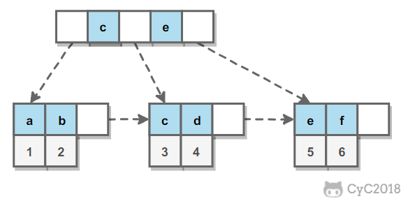

[TOC]

# mysql覆盖索引与回表

## **一、什么是回表查询？**

这先要从InnoDB的索引实现说起，InnoDB有两大类索引：

- 聚集索引(clustered index)
- 普通索引(secondary index)

## **InnoDB聚集索引和普通索引有什么差异？**

InnoDB**聚集索引**的叶子节点存储行记录，因此， InnoDB必须要有，且只有一个聚集索引：

（1）如果表定义了PK，则PK就是聚集索引；

（2）如果表没有定义PK，则第一个not NULL unique列是聚集索引；

（3）否则，InnoDB会创建一个隐藏的row-id作为聚集索引；

*画外音：所以PK查询非常快，直接定位行记录。*

InnoDB**普通索引**的叶子节点存储主键值。

*画外音：注意，不是存储行记录头指针，MyISAM的索引叶子节点存储记录指针。*

举个栗子，不妨设有表：

*t(id PK, name KEY, sex, flag);*

*画外音：id是聚集索引，name是普通索引。*

表中有四条记录：

*1, shenjian, m, A*

*3, zhangsan, m, A*

*5, lisi, m, A*

*9, wangwu, f, B*


image

两个B+树索引分别如上图：

（1）id为PK，聚集索引，叶子节点存储行记录；

（2）name为KEY，普通索引，叶子节点存储PK值，即id；

既然从普通索引无法直接定位行记录，那**普通索引的查询过程是怎么样的呢？**

通常情况下，需要扫码两遍索引树。

例如：

*select \* from t where name='lisi';*

**是如何执行的呢？**


image

如**粉红色**路径，需要扫码两遍索引树：

（1）先通过普通索引定位到主键值id=5；

（2）在通过聚集索引定位到行记录；

这就是所谓的**回表查询**，先定位主键值，再定位行记录，它的性能较扫一遍索引树更低。

## **二、什么是索引覆盖\**\**(Covering index)\**\**？**

额，楼主并没有在MySQL的官网找到这个概念。

*画外音：治学严谨吧？*

借用一下SQL-Server官网的说法。


image

MySQL官网，类似的说法出现在explain查询计划优化章节，即explain的输出结果Extra字段为Using index时，能够触发索引覆盖。


image

不管是SQL-Server官网，还是MySQL官网，都表达了：只需要在一棵索引树上就能获取SQL所需的所有列数据，无需回表，速度更快。

## **三、如何实现索引覆盖？**

常见的方法是：将被查询的字段，建立到联合索引里去。

仍是《[迅猛定位低效SQL？](https://links.jianshu.com/go?to=http%3A%2F%2Fmp.weixin.qq.com%2Fs%3F__biz%3DMjM5ODYxMDA5OQ%3D%3D%26mid%3D2651962587%26idx%3D1%26sn%3Dd197aea0090ce93b156e0774c6dc3019%26chksm%3Dbd2d09078a5a801138922fb5f2b9bb7fdaace7e594d55f45ce4b3fc25cbb973bbc9b2deb2c31%26scene%3D21%23wechat_redirect)》中的例子：

*create table user (*

*id int primary key,*

*name varchar(20),*

*sex varchar(5),*

*index(name)*

*)engine=innodb;*

第一个SQL语句：


image

*select id,name from user where name='shenjian';*

能够命中name索引，索引叶子节点存储了主键id，通过name的索引树即可获取id和name，无需回表，符合索引覆盖，效率较高。

*画外音，Extra：**Using index**。*

第二个SQL语句：


*image*


*select id,name**,sex** from user where name='shenjian';*

能够命中name索引，索引叶子节点存储了主键id，但sex字段必须回表查询才能获取到，不符合索引覆盖，需要再次通过id值扫码聚集索引获取sex字段，效率会降低。

*画外音，Extra：**Using index condition**。*

如果把(name)单列索引升级为联合索引(name, sex)就不同了。

*create table user (*

*id int primary key,*

*name varchar(20),*

*sex varchar(5),*

*index(name, sex)*

*)engine=innodb;*


image

可以看到：

*select id,name ... where name='shenjian';*

*select id,name,**sex** ... where name='shenjian';*

都能够命中索引覆盖，无需回表。

*画外音，Extra：**Using index**。*

## **四、哪些场景可以利用索引覆盖来优化SQL？**

### **场景1：全表count查询优化**


image

原表为：

*user(PK id, name, sex)；*

直接：

*select count(name) from user;*

不能利用索引覆盖。

添加索引：

*alter table user add key(name);*

就能够利用索引覆盖提效。

### **场景2：列查询回表优化**

*select id,name,sex ... where name='shenjian';*

这个例子不再赘述，将单列索引(name)升级为联合索引(name, sex)，即可避免回表。

### **场景3：分页查询**

*select id,name,sex ... **order by** name limit 500,100;*

将单列索引(name)升级为联合索引(name, sex)，也可以避免回表。

**InnoDB聚集索引普通索引**，**回表**，**索引覆盖**，希望这1分钟大家有收获。


作者：Harri2012
链接：https://www.jianshu.com/p/8991cbca3854
来源：简书
著作权归作者所有。商业转载请联系作者获得授权，非商业转载请注明出处。

# 一、索引

## B+ Tree 原理

### 1. 数据结构

B Tree 指的是 Balance Tree，也就是平衡树。平衡树是一颗查找树，并且所有叶子节点位于同一层。

B+ Tree 是基于 B Tree 和**叶子节点**顺序访问指针进行实现，它具有 B Tree 的平衡性，并且通过顺序访问指针来提高区间查询的性能。

在 B+ Tree 中，一个节点中的 key 从左到右非递减排列，如果某个指针的左右相邻 key 分别是 key<sub>i</sub> 和 key<sub>i+1</sub>，且不为 null，则该指针指向节点的所有 key 大于等于 key<sub>i</sub> 且小于等于 key<sub>i+1</sub>。

     

### 2. 操作

进行查找操作时，首先在根节点进行二分查找，找到一个 key 所在的指针，然后递归地在指针所指向的节点进行查找。直到查找到叶子节点，然后在叶子节点上进行二分查找，找出 key 所对应的 data。

插入删除操作会破坏平衡树的平衡性，因此在插入删除操作之后，需要对树进行一个分裂、合并、旋转等操作来维护平衡性。

### 3. 与红黑树的比较

红黑树等平衡树也可以用来实现索引，但是文件系统及数据库系统普遍采用 B+ Tree 作为索引结构，主要有以下两个原因：

（一）更少的查找次数

平衡树查找操作的时间复杂度和树高 h 相关，O(h)=O(log<sub>d</sub>N)，其中 d 为每个节点的出度。

红黑树的出度为 2，而 **B+ Tree 的出度一般都非常大**，所以红黑树的树高 h 很明显比 B+ Tree 大非常多，查找的次数也就更多。

（二）利用磁盘预读特性

为了减少磁盘 I/O 操作，磁盘往往不是严格按需读取，而是每次都会预读。预读过程中，磁盘进行顺序读取，顺序读取不需要进行磁盘寻道，并且只需要很短的磁盘旋转时间，速度会非常快。

操作系统一般将内存和磁盘分割成固定大小的块，每一块称为一页，内存与磁盘以页为单位交换数据。数据库系统将索引的一个节点的大小设置为页的大小，使得一次 I/O 就能完全载入一个节点。并且可以利用预读特性，相邻的节点也能够被预先载入。

## MySQL 索引

索引是在存储引擎层实现的，而不是在服务器层实现的，所以不同存储引擎具有不同的索引类型和实现。

### 索引设计原则？

索引的设计可以遵循一些已有的原则，创建索引的时候应尽量考虑符合这些原则，便于提升索引的使用效率，更高效的使用索引。本节将介绍一些索引的设计原则。

#### 1. 选择唯一性索引

唯一性索引的值是唯一的，可以更快速的通过该索引来确定某条记录。例如，学生表中学号是具有唯一性的字段。为该字段建立唯一性索引可以很快的确定某个学生的信息。如果使用姓名的话，可能存在同名现象，从而降低查询速度。

#### 2. 为经常需要排序、分组和联合操作的字段建立索引

经常需要 ORDER BY、GROUP BY、DISTINCT 和 UNION 等操作的字段，排序操作会浪费很多时间。如果为其建立索引，可以有效地避免排序操作。

#### 3. 为常作为查询条件的字段建立索引

如果某个字段经常用来做查询条件，那么该字段的查询速度会影响整个表的查询速度。因此，为这样的字段建立索引，可以提高整个表的查询速度。

注意：常查询条件的字段不一定是所要选择的列，换句话说，最适合索引的列是出现在 WHERE 子句中的列，或连接子句中指定的列，而不是出现在 SELECT 关键字后的选择列表中的列。

#### 4. 限制索引的数目

索引的数目不是“越多越好”。每个索引都需要占用磁盘空间，索引越多，需要的磁盘空间就越大。在修改表的内容时，索引必须进行更新，有时还可能需要重构。因此，索引越多，更新表的时间就越长。

如果有一个索引很少利用或从不使用，那么会不必要地减缓表的修改速度。此外，MySQL 在生成一个执行计划时，要考虑各个索引，这也要花费时间。创建多余的索引给查询优化带来了更多的工作。索引太多，也可能会使 MySQL 选择不到所要使用的最佳索引。

#### 5. 尽量使用数据量少的索引

如果索引的值很长，那么查询的速度会受到影响。例如，对一个 CHAR(100) 类型的字段进行全文检索需要的时间肯定要比对 CHAR(10) 类型的字段需要的时间要多。

#### 6. 数据量小的表最好不要使用索引

由于数据较小，查询花费的时间可能比遍历索引的时间还要短，索引可能不会产生优化效果。

#### 7. 尽量使用前缀来索引

如果索引字段的值很长，最好使用值的前缀来索引。例如，TEXT 和 BLOG 类型的字段，进行全文检索会很浪费时间。如果只检索字段的前面的若干个字符，这样可以提高检索速度。

#### 8. 删除不再使用或者很少使用的索引

表中的数据被大量更新，或者数据的使用方式被改变后，原有的一些索引可能不再需要。应该定期找出这些索引，将它们删除，从而减少索引对更新操作的影响。

#### 总结

选择索引的最终目的是为了使查询的速度变快，上面给出的原则是最基本的准则，但不能只拘泥于上面的准则。应该在学习和工作中不断的实践，根据应用的实际情况进行分析和判断，选择最合适的索引方式。

### 1. B+Tree 索引

是大多数 MySQL 存储引擎的默认索引类型。

因为不再需要进行全表扫描，只需要对树进行搜索即可，所以查找速度快很多。

因为 B+ Tree 的有序性，所以除了用于查找，还可以用于**排序和分组**。

可以指定多个列作为索引列，多个索引列共同组成键。

适用于**全键值**、**键值范围**和**键前缀**查找，其中键前缀查找只适用于最左前缀查找。如果不是按照索引列的顺序进行查找，则无法使用索引。

InnoDB 的 B+Tree 索引分为主索引和辅助索引。主索引的叶子节点 data 域记录着完整的数据记录，这种索引方式被称为**聚簇索引**。因为无法把数据行存放在两个不同的地方，所以**一个表只能有一个聚簇索引**。

     

**辅助索引的叶子节点的 data 域记录着主键的值**，因此在使用辅助索引进行查找时，需要先查找到主键值，然后再到主索引中进行查找。

     

### 2. 哈希索引

哈希索引能以 O(1) 时间进行查找，但是失去了有序性：

- 无法用于排序与分组；
- 只支持精确查找，无法用于部分查找和范围查找。

InnoDB 存储引擎有一个特殊的功能叫“自适应哈希索引”，当某个索引值被使用的非常频繁时，会在 B+Tree 索引之上再创建一个哈希索引，这样就让 B+Tree 索引具有哈希索引的一些优点，比如快速的哈希查找。

#### Hash索引和BTree索引区别

[](https://www.jianshu.com/u/efde241036b3)


- Hash仅支持=、>、>=、<、<=、between。BTree可以支持like模糊查询

- 索引是帮助mysql获取数据的数据结构。最常见的索引是Btree索引和Hash索引。

- 不同的引擎对于索引有不同的支持：Innodb和MyISAM默认的索引是Btree索引；而Mermory默认的索引是Hash索引。

我们在mysql中常用两种索引算法BTree和Hash，两种算法检索方式不一样，对查询的作用也不一样。

##### 一、BTree

BTree索引是最常用的mysql数据库索引算法，因为它不仅可以被用在**=,>,>=,<,<=**和between这些比较操作符上，而且还可以用于**like**操作符，只要它的查询条件是一个不以通配符开头的常量，例如：
select * from user where name like ‘jack%’;
select * from user where name like ‘jac%k%’;
**如果以通配符开头，或者没有使用常量，则<u>不会使用索引</u>**，例如：
select * from user where name like ‘**%jack**’;
select * from user where name like simply_name;

##### 二、Hash

Hash索引只能用于**对等比较，例如=,<=>（相当于=）操作符**。由于是一次定位数据，不像BTree索引需要从根节点到枝节点，最后才能访问到页节点这样多次IO访问，所以检索效率远高于BTree索引。
但为什么我们使用BTree比使用Hash多呢？主要**Hash**本身由于其特殊性，也带来了很多限制和**弊端**：

1. - Hash索引仅仅能满足**“=”,“IN”,“<=>”查询**，**不能使用范围查询**。
2. - 联合索引中，Hash索引**不能利用部分索引键**查询。
     对于联合索引中的多个列，Hash是要么全部使用，要么全部不使用，并不支持BTree支持的联合索引的最优前缀，也就是联合索引的前面一个或几个索引键进行查询时，Hash索引无法被利用。
3. - Hash索引**无法避免数据的排序**操作
     由于Hash索引中存放的是经过Hash计算之后的Hash值，而且Hash值的大小关系并不一定和Hash运算前的键值完全一样，所以数据库无法利用索引的数据来避免任何排序运算。
4. - Hash索引任何时候都**不能避免表扫描**
     Hash索引是将索引键通过Hash运算之后，将Hash运算结果的Hash值和所对应的行指针信息存放于一个Hash表中，由于不同索引键存在相同Hash值，所以即使满足某个Hash键值的数据的记录条数，也无法从Hash索引中直接完成查询，还是要通过访问表中的实际数据进行比较，并得到相应的结果。
5. - Hash索引<u>遇到大量Hash值相等的情况后性能并不一定会比BTree高</u>
     对于选择性比较低的索引键，如果创建Hash索引，那么将会存在大量记录指针信息存于同一个Hash值相关联。这样要定位某一条记录时就会非常麻烦，会浪费多次表数据访问，而造成整体性能底下。

- hash索引查找数据基本上能一次定位数据，当然有大量碰撞的话性能也会下降。而btree索引就得在节点上挨着查找了，很明显在数据精确查找方面hash索引的效率是要高于btree的；
- 那么不精确查找呢，也很明显，因为hash算法是基于等值计算的，所以对于“like”等范围查找hash索引无效，不支持；
- 于btree支持的[联合索引](https://www.baidu.com/s?wd=联合索引&tn=SE_PcZhidaonwhc_ngpagmjz&rsv_dl=gh_pc_zhidao)的最优前缀，hash也是无法支持的，[联合索引](https://www.baidu.com/s?wd=联合索引&tn=SE_PcZhidaonwhc_ngpagmjz&rsv_dl=gh_pc_zhidao)中的字段要么全用要么全不用。提起最优前缀居然都泛起迷糊了，看来有时候放空得太厉害；
- hash不支持索引排序，索引值和计算出来的hash值大小并不一定一致。

### 3. 全文索引

MyISAM 存储引擎支持全文索引，用于查找文本中的关键词，而不是直接比较是否相等。

查找条件使用 MATCH AGAINST，而不是普通的 WHERE。

全文索引使用倒排索引实现，它记录着关键词到其所在文档的映射。

InnoDB 存储引擎在 MySQL 5.6.4 版本中也开始支持全文索引。

### 4. 空间数据索引

MyISAM 存储引擎支持空间数据索引（R-Tree），可以用于地理数据存储。空间数据索引会从所有维度来索引数据，可以有效地使用任意维度来进行组合查询。

必须使用 GIS 相关的函数来维护数据。

#### 联合索引

## 索引优化

### 1. 独立的列

在进行查询时，**索引列不能是表达式的一部分，也不能是函数的参数，否则无法使用索引。**

例如下面的查询不能使用 actor_id 列的索引：

```sql
SELECT actor_id FROM sakila.actor WHERE actor_id + 1 = 5;
```

### 2. 多列索引

> 在Mysql建立多列索引（联合索引）有最左前缀的原则，即最左优先。
> 如果我们建立了一个2列的联合索引(col1,col2),实际上已经建立了两个联合索引(col1)、(col1,col2）;
> 如果有一个3列索引(col1,col2,col3)，实际上已经建立了三个联合索引(col1)、(col1,col2)、(col1,col2,col3)。

#### 解释（联合索引最左匹配原因）

1、b+树的数据项是复合的数据结构，比如(name,age,sex)的时候，b+树是按照从左到右的顺序来建立搜索树的，比如当(张三,20,F)这样的数据来检索的时候，b+树会优先比较name来确定下一步的所搜方向，如果name相同再依次比较age和sex，最后得到检索的数据；但当(20,F)这样的没有name的数据来的时候，b+树就不知道第一步该查哪个节点，因为建立搜索树的时候name就是第一个比较因子，必须要先根据name来搜索才能知道下一步去哪里查询。

2、比如当(张三,F)这样的数据来检索时，b+树可以用name来指定搜索方向，但下一个字段age的缺失，所以只能把名字等于张三的数据都找到，然后再匹配性别是F的数据了， 这个是非常重要的性质，即索引的最左匹配特性。（这种情况无法用到联合索引）

~~~markdown
mysql创建复合索引的规则是首先会对复合索引的最左边，也就是索引中的第一个字段进行排序，在第一个字段排序的基础上，在对索引上第二个字段进行排序，其实就像是实现类似order by 字段1，字段2这样的排序规则，那么第一个字段是绝对有序的，而第二个字段就是无序的了，因此一般情况下直接只用第二个字段判断是用不到索引的，这就是为什么mysql要强调联合索引最左匹配原则的原因
~~~

#### mysql里创建联合索引的意义

##### 一个顶三个

建了一个(a,b,c)的复合索引，那么实际等于建了(a),(a,b),(a,b,c)三个索引，因为每多一个索引，都会增加写操作的开销和磁盘空间的开销。对于大量数据的表，这可是不小的开销！

#### 覆盖索引

同样的有复合索引（a,b,c），如果有如下的sql: select a,b,c from table where a=1 and b = 1。那么MySQL可以直接通过遍历索引取得数据，而**无需回表**，这减少了很多的随机io操作。减少io操作，特别的随机io其实是dba主要的优化策略。所以，在真正的实际应用中，覆盖索引是主要的提升性能的优化手段之一

#### 索引列越多，通过索引筛选出的数据越少

有1000W条数据的表，有如下sql:select * from table where a = 1 and b =2 and c = 3,假设假设每个条件可以筛选出10%的数据，如果只有单值索引，那么通过该索引能筛选出1000W*10%=100w 条数据，然后再回表从100w条数据中找到符合b=2 and c= 3的数据，然后再排序，再分页；如果是复合索引，通过索引筛选出1000w *10% *10% *10%=1w，然后再排序、分页，哪个更高效，一眼便知

#### 创建联合索引时列的选择原则

1. 经常用的列优先（最左匹配原则）
2. 离散度高的列优先（离散度高原则）
3. 宽度小的列优先（最少空间原则）

列的离散性计算：count（distinct col）/ count(col)
例如：
id列一共9列都不重复 9/9 = 1
性别列一共9列只有（男或者女）两列 2/9 约等于0.2
离散性越高选择性越大

在需要使用多个列作为条件进行查询时，使用多列索引比使用多个单列索引性能更好。例如下面的语句中，最好把 actor_id 和 film_id 设置为多列索引。

```sql
SELECT film_id, actor_ id FROM sakila.film_actor
WHERE actor_id = 1 AND film_id = 1;
```

### 3. 索引列的顺序

让选择性最强的索引列放在前面。

索引的选择性是指：不重复的索引值和记录总数的比值。最大值为 1，此时每个记录都有唯一的索引与其对应。选择性越高，每个记录的区分度越高，查询效率也越高。

例如下面显示的结果中 customer_id 的选择性比 staff_id 更高，因此最好把 customer_id 列放在多列索引的前面。

```sql
SELECT COUNT(DISTINCT staff_id)/COUNT(*) AS staff_id_selectivity,
COUNT(DISTINCT customer_id)/COUNT(*) AS customer_id_selectivity,
COUNT(*)
FROM payment;
```

```html
   staff_id_selectivity: 0.0001
customer_id_selectivity: 0.0373
               COUNT(*): 16049
```

### 4. 前缀索引

对于 BLOB、TEXT 和 VARCHAR 类型的列，必须使用前缀索引，只索引开始的部分字符。

前缀长度的选取需要根据索引选择性来确定。

*mysql*无法使用其*前缀索引*做ORDER BY和GROUP BY,也无法使用*前缀索引*做覆盖扫描。

- 注意1:前缀索引一般只能用于普通索引当中,不能使用在unique当中,如果强行unique中索引有可能无法被使用上
- 注意2:前缀索引只支持英文和数字,一般使用场景在网站中的用户注册模块,因为用户名注册多用邮箱和手机号码为主
- 查询索引的长度
  select length(old_kefuid) from xw_user_applyloan LIMIT 1;
- 查询索引长度是5的时候的数据重复次数
  select left(old_kefuid,4) as 左边5位2长度,count(*) as 总数 from xw_user_applyloan GROUP by left(old_kefuid,4);
- 设置前缀索引
  alter table xw_user_applyloan add index uname( old_kefuid(4) )

### 5. 覆盖索引

索引包含所有需要查询的字段的值。

具有以下优点：

- 索引通常远小于数据行的大小，只读取索引能大大减少数据访问量。
- 一些存储引擎（例如 MyISAM）在内存中只缓存索引，而数据依赖于操作系统来缓存。因此，只访问索引可以不使用系统调用（通常比较费时）。
- 对于 InnoDB 引擎，若辅助索引能够覆盖查询，则无需访问主索引。

## 索引的优点

- **大大减少了服务器需要扫描的数据行数。**

- **帮助服务器避免进行排序和分组**，以及避免创建临时表（B+Tree 索引是有序的，可以用于 ORDER BY 和 GROUP BY 操作。临时表主要是在排序和分组过程中创建，不需要排序和分组，也就不需要创建临时表）。

- 将随机 I/O 变为顺序 I/O（B+Tree 索引是有序的，会将相邻的数据都存储在一起）。

## 索引的使用条件

- 对于非常小的表、大部分情况下简单的全表扫描比建立索引更高效；
- 对于中到大型的表，索引就非常有效；
- 但是对于**特大型的表，建立和维护索引的代价将会随之增长**。这种情况下，需要用到一种技术可以直接区分出需要查询的一组数据，而不是一条记录一条记录地匹配，例如**可以使用分区技术**。

## 索引是键的越多越好吗？

答案是否定的

- 数据量小的表不需要建立索引，建立会增加额外的索引开销
- 数据变更需要维护索引，意味着更多的索引意味着更多的维护成本
- 更多的索引也需要跟多的存储空间

## MySQL索引——分类、何时使用、何时不使用、何时失效

### 1、分类

  MySQL索引分为普通索引、唯一索引、主键索引、组合索引、全文索引。索引不会包含有null值的列，索引项可以为null（唯一索引、组合索引等），但是只要列中有null值就不会被包含在索引中。

  （1）普通索引：create index index_name on table(column)；

  或者创建表时指定，create table(..., index index_name column);

  （2）唯一索引：类似普通索引，索引列的值必须唯一（可以为空，这点和主键索引不同）

  create unique index index_name on table(column)；或者创建表时指定unique index_name column

  （3）主键索引：特殊的唯一索引，不允许为空，只能有一个，一般是在建表时指定primary key(column)

  （4）组合索引：在多个字段上创建索引，遵循最左前缀原则。alter table t add index index_name(a,b,c);

​    https://blog.csdn.net/xing_____/article/details/78826508

  （5）全文索引：主要用来查找文本中的关键字，不是直接与索引中的值相比较，像是一个搜索引擎，配合match against使用，现在只有char，varchar，text上可以创建全文索引。在数据量较大时，**先将数据放在一张没有全文索引的表里，然后再利用create index创建全文索引，比先生成全文索引再插入数据快很多**。

 

### 2、何时使用索引

  MySQL每次查询只使用一个索引。与其说是“数据库查询只能用到一个索引”，倒不如说，和全表扫描比起来，去分析两个索引B+树更加耗费时间。所以where A=a and B=b这种查询使用（A，B）的组合索引最佳，B+树根据（A，B）来排序。

  （1）主键，unique字段；

  （2）和其他表做连接的字段需要加索引；

  （3）在where里使用＞，≥，＝，＜，≤，is null和between等字段；

  （4）使用不以通配符开始的like，where A like 'China%'；

  （5）聚集函数MIN()，MAX()中的字段；

  （6）order by和group by字段；

###  3、何时不使用索引

  （1）表记录太少；

  （2）数据重复且分布平均的字段（只有很少数据值的列）；

  （3）经常插入、删除、修改的表要减少索引；

  （4）text，image等类型不应该建立索引，这些列的数据量大（假如text前10个字符唯一，也可以对text前10个字符建立索引）；

  （5）MySQL能估计出全表扫描比使用索引更快时，不使用索引；

###  4、索引何时失效

  （1）组合索引未使用最左前缀，例如组合索引（A，B），where B=b不会使用索引；

  （2）like未使用最左前缀，where A like '%China'；

  （3）搜索一个索引而在另一个索引上做order by，where A=a order by B，只使用A上的索引，因为查询只使用一个索引 ；

  （4）or会使索引失效。如果查询字段相同，也可以使用索引。例如where A=a1 or A=a2（生效），where A=a or B=b（失效）

  （5）如果列类型是字符串，要使用引号。例如where A='China'，否则索引失效（会进行类型转换）；

  （6）在索引列上的操作，函数（upper()等）、or、！=(<>)、not in等；

 

### 5、explain语句


   type字段为All，未使用索引；为ref，使用索引

   ALL         全表扫描

   index        索引全扫描

   range        索引范围扫描，常用语<,<=,>=,between等操作

   ref          使用非唯一索引扫描或唯一索引前缀扫描，返回单条记录，常出现在关联查询中

   eq_ref        类似ref，区别在于使用的是唯一索引，使用主键的关联查询

   const/system   单条记录，系统会把匹配行中的其他列作为常数处理，如主键或唯一索引查询

   null          MySQL不访问任何表或索引，直接返回结果

# （锁）MySQL常见的七种锁详细介绍

## 一、死锁示例

**RR<u>和Serializable两个隔离级别，是因为只有这两个级别下才会有间隙锁/临键锁**</u>，而这是导致死锁的**根本原因**

考虑下面一个MySQL死锁的示例：

有如下一张表：

```
CREATE TABLE `test` (


  `id` int(20) NOT NULL,


  `name` varchar(20) DEFAULT NULL,


  PRIMARY KEY (`id`)


) ENGINE=InnoDB DEFAULT CHARSET=utf8
```

表中有如下数据：

```
mysql> SELECT * FROM test;
+----+------+
| id | name |
+----+------+
|  1 | 1    |
|  5 | 5    |
| 10 | 10   |
| 15 | 15   |
| 20 | 20   |
| 25 | 25   |
+----+------+
6 rows in set (0.00 sec)
```

当数据库的隔离级别为<u>Repeatable Read或Serializable</u>时,我们来看这样的两个并发事务（**场景一**）：

| session1                                        | session2                                        |
| ----------------------------------------------- | ----------------------------------------------- |
| begin;                                          |                                                 |
|                                                 | begin;                                          |
| select * from test where id = 12 for update;    |                                                 |
|                                                 | select * from test where id = 13 for update;    |
| insert into test(id, name) values(12, "test1"); |                                                 |
| 锁等待中                                        | insert into test(id, name) values(13, "test2"); |
| 锁等待解除                                      | 死锁，session 2的事务被回滚                     |

上面两个并发事务一定会发生死锁（这里之所以限定**RR<u>和Serializable两个隔离级别，是因为只有这两个级别下才会有间隙锁/临键锁**</u>，而这是导致死锁的**根本原因**，后面会详细分析）。

我们再来看另外一个并发场景（**场景二**）：

| session1                                        | session2                                        |
| ----------------------------------------------- | ----------------------------------------------- |
| begin;                                          |                                                 |
|                                                 | begin;                                          |
| select * from test where id = 12 for update;    |                                                 |
|                                                 | select * from test where id = 16 for update;    |
| insert into test(id, name) values(12, "test1"); |                                                 |
| commit;                                         | insert into test(id, name) values(16, "test2"); |
|                                                 | commit;                                         |

在这个并发场景下，两个事务均能成功提交，而不会有死锁。

在上面的示例中，我们发现，select ... for update虽然可以用于解决数据库的并发操作，但在实际项目中却不建议使用，原因是当查询条件对应的记录不存在时，很容易造成死锁。而造成死锁的原因和MySQL的锁机制有关。本文将详细介绍常见的七种锁机制，了解了这些锁机制之后就能理解造成场景一死锁的根本原因以及场景一和场景二差异的原因。

## 二、MySQL的八种锁

- 行锁（Record Locks）
- 间隙锁（Gap Locks）
- 临键锁（Next-key Locks）
- 共享锁/排他锁（Shared and Exclusive Locks）
- 意向共享锁/意向排他锁（Intention Shared and Exclusive Locks）
- 插入意向锁（Insert Intention Locks）

- 自增锁（Auto-inc Locks）

  实际上，MySQL官网中还提到了一种**预测锁**，这种锁主要用于存储了空间数据的**空间索引**，本文暂不讨论。

### 1、行锁（记录琐、间隙锁、临键锁）

这MySQL的官方文档中有以下描述：

A record lock is a lock on an **index record**. Record locks always lock **index records**, even if a table is defined with no indexes. For such cases, InnoDB creates a hidden clustered index and uses this index for record locking.

这句话说明行锁一定是作用在索引上的。

### 2、间隙锁(**开区间**)

在MySQL的官方文档中有以下描述：

A gap lock is a lock on a gap between index records, or a lock on the gap before the first or after the last index record。

这句话表明间隙锁一定是**开区间**，比如（3，5）或者。在MySQL官网上还有一段非常关键的描述：

Gap locks in InnoDB are “purely inhibitive”, which means that their only purpose is to prevent other transactions from inserting to the gap. Gap locks can **co-exist**. A gap lock taken by one transaction does not prevent another transaction from **taking a gap lock on the same gap**. There is no difference between shared and exclusive gap locks. They do not conflict with each other, and they perform the same function.

这段话表明间隙锁在本质上是不区分共享间隙锁或互斥间隙锁的，而且**间隙锁是不互斥**的，即<u>两个事务可以同时持有包含**共同间隙**的间隙锁</u>。这里的**共同间隙**包括两种场景：其一是两个间隙锁的**间隙区间**完全一样；其二是一个间隙锁包含的**间隙区间**是另一个间隙锁包含**间隙区间**的**子集**。间隙锁本质上是用于**阻止<u>其他事务</u>在该间隙内插入新记录**，而<u>**自身事务</u>是允许在该间隙内插入数据的**。也就是说间隙锁的应用场景包括并发**读取**、并发**更新**、并发**删除**和并发**插入**。

在MySQL官网上关于间隙锁还有一段重要描述：

Gap locking can be disabled explicitly. This occurs if you change the transaction isolation level to [READ COMMITTED](https://dev.mysql.com/doc/refman/8.0/en/innodb-transaction-isolation-levels.html#isolevel_read-committed). Under these circumstances, gap locking is disabled for searches and index scans and is used only for foreign-key constraint checking and duplicate-key checking.

<u>这段话表明，在RU和RC两种隔离级别下，即使你使用select ... in share mode或select ... for update，也无法防止**幻读**（读后写的场景）。因为这两种隔离级别下只会有**行锁**，而不会有**间隙锁**。这也是为什么示例中要规定隔离级别为RR的原因。</u>

### 3、临键锁(行锁+间隙锁)

在MySQL的官方文档中有以下描述：

A next-key lock is a combination of a record lock on the index record and a gap lock on the gap before the index record.

这句话表明临键锁是行锁+间隙锁，即临键锁是是一个左开右闭的区间，比如（3，5]。

在MySQL的官方文档中还有以下重要描述：

By default, InnoDB operates in [REPEATABLE READ](https://dev.mysql.com/doc/refman/8.0/en/innodb-transaction-isolation-levels.html#isolevel_repeatable-read) transaction isolation level. In this case, InnoDB uses next-key locks for searches and index scans, which prevents phantom rows.

个人觉得这段话描述得不够好，很容易引起误解。这里更正如下：InnoDB的默认事务隔离级别是RR，在这种级别下，如果你使用select ... in share mode或者select ... for update语句，那么InnoDB会使用临键锁，因而可以防止**幻读**；但即使你的隔离级别是RR，如果你这是使用普通的select语句，那么InnoDB将是快照读，不会使用任何锁，因而还是无法防止**幻读**。

### 4、共享锁/排他锁(行锁)

在MySQL的官方文档中有以下描述：

InnoDB implements standard **row-level locking** where there are two types of locks, [shared (S) locks](https://dev.mysql.com/doc/refman/8.0/en/glossary.html#glos_shared_lock) and [exclusive (X) locks](https://dev.mysql.com/doc/refman/8.0/en/glossary.html#glos_exclusive_lock)。

- A [shared (S) lock](https://dev.mysql.com/doc/refman/8.0/en/glossary.html#glos_shared_lock) permits the transaction that holds the lock to read a row.
- An [exclusive (X) lock](https://dev.mysql.com/doc/refman/8.0/en/glossary.html#glos_exclusive_lock) permits the transaction that holds the lock to update or delete a row.

这段话明确说名了共享锁/排他锁都只是**行锁**，与**间隙锁**无关，这一点很重要，后面还会强调这一点。其中共享锁是一个事务并发**读取**某一行记录所需要持有的锁，比如<u>**select ... in share mode**</u>；排他锁是一个事务并发**更新或删除**某一行记录所需要持有的锁，**<u>比如select ... for update。</u>**

- 共享锁<u>**select ... lock in share mode**</u>
- 排他锁**select ... for update**

不过这里需要重点说明的是，尽管共享锁/排他锁是行锁，与间隙锁无关，但一个事务在请求共享锁/排他锁时，获取到的结果却可能是**行锁**，也可能是**间隙锁**，也可能是**临键锁**，这取决于数据库的**隔离级别**以及查询的**数据是否存在**。关于这一点，后面分析场景一和场景二的时候还会提到。

### 5、意向共享锁/意向排他锁(表锁)

在MySQL的官方文档中有以下描述：

Intention locks are **table-level locks** that indicate which type of lock (shared or exclusive) a transaction requires later **for a row** in a table。

The intention locking protocol is as follows:

- Before a transaction can acquire a shared lock on a row in a table, it must first acquire an IS lock or stronger on the table.
- Before a transaction can acquire an exclusive lock on a row in a table, it must first acquire an IX lock on the table.

 

这段话说明意向共享锁/意向排他锁属于**表锁**，且取得意向共享锁/意向排他锁是取得共享锁/排他锁的**前置条件**。

共享锁/排他锁与意向共享锁/意向排他锁的兼容性关系：

|        | **X** | **IX**   | **S** | **IS** |
| :----- | :---- | :------- | :---- | :----- |
| **X**  | 互斥  | 互斥     | 互斥  | 互斥   |
| **IX** | 互斥  | **兼容** | 互斥  | 兼容   |
| **S**  | 互斥  | 互斥     | 兼容  | 兼容   |
| **IS** | 互斥  | 兼容     | 兼容  | 兼容   |

这里需要重点关注的是**IX锁和IX锁是相互兼容**的，这是导致上面场景一发生死锁的前置条件，后面会对死锁原因进行详细分析。

### 6、插入意向锁(IIX)

在MySQL的官方文档中有以下重要描述：

An insert intention lock is a type of gap lock set by [INSERT](https://dev.mysql.com/doc/refman/8.0/en/insert.html) operations prior to row insertion. This lock signals the intent to insert in such a way that multiple transactions inserting into the same index gap need not wait for each other if they are not inserting at the same position within the gap. Suppose that there are index records with values of 4 and 7. Separate transactions that attempt to insert values of 5 and 6, respectively, each lock the gap between 4 and 7 with insert intention locks prior to obtaining the exclusive lock on the inserted row, but do not block each other because the rows are nonconflicting.

这段话表明尽管插入意向锁是一种**特殊**的间隙锁，但不同于间隙锁的是，该锁只用于并发**插入**操作。如果说间隙锁锁住的是一个区间，那么插入意向锁锁住的就是一个点。因而从这个角度来说，插入意向锁确实是一种特殊的间隙锁。与间隙锁的另一个非常**重要的差别**是：尽管**插入意向锁**也属于**间隙锁**，但两个事务却不能在同一时间内一个拥有间隙锁，另一个拥有该间隙区间内的插入意向锁（当然，插入意向锁如果不在间隙锁区间内则是可以的）。这里我们再回顾一下共享锁和排他锁：共享锁用于**读取**操作，而排他锁是用于**更新**或**删除**操作。也就是说插入意向锁、共享锁和排他锁涵盖了常用的增删改查四个动作。

### 7、示例分析

到此为止，我们介绍了MySQL常用的七种锁的前六种，理解了这六种锁之后，才能很好地分析和理解开头给出的两个场景。我们先来分析场景一：

| session1                                                     | session2                                                     |
| ------------------------------------------------------------ | ------------------------------------------------------------ |
| begin;                                                       |                                                              |
|                                                              | begin;                                                       |
| select * from test where id = 12 for update;先请求IX锁并成功获取再请求X锁，但因行记录不存在，故得到的是间隙锁（10，15） |                                                              |
|                                                              | select * from test where id = 13 for update;先请求IX锁并成功获取再请求X锁，但因行记录不存在，故得到的是间隙锁（10，15） |
| insert into test(id, name) values(12, "test1");请求插入意向锁（12），因事务二已有间隙锁，请求只能等待 |                                                              |
| 锁等待中                                                     | insert into test(id, name) values(13, "test2");请求插入意向锁（13），因事务一已有间隙锁，请求只能等待 |
| 锁等待解除                                                   | 死锁，session 2的事务被回滚                                  |

在场景一中，因为**IX**锁是**表锁**且**IX锁之间是兼容**的，因而事务一和事务二都能同时获取到**IX**锁和**间隙锁**。另外，需要说明的是，因为我们的隔离级别是RR，且在请求X锁的时候，查询的对应记录都不存在，因而返回的都是**间隙锁**。接着事务一请求插入意向锁，这时发现事务二已经获取了一个区间间隙锁，而且事务一请求的插入点在事务二的间隙锁区间内，因而只能等待事务二释放间隙锁。这个时候事务二也请求插入意向锁，该插入点同样位于事务一已经获取的间隙锁的区间内，因而也不能获取成功，<u>不过这个时候，MySQL已经检查到了死锁，于是事务二被回滚，事务一提交成功。</u>

分析并理解了场景一，那场景二理解起来就会简单多了：

| session1                                                     | session2                                                     |
| ------------------------------------------------------------ | ------------------------------------------------------------ |
| begin;                                                       |                                                              |
|                                                              | begin;                                                       |
| select * from test where id = 12 for update;先请求IX锁并成功获取再请求X锁，但因行记录不存在，故得到的是间隙锁（10，15） |                                                              |
|                                                              | select * from test where id = 16 for update;先请求IX锁并成功获取再请求X锁，但因行记录不存在，故得到的是间隙锁（15，20） |
| insert into test(id, name) values(12, "test1");请求插入意向锁（12），获取成功 |                                                              |
| commit;                                                      | insert into test(id, name) values(16, "test2");请求插入意向锁（16），获取成功 |
|                                                              | .commit;                                                     |

场景二中，两个间隙锁没有交集，而各自获取的插入意向锁也不是同一个点，因而都能执行成功。

### 8、自增锁(特殊的表级锁)

最后，我们再来介绍下自增锁。在MySQL的官方文档中有以下描述：

An AUTO-INC lock is a **special table-level lock** taken by transactions inserting into tables with AUTO_INCREMENT columns.The [innodb_autoinc_lock_mode](https://dev.mysql.com/doc/refman/8.0/en/innodb-parameters.html#sysvar_innodb_autoinc_lock_mode) configuration option controls the algorithm used for auto-increment locking. It allows you to choose how to trade off between predictable sequences of auto-increment values and maximum concurrency for insert operations.

这段话表明自增锁是一种特殊的表级锁，主要用于事务中插入自增字段，也就是我们最常用的自增主键id。通过innodb_autoinc_lock_mode参数可以设置自增主键的生成策略。为了便于介绍innodb_autoinc_lock_mode参数，我们先将需要用到自增锁的Insert语句进行分类：

#### 1）Insert语句分类

- 1.**“INSERT-like” statements**(类INSERT语句) （这种语句实际上包含了下面的2、3、4）

所有可以向表中增加行的语句，包括

INSERT,

 INSERT ... SELECT, 

REPLACE, 

REPLACE ... SELECT, 

and LOAD DATA。包括“simple-inserts”, “bulk-inserts”, and “mixed-mode” inserts.

- 2. “**Simple inserts**”

**可以预先确定要插入的行数（当语句被初始处理时）的语句**。 <u>这包括没有嵌套子查询的单行和多行INSERT和REPLACE语句，但不包括INSERT ... ON DUPLICATE KEY UPDATE。</u>

- 3. “**Bulk inserts**” 

**事先不知道要插入的行数（和所需自动递增值的数量）的语句**。 这包括<u>INSERT ... SELECT，REPLACE ... SELECT和LOAD DATA语句，但不包括纯INSERT。</u> InnoDB在处理每行时一次为AUTO_INCREMENT列分配一个新值。

- 4. “**Mixed-mode inserts**”

这些是“Simple inserts”语句但是指定一些（但不是全部）新行的自动递增值。 示例如下，其中c1是表t1的AUTO_INCREMENT列：

INSERT INTO t1 (c1,c2) VALUES (1,'a'), (NULL,'b'), (5,'c'), (NULL,'d');

另一种类型的“Mixed-mode inserts”是INSERT ... ON DUPLICATE KEY UPDATE，其在最坏的情况下实际上是INSERT语句随后又跟了一个UPDATE，其中AUTO_INCREMENT列的分配值不一定会在 UPDATE 阶段使用。

#### 2）**InnoDB AUTO_INCREMENT锁定模式分类**

1. **innodb_autoinc_lock_mode = 0 (“traditional” lock mode)**

   这种锁定模式提供了在MySQL 5.1中引入innodb_autoinc_lock_mode配置参数之前存在的相同行为。传统的锁定模式选项用于向后兼容性，性能测试以及解决“Mixed-mode inserts”的问题，因为语义上可能存在差异。

   在此锁定模式下，所有“INSERT-like”语句获得一个**特殊的表级AUTO-INC锁**，用于插入具有AUTO_INCREMENT列的表。此锁定通常保持到**语句结束（不是事务结束）**，以**确保为给定的INSERT语句序列以可预测和可重复的顺序分配自动递增值**，并**确保自动递增由任何给定语句分配的值是连续的**。

   在**基于语句复制(statement-based replication)**的情况下，这意味着当在从服务器上复制SQL语句时，自动增量列使用与主服务器上相同的值。多个INSERT语句的执行结果是确定性的，SLAVE再现与MASTER相同的数据（反之，如果由多个INSERT语句生成的自动递增值交错，则两个并发INSERT语句的结果将是不确定的，并且不能使用基于语句的复制可靠地传播到从属服务器）。

2. **innodb_autoinc_lock_mode = 1 (“consecutive” lock mode)**连续模式

   这是默认的锁定模式。在这个模式下,“bulk inserts”仍然使用AUTO-INC表级锁,并保持到语句结束.这适用于所有INSERT ... SELECT，REPLACE ... SELECT和LOAD DATA语句。**同一时刻只有一个语句可以持有AUTO-INC锁**。

   而“Simple inserts”（要插入的行数事先已知）通过在**mutex（轻量锁）**的控制下获得所需数量的自动递增值来**避免表级AUTO-INC锁**， 它**只在分配过程的持续时间内保持**，而**不是直到语句完成**。 **不使用表级AUTO-INC锁，除非AUTO-INC锁由另一个事务保持**。 如果另一个事务保持AUTO-INC锁，则“简单插入”等待AUTO-INC锁，如同它是一个“批量插入”。

   此锁定模式确保,当行数不预先知道的INSERT存在时(并且自动递增值在语句过程执行中分配)由任何“类INSERT”语句分配的所有自动递增值是连续的，并且对于**基于语句的复制(statement-based replication)操作是安全的**。

   这种锁定模式显著地提高了可扩展性,并且保证了对于基于语句的复制(statement-based replication)的安全性。此外，与“传统”锁定模式一样，由任何给定语句分配的自动递增数字是连续的。 与使用自动递增的任何语句的“传统”模式相比，语义没有变化，但有个特殊场景需要注意：The exception is for “mixed-mode inserts”, where the user provides explicit values for an AUTO_INCREMENT column for some, but not all, rows in a multiple-row “simple insert”. For such inserts, InnoDB allocates more auto-increment values than the number of rows to be inserted. However, all values automatically assigned are consecutively generated (and thus higher than) the auto-increment value generated by the most recently executed previous statement. “Excess” numbers are lost.

   也就说对于混合模式的插入，可能会有部分多余自增值丢失。

   **在连续锁定模式下，InnoDB可以避免为“Simple inserts”语句使用表级AUTO-INC锁，其中行数是预先已知的，并且仍然保留基于语句的复制的确定性执行和安全性。**

3. **innodb_autoinc_lock_mode = 2 (“interleaved” lock mode)** 交替 交错 交叉

   在这种锁定模式下,所有类INSERT(“INSERT-like” )语句都不会使用表级AUTO-INC lock,并且可以同时执行多个语句。这是最快和最可扩展的锁定模式，但是当使用基**于语句的复制或恢复方案时，从二进制日志重播SQL语句时，这是不安全的**。

   在此锁定模式下，自动递增值保证在所有并发执行的“类INSERT”语句中是唯一且单调递增的。但是，由于多个语句可以同时生成数字（即，跨语句交叉编号），为任何给定语句插入的行生成的值可能不是连续的。

   如果执行的语句是“simple inserts”，其中要插入的行数已提前知道，则除了“混合模式插入”之外，为单个语句生成的数字不会有间隙。然而，当执行“批量插入”时，在由任何给定语句分配的自动递增值中可能存在间隙。

   **如果不使用二进制日志作为恢复或复制的一部分来重放SQL语句，则可以使用interleaved lock模式来消除所有使用表级AUTO-INC锁，以实现更大的并发性和性能,其代价是由于并发的语句交错执行,同一语句生成的AUTO-INCREMENT值可能会产生GAP。**

4. **innodb_autoinc_lock_mode参数的修改**

   编辑/etc/my.cnf，加入如下行:

   ```
   innodb_autoinc_lock_mode=2
   ```

   直接通过命令修改会报错:

   ```
   mysql(mdba@localhost:(none) 09:32:19)>set global innodb_autoinc_lock_mode=2;
   ERROR 1238 (HY000): Variable 'innodb_autoinc_lock_mode' is a read only variable
   ```

#### 3）**InnoDB AUTO_INCREMENT锁定模式含义**

**1.在复制环节中使用自增列**

mysql主从复制有三种模式：row，statement，mixed三种。

- row模式：

在row模式下，日志中会记录成每一行数据被修改的形式，然后在slave端再对相同的数据进行修改，只记录要修改的数据，只有value，不会有sql多表关联的情况。由于row模式是直接将主库中的每一行数据在从库进行复写，因而row模式的优点是不会存在主从不一致的问题；而row模式的缺点就是会产生大量的binlog日志。

- statement模式：

在statement模式下，每一条会修改数据的sql都会记录到master的binlog中，slave在复制的时候sql进程会解析成和原来master端执行多相同的sql再执行。statement模式的优点是不需要记录每一行数据的变化减少了binlog日志量，节省了I/O以及存储资源，提高性能，因为他只需要记录在master上所执行的语句的细节以及执行语句的上下文信息；statement模式的缺点是，由于他是记录的执行语句，所以，为了让这些语句在slave端也能正确执行，那么他还必须记录每条语句在执行的时候的一些相关信息，也就是上下文信息，以保证所有语句在slave端被执行的时候能够得到和在master端执行时候相同的结果。另外就是，由于mysql现在发展比较快，很多的新功能不断的加入，使mysql的复制遇到了不小的挑战，自然复制的时候涉及到越复杂的内容，bug也就越容易出现。在statement中，目前已经发现不少情况会造成Mysql的复制出现问题，主要是修改数据的时候使用了某些特定的函数或者功能的时候会出现，比如：sleep()函数在有些版本中就不能被正确复制，在存储过程中使用了last_insert_id()函数，可能会使slave和master上得到不一致的id等等。由于row是基于每一行来记录的变化，所以不会出现，类似的问题。

- mixed模式：

从官方文档中看到，之前的 MySQL 一直都只有基于 statement 的复制模式，直到 5.1.5 版本的 MySQL 才开始支持 row 复制。从 5.0 开始，MySQL 的复制已经解决了大量老版本中出现的无法正确复制的问题。但是由于存储过程的出现，给 MySQL Replication 又带来了更大的新挑战。另外，看到官方文档说，从 5.1.8 版本开始，MySQL 提供了除 Statement 和 Row 之外的第三种复制模式：Mixed，实际上就是前两种模式的结合。在 Mixed 模式下，MySQL 会根据执行的每一条具体的 SQL 语句来区分对待记录的日志形式，也就是在 statement 和 row 之间选择一种。新版本中的 statment 还是和以前一样，仅仅记录执行的语句。而新版本的 MySQL 中对 row 模式也被做了优化，并不是所有的修改都会以 row 模式来记录，比如遇到表结构变更的时候就会以 statement 模式来记录，如果 SQL 语句确实就是 update 或者 delete 等修改数据的语句，那么还是会记录所有行的变更。

由此可知，如果你在使用基于**语句的复制**(statement-based replication)请将innodb_autoinc_lock_mode设置为0或1，并在主从上使用相同的值。 如果使用innodb_autoinc_lock_mode = 2（“interleaved”）或主从不使用相同的锁定模式的配置，自动递增值不能保证在从机上与主机上相同。

**如果使用基于行的或混合模式的复制**，则**所有自动增量锁定模式都是安全**的，因为基于**行的复制对SQL语句的执行顺序不敏感**（**混合模式会在遇到不安全的语句是使用基于行的复制模式**）。

**2. “Lost” auto-increment values and sequence gaps**

在所有锁定模式（0,1和2）中，如果**生成自动递增值的事务回滚，那些自动递增值将“丢失”**。 一旦为自动增量列生成了值，无论是否完成“类似INSERT”语句以及包含事务是否回滚，都不能回滚。 这种丢失的值不被重用。 因此，存储在表的AUTO_INCREMENT列中的值可能存在间隙。

**3. Specifying NULL or 0 for the AUTO_INCREMENT column**

在所有锁定模式（0,1和2）中，如果用户在INSERT中为AUTO_INCREMENT列指定NULL或0，InnoDB会将该行视为未指定值，并为其生成新值。

**4. 为AUTO_INCREMENT列分配一个负值**

在所有锁定模式（0,1和2）中，如果您为AUTO_INCREMENT列分配了一个负值，则InnoDB会将该行为视为未指定值，并为其生成新值。

**5. 如果AUTO_INCREMENT值大于指定整数类型的最大整数**

在所有锁定模式（0,1和2）中，如果值大于可以存储在指定整数类型中的最大整数，则InnoDB会将该值设置为指定类型所允许的最大值。

**6. Gaps in auto-increment values for “bulk inserts”**

当innodb_autoinc_lock_mode设置为0（“traditional”）或1（“consecutive”）时,任何给定语句生成的自动递增值是连续的，没有间隙，因为表级AUTO-INC锁会持续到 语句结束,并且一次只能执行一个这样的语句。

当innodb_autoinc_lock_mode设置为2（“interleaved”）时，在“bulk inserts”生成的自动递增值中可能存在间隙，但只有在并发执行“INSERT-Like”语句时才会产生这种情况。

对于锁定模式1或2，在**连续语句之间**可能出现间隙，因为对于批量插入，每个语句所需的自动递增值的确切数目可能不为人所知，并且可能进行过度估计。

**7. 由“mixed-mode inserts”分配的自动递增值**

考虑一下场景,在“mixed-mode insert”中,其中一个“simple insert”语句指定了一些（但不是全部）行的AUTO-INCREMENT值。 这样的语句在锁模式0,1和2中表现不同。innodb_autoinc_lock_mode=0时,auto-increment值一次只分配一个,而不是在开始时全部分配。当innodb_autoinc_lock_mode=1时，不同于innodb_autoinc_lock_mode=0时的情况，因为auto-increment值在语句一开始就分配了，但实际可能使用不完。当innodb_autoinc_lock_mode=2时，取决于并发语句的执行顺序。

**8. 在INSERT语句序列的中间修改AUTO_INCREMENT列值**

**在所有锁定模式（0,1和2）中，在INSERT语句序列中间修改AUTO_INCREMENT列值可能会导致duplicate key错误**。

#### 4）**InnoDB AUTO_INCREMENT计数器初始化**

如果你为一个Innodb表创建了一个AUTO_INCREMENT列，则**InnoDB数据字典中的表句柄包含一个称为自动递增计数器的特殊计数器**，用于为列分配新值。 **此计数器仅存在于内存中，而不存储在磁盘上**。

要在服务器重新启动后初始化自动递增计数器，**InnoDB将在首次插入行到包含AUTO_INCREMENT列的表时执行以下语句**的等效语句。

```
SELECT MAX(ai_col) FROM table_name FOR UPDATE;
```

**InnoDB增加语句检索的值，并将其分配给表和表的自动递增计数器。 默认情况下，值增加1。此默认值可以由auto_increment_increment配置设置覆盖。**

**如果表为空，InnoDB使用值1。此默认值可以由auto_increment_offset配置设置覆盖。**

如果在自动递增计数器初始化前使用SHOW TABLE STATUS语句查看表, InnoDB将初始化计数器值,但不会递增该值。这个值会储存起来以备之后的插入语句使用。这个初始化过程使用了一个普通的排它锁来读取表中自增列的最大值。InnoDB遵循相同的过程来初始化新创建的表的自动递增计数器。

在自动递增计数器初始化之后，如果您未明确指定AUTO_INCREMENT列的值，InnoDB会递增计数器并将新值分配给该列。如果插入显式指定列值的行，并且该值大于当前计数器值，则将计数器设置为指定的列值。

只要服务器运行，InnoDB就使用内存中自动递增计数器。当服务器停止并重新启动时，InnoDB会重新初始化每个表的计数器，以便对表进行第一次INSERT，如前所述。

**服务器重新启动还会取消CREATE TABLE和ALTER TABLE语句中的AUTO_INCREMENT = N表选项的效果（**可在建表时可用“AUTO_INCREMENT=n”选项来指定一个自增的**初始值**，也可用alter table table_name AUTO_INCREMENT=n命令来重设自增的**起始值）**。 

参考博客：

1. https://dev.mysql.com/doc/refman/8.0/en/innodb-locking.html MySQL官网
2. https://www.cnblogs.com/rjzheng/p/9950951.html 史上最全的select加锁分析
3. https://blog.csdn.net/wufaliang003/article/details/81937418 InnoDB并发插入，居然使用意向锁
4. https://blog.csdn.net/ignorewho/article/details/86423147 插入意向锁
5. https://www.cnblogs.com/rjzheng/p/9955395.html MySQL事务隔离级别
6. https://www.jianshu.com/p/68b581481831AUTO-INC锁和AUTO_INCREMENT在InnoDB中处理方式
7. https://www.jianshu.com/p/10a8d8977aaf MySQL自增锁模式innodb_autoinc_lock_mode参数详解
8. https://blog.csdn.net/wanghao112956/article/details/91957538 MySQL 死锁套路：三个事务插入有一个回滚
9. https://dev.mysql.com/doc/refman/5.7/en/innodb-locks-set.html Locks Set by Different SQL Statements in InnoDB
10. https://blog.csdn.net/keda8997110/article/details/50895171/ binlog三种模式的区别（row，statement，mixed）

 


### 9.乐观锁

**乐观锁不是数据库自带的**，需要我们自己去实现。乐观锁是指操作数据库时(更新操作)，想法很乐观，认为这次的操作不会导致冲突，在操作数据时，并不进行任何其他的特殊处理（也就是不加锁），而在进行更新后，再去判断是否有冲突了。

通常实现是这样的：在表中的数据进行操作时(更新)，先给数据表加一个版本(version)字段，每操作一次，将那条记录的版本号加1。也就是先查询出那条记录，获取出version字段,如果要对那条记录进行操作(更新),则先判断此刻version的值是否与刚刚查询出来时的version的值相等，如果相等，则说明这段期间，没有其他程序对其进行操作，则可以执行更新，将version字段的值加1；如果更新时发现此刻的version值与刚刚获取出来的version的值不相等，则说明这段期间已经有其他程序对其进行操作了，则不进行更新操作。

### 10悲观锁(共享锁与排它锁)

与乐观锁相对应的就是悲观锁了。悲观锁就是在操作数据时，认为此操作会出现数据冲突，所以在进行每次操作时都要通过获取锁才能进行对相同数据的操作，这点跟java中的synchronized很相似，所以悲观锁需要耗费较多的时间。另外与乐观锁相对应的，悲观锁是由数据库自己实现了的，要用的时候，我们直接调用数据库的相关语句就可以了。

说到这里，由悲观锁涉及到的另外两个锁概念就出来了，它们就是共享锁与排它锁。**<u>共享锁和排它锁是悲观锁的不同的实现，它俩都属于悲观锁的范畴。</u>**

# 二、查询性能优化

## 使用 Explain 进行分析

Explain 用来分析 SELECT 查询语句，开发人员可以通过分析 Explain 结果来优化查询语句。

比较重要的字段有：

- select_type : 查询类型，有简单查询、联合查询、子查询等
- key : 使用的索引
- rows : 扫描的行数

## 优化数据访问

### 1. 减少请求的数据量

- 只返回必要的列：最好不要使用 SELECT * 语句。
- 只返回必要的行：使用 LIMIT 语句来限制返回的数据。
- 缓存重复查询的数据：使用缓存可以避免在数据库中进行查询，特别在要查询的数据经常被重复查询时，缓存带来的查询性能提升将会是非常明显的。

### 2. 减少服务器端扫描的行数

最有效的方式是使用索引来覆盖查询。

## 重构查询方式

### 1. 切分大查询

一个大查询如果一次性执行的话，可能一次锁住很多数据、占满整个事务日志、耗尽系统资源、阻塞很多小的但重要的查询。

```sql
DELETE FROM messages WHERE create < DATE_SUB(NOW(), INTERVAL 3 MONTH);
```

```sql
rows_affected = 0
do {
    rows_affected = do_query(
    "DELETE FROM messages WHERE create  < DATE_SUB(NOW(), INTERVAL 3 MONTH) LIMIT 10000")
} while rows_affected > 0
```

### 2. 分解大连接查询

将一个大连接查询分解成对每一个表进行一次单表查询，然后在应用程序中进行关联，这样做的好处有：

- 让缓存更高效。对于连接查询，如果其中一个表发生变化，那么整个查询缓存就无法使用。而分解后的多个查询，即使其中一个表发生变化，对其它表的查询缓存依然可以使用。
- 分解成多个单表查询，这些单表查询的缓存结果更可能被其它查询使用到，从而减少冗余记录的查询。
- 减少锁竞争；
- 在应用层进行连接，可以更容易对数据库进行拆分，从而更容易做到高性能和可伸缩。
- 查询本身效率也可能会有所提升。例如下面的例子中，使用 IN() 代替连接查询，可以让 MySQL 按照 ID 顺序进行查询，这可能比随机的连接要更高效。

```sql
SELECT * FROM tab
JOIN tag_post ON tag_post.tag_id=tag.id
JOIN post ON tag_post.post_id=post.id
WHERE tag.tag='mysql';
```

```sql
SELECT * FROM tag WHERE tag='mysql';
SELECT * FROM tag_post WHERE tag_id=1234;
SELECT * FROM post WHERE post.id IN (123,456,567,9098,8904);
```

# 三、存储引擎

## InnoDB

是 MySQL 默认的事务型存储引擎，只有在需要它不支持的特性时，才考虑使用其它存储引擎。

实现了四个标准的隔离级别，默认级别是可重复读（REPEATABLE READ）。在可重复读隔离级别下，通过多版本并发控制（MVCC）+ 间隙锁（Next-Key Locking）防止幻影读。

主索引是聚簇索引，在索引中保存了数据，从而避免直接读取磁盘，因此对查询性能有很大的提升。

内部做了很多优化，包括从磁盘读取数据时采用的可预测性读、能够加快读操作并且自动创建的自适应哈希索引、能够加速插入操作的插入缓冲区等。

支持真正的在线热备份。其它存储引擎不支持在线热备份，要获取一致性视图需要停止对所有表的写入，而在读写混合场景中，停止写入可能也意味着停止读取。

## MyISAM

设计简单，数据以紧密格式存储。对于只读数据，或者表比较小、可以容忍修复操作，则依然可以使用它。

提供了大量的特性，包括压缩表、空间数据索引等。

不支持事务。

不支持行级锁，只能对整张表加锁，读取时会对需要读到的所有表加共享锁，写入时则对表加排它锁。但在表有读取操作的同时，也可以往表中插入新的记录，这被称为并发插入（CONCURRENT INSERT）。

可以手工或者自动执行检查和修复操作，但是和事务恢复以及崩溃恢复不同，可能导致一些数据丢失，而且修复操作是非常慢的。

如果指定了 DELAY_KEY_WRITE 选项，在每次修改执行完成时，不会立即将修改的索引数据写入磁盘，而是会写到内存中的键缓冲区，只有在清理键缓冲区或者关闭表的时候才会将对应的索引块写入磁盘。这种方式可以极大的提升写入性能，但是在数据库或者主机崩溃时会造成索引损坏，需要执行修复操作。

## 比较

- 事务：InnoDB 是事务型的，可以使用 Commit 和 Rollback 语句。

- 并发：MyISAM 只支持表级锁，而 InnoDB 还支持行级锁。

- 外键：InnoDB 支持外键。

- 备份：InnoDB 支持在线热备份。

- 崩溃恢复：MyISAM 崩溃后发生损坏的概率比 InnoDB 高很多，而且恢复的速度也更慢。

- 其它特性：MyISAM 支持压缩表和空间数据索引。

# 四、数据类型

## 整型

TINYINT, SMALLINT, MEDIUMINT, INT, BIGINT 分别使用 8, 16, 24, 32, 64 位存储空间，一般情况下越小的列越好。

INT(11) 中的数字只是规定了交互工具显示字符的个数，对于存储和计算来说是没有意义的。

## 浮点数

FLOAT 和 DOUBLE 为浮点类型，DECIMAL 为高精度小数类型。CPU 原生支持浮点运算，但是不支持 DECIMAl 类型的计算，因此 DECIMAL 的计算比浮点类型需要更高的代价。

FLOAT、DOUBLE 和 DECIMAL 都可以指定列宽，例如 DECIMAL(18, 9) 表示总共 18 位，取 9 位存储小数部分，剩下 9 位存储整数部分。

## 字符串

主要有 CHAR 和 VARCHAR 两种类型，一种是定长的，一种是变长的。

VARCHAR 这种变长类型能够节省空间，因为只需要存储必要的内容。但是在执行 UPDATE 时可能会使行变得比原来长，当超出一个页所能容纳的大小时，就要执行额外的操作。MyISAM 会将行拆成不同的片段存储，而 InnoDB 则需要分裂页来使行放进页内。

在进行存储和检索时，会保留 VARCHAR 末尾的空格，而会删除 CHAR 末尾的空格。

## 时间和日期

MySQL 提供了两种相似的日期时间类型：DATETIME 和 TIMESTAMP。

### 1. DATETIME

能够保存从 1000 年到 9999 年的日期和时间，精度为秒，使用 **8 字节**的存储空间。

它与时区无关。

默认情况下，MySQL 以一种可排序的、无歧义的格式显示 DATETIME 值，例如“2008-01-16 22<span>:</span>37<span>:</span>08”，这是 ANSI 标准定义的日期和时间表示方法。

### 2. TIMESTAMP

和 UNIX 时间戳相同，保存从 1970 年 1 月 1 日午夜（格林威治时间）以来的秒数，使用 **4 个字节**，只能表示从 1970 年到 2038 年。

它和时区有关，也就是说一个时间戳在不同的时区所代表的具体时间是不同的。

MySQL 提供了 FROM_UNIXTIME() 函数把 UNIX 时间戳转换为日期，并提供了 UNIX_TIMESTAMP() 函数把日期转换为 UNIX 时间戳。

默认情况下，如果插入时没有指定 TIMESTAMP 列的值，会将这个值设置为当前时间。

应该尽量使用 TIMESTAMP，因为它比 DATETIME 空间效率更高。

# 五、切分

## 水平切分

水平切分又称为 Sharding，它是将同一个表中的记录拆分到多个结构相同的表中。

当一个表的数据不断增多时，Sharding 是必然的选择，它可以将数据分布到集群的不同节点上，从而缓存单个数据库的压力。

     

## 垂直切分

垂直切分是将一张表按列切分成多个表，通常是按照列的关系密集程度进行切分，也可以利用垂直切分将经常被使用的列和不经常被使用的列切分到不同的表中。

在数据库的层面使用垂直切分将按数据库中表的密集程度部署到不同的库中，例如将原来的电商数据库垂直切分成商品数据库、用户数据库等。

     

## Sharding 策略

- 哈希取模：hash(key) % N；
- 范围：可以是 ID 范围也可以是时间范围；
- 映射表：使用单独的一个数据库来存储映射关系。

## Sharding 存在的问题

### 1. 事务问题

使用分布式事务来解决，比如 XA 接口。

### 2. 连接

可以将原来的连接分解成多个单表查询，然后在用户程序中进行连接。

### 3. ID 唯一性

- 使用全局唯一 ID（GUID）
- 为每个分片指定一个 ID 范围
- 分布式 ID 生成器 (如 Twitter 的 Snowflake 算法)

# 六、复制

## 主从复制

主要涉及三个线程：binlog 线程、I/O 线程和 SQL 线程。

-  **binlog 线程** ：负责将主服务器上的数据更改写入二进制日志（Binary log）中。
-  **I/O 线程** ：负责从主服务器上读取二进制日志，并写入从服务器的中继日志（Relay log）。
-  **SQL 线程** ：负责读取中继日志，解析出主服务器已经执行的数据更改并在从服务器中重放（Replay）。

     

## 读写分离

**主服务器处理写操作以及实时性要求比较高的读操作，而从服务器处理读操作。**

读写分离能提高性能的原因在于：

- 主从服务器负责各自的读和写，极大程度缓解了锁的争用；
- 从服务器可以使用 MyISAM，提升查询性能以及节约系统开销；
- 增加冗余，提高可用性。

读写分离常用代理方式来实现，代理服务器接收应用层传来的读写请求，然后决定转发到哪个服务器。

     

# 锁-何时加锁？加什么锁？

## 一.背景

  通过上节分析锁的基本概念，我们知道锁的模式有：

行级别的：(排他行锁)X、(共享行锁)S。

在加行锁之前需要先对库表页加意向锁：(意向排他锁)IX、(意向共享锁)IS。

以及实现锁的三种算法：

1>.record lock:锁住当前记录

2>.gap lock:锁住记录中间

3>.next-key lock:record lock+gap lock

这一节我们详细的分析这些锁的使用场景。

## 二.整体使用场景

~~~sql
insert into mytable(name) values("重庆大学") where not exists(select name from mytable where name="重庆大学" for update)


~~~


1.普通的select操作(一致性非锁定读)**不加任何锁**(Serializable隔离级别加锁)。

2.UPDATE、DELETE和INSERT以及SELECT ... FOR UPDATE语句**加IX和X锁**。

3.SELECT * FROM table_name WHERE ... LOCK IN SHARE MODE、

 唯一key Duplicate后当前事务会**对该key加S锁**。

create table new_table select * from old_talbe; 会对old_talbe**加S锁**

## 三.详细的分析加锁情况

注：<u>**不同的隔离级别解决的问题不同，比如读已提交解决脏读，重复读解决幻读，所以不同的隔离级别加锁机制不同(这点很重要，很多人上来看sql就说加什么锁，这种很不负责任)。**</u>

下图是一张整体的加锁这里只讨论Read Commited和Repeatable Read，其他两种基本不会用讨论意义不大。

分析加锁，首先要知道下面几点：(不同的条件加锁机制也不相同)

- 1>.隔离级别

- 2>.索引类型和执行计划
- 3>.更新的字段中是否有索引字段

先贴一下表结构


1>.场景一：Read Commited+无索引

**设置隔离级别：set session transaction isolation level read uncommitted;**

不走索引语句：update t_user set name ='mbj111' where text='text1'; 

图1：事务1模拟使用无索引字段更新未提交


图2：事务2模拟使用无索引字段更新


图3：确认下隔离级别：是Read Commited


图4：冲突锁展示，在主键索引加的X锁，id都是1。注：表字段解释见上篇。


结论：

**Read Commited+无索引 对满足条件的记录对应的主键索引加X锁。**

值得注意的是：此场景因为是全表扫描，实际处理过程较复杂如下：


1>.mysql server向innodb发起一笔当前读(一致性锁定读)：select * from t_user where text='text1' 

2>.innodb收到该当前读请求发现全表扫描，会对所有主键索引的每一个节点加X锁并返回。

3>.mysql server收到结果集过滤，对不满足条件的记录解锁。

4>.mysql server对满足条件的记录发起更新的操作。

5>.innodb收到请求执行更新操作。

6>.mysql server发起commit命令给innodb

7>.innodb释放锁。

(更具体的流程后面的章节会详细的说)

从上面简易的流程可以看出，没有索引innodb对所有数据会执行加锁解锁的操作，这是由于MySQL的实现决定的如果一个条件无法通过索引快速过滤，那么存储引擎层面就会将所有记录加锁后返回，然后由MySQL Server层进行过滤。

在实际的实现中，MySQL有一些优化，在MySQL Server过滤条件，发现不满足后，会调用unlock_row方法，把不满足条件的记录放锁 (违背了2PL的约束，两阶段锁(Two-phase locking)约定加锁和解锁都在同一阶段执行，来保证加锁和解锁无交叉，在同一个事务中不会出现死锁)。这样做，保证了最后只会持有满足条件记录上的锁，但是每条记录的加锁操作还是不能省略的，并发下会影响性能。

2>.场景二：Read Commited+普通索引

普通索引语句：update t_user set name ='mbj123' where name='mbj111'; 

图1：数据展示


图2：执行计划展示


图3：RC隔离级别+模拟事务1根据普通索引更新未提交


图4：RC隔离级别+模拟事务2根据普通索引更新未提交


图5：冲突锁展示，可以看出对普通索引加了锁。


图6：事务2模式使用主键更新。


图7：冲突锁展示，可以看出对主键索引加了锁。


图8：模拟使用唯一索引更新（注意unique_no是字符型，值不带''不走索引）


图9：冲突锁展示，可以看出使用唯一索引更新依然对主键索引加了锁。


图10：模拟不使用索引。


图11：冲突锁展示，不使用索引意味着对主键加锁，引起主键锁冲突。


结论：RC+普通索引，会对所有满足条件的记录的普通索引加锁，并且会对对应的主键索引加锁。而对其他索引不加锁。

3>.场景三：Read Commited+唯一索引

图1：模拟使用唯一索引未提交


图2：模拟事务2使用唯一索引更新


图3：冲突锁展示，可以看出对唯一索引加锁


图4：事务2模拟主键更新


图5：冲突锁展示，可以看出引起主键锁冲突。


图6：事务2模拟使用非索引更新


图7：冲突锁展示：可以看出主键锁冲突了


图8：普通索引更新


图9：冲突锁展示：可以看出主键锁冲突了,因为普通所以会对主键加锁，而当前主键被事务1已经上锁。


结论：Read Commited+唯一索引：会对唯一索引和主键加锁，其他不加锁。

4>.场景四：Read Commited+主键索引

图1：事务1模拟主键事务未提交


图2：事务2模拟通过主键修改


图3：冲突锁展示：主键X锁冲突了

结论：Read Commited+主键索引，则对满足条件的主键索引加X锁。此场景性能最高。

5>.场景五：Repeatable Read+无索引

图1：事务1模拟无索引事务更新未提交


图2：事务2模拟无索引事务更新


图3：隔离级别展示，可以看出是可重复读


图4：锁展示，看出对主键加X锁了。


图5：事务2模拟更新其他行


图6：锁展示：等待id=1的主键X锁。


图7：事务2模拟执行插入


图8：锁展示：等待id=1的主键X锁。


结论：Repeatable Read+无索引，会对所有数据的主键加X锁，并且在记录的缝隙之间加GAP锁防止新记录插入来解决幻读。

也可以通过开启innodb_locks_unsafe_for_binlog来关闭GAP锁实现与RC隔离级别的处理方式。

mysql默认使用Repeatable Read隔离级别关闭innodb_locks_unsafe_for_binlog。

6>.场景六：Repeatable Read+普通索引

图0：看下目前的数据


 图1：事务1模拟根据普通索引修改未提交


图2：事务2根据普通索引修改同一行


图3：锁展示：锁定了普通索引。


图4：事务2根据id修改


图5：锁展示，锁定了主键


图6：事务2插入name=mbj14向(mbj12,mbj15]之间插入，被阻塞


图7：锁展示，可以看出等待锁模式为X+GAP。在普通索引上。


结论：对满足条件的记录加X锁+GAP锁，对应的主键加X锁。防止幻读。

注：上图的数据可以看出，普通索引mbj15上加X锁，在(mbj12,mbj15)和(mbj15,mbj18）加GAP锁，之间不会被插入数据。注意GAP锁是加在普通索引之间的不是唯一索引。

7>.场景七：Repeatable Read+唯一索引

图1：事务1根据唯一索引修改，未提交


图2：事务2根据唯一索引，修改同一行


图3：锁展示，对唯一索引加了X锁


图4：事务2根据其他字段修改，被阻塞


图5.锁展示，主键X锁。


图6.事务2插入name=mbj14向(mbj12,mbj15]之间插入，成功。


结论：Repeatable Read+唯一索引，同场景三，对满足条件的唯一索引和对应的主键索引+X锁。此时没有GAP锁，因为唯一性索引next key锁会降级为X锁。

8>.场景八：Repeatable Read+主键索引

图1：事务1模拟根据普通索引更新未提交


图2：更新其他行字段，发现更新成功，未阻塞。


图3：事务2模拟修改相同行，被阻塞


图4：锁冲突展示，id=15的主键索引加了X锁


图5：事务2模拟插入id=16的值，成功


结论：Repeatable Read+主键索引，同场景四，仅对主键加X锁。

场景九：update字段中含索引

图1：事务1模拟修改索引字段name，未提交。


图2：事务2根据name修改，对name索引上X锁。被阻塞


图3：锁展示，发现name索引冲突了。说明事务1正在占用。


结论：所有场景加锁的基础上，对索引字段修改会对该索引加锁。

场景十：S锁的使用场景之LOCK IN SHARE MODE

图1：事务1使用中


图2：select * from t_user LOCK IN SHARE MODE加S锁


图3：锁展示，可以看出加了S锁，与X锁冲突。


结论：S锁与X锁冲突。具体兼容性如下：


场景十一：S锁的使用场景之Duplicate entry for key 

图1：事务1发生Duplicate key


图2：事务2等待事务1


图3：锁冲突展示


结论：发生Duplicate key的事物会对该key持有S锁，直到回滚释放。此时对该索引加X锁是排斥的。

四.总结


  整理以上结论如下图， 后面章节会根据锁机制去编写适合高并发的SQL。


# [mysql 事务的实现原理](https://www.cnblogs.com/wyc1994666/p/11367051.html)

### 开篇

相信大家都用过事务以及了解他的特点，如原子性(Atomicity),一致性(Consistency),隔离型(Isolation)以及持久性(Durability)等。今天想跟大家一起研究下事务内部到底是怎么实现的，在讲解前我想先抛出个问题：
**事务想要做到什么效果？**

按我理解，无非是要做到**可靠性**以及**并发处理**

可靠性：数据库要保证当insert或update操作时抛异常或者数据库crash的时候需要保障数据的操作前后的一致，想要做到这个，我需要知道我修改之前和修改之后的状态，所以就有了undo log和redo log。

并发处理：也就是说当多个并发请求过来，并且其中有一个请求是对数据修改操作的时候会有影响，为了避免读到脏数据，所以需要对事务之间的读写进行隔离，至于隔离到啥程度得看业务系统的场景了，实现这个就得用MySQL 的隔离级别。

下面我首先讲实现事务功能的三个技术，分别是日志文件(redo log 和 undo log)，锁技术以及MVCC，然后再讲事务的实现原理，包括原子性是怎么实现的，隔离型是怎么实现的等等。最后在做一个总结，希望大家能够耐心看完

- redo log与undo log介绍
- mysql锁技术以及MVCC基础
- 事务的实现原理
- 总结

------

### 二、 redo log 与 undo log介绍

#### 1. redo log

**什么是redo log ?**

redo log叫做**重做**日志，是用来实现事务的持久性。该日志文件由两部分组成：重做日志缓冲（redo log buffer）以及重做日志文件（redo log）,前者是在内存中，后者在磁盘中。当**事务提交之后**会把所有修改信息都会存到该日志中。假设有个表叫做tb1(id,username) 现在要插入数据（3，ceshi）


```
start transaction;
select balance from bank where name="zhangsan";
// 生成 重做日志 balance=600
update bank set balance = balance - 400; 
// 生成 重做日志 amount=400
update finance set amount = amount + 400;
commit;
```


**redo log 有什么作用？**

mysql 为了提升性能不会把每次的修改都实时同步到磁盘，而是会先存到Boffer Pool(缓冲池)里头，把这个当作缓存来用。然后使用后台线程去做**缓冲池和磁盘之间的同步**。

那么问题来了，如果还没来的同步的时候宕机或断电了怎么办？还没来得及执行上面图中红色的操作。这样会导致丢部分已提交事务的修改信息！

所以引入了redo log来记录已成功提交事务的修改信息，并且会把redo log持久化到磁盘，系统重启之后在读取redo log恢复最新数据。

总结：
redo log是用来恢复数据的 用于保障，已提交事务的持久化特性

#### 2.undo log

**什么是 undo log ？**

undo log 叫做回滚日志，用于记录数据**被修改前**的信息。他正好跟前面所说的重做日志所记录的相反，重做日志记录数据被修改后的信息。undo log主要记录的是数据的逻辑变化，为了在发生错误时回滚之前的操作，需要将之前的操作都记录下来，然后在发生错误时才可以回滚。

还用上面那两张表


每次写入数据或者修改数据之前都会把修改前的信息记录到 undo log。

**undo log 有什么作用？**

undo log 记录事务修改之前版本的数据信息，因此假如由于系统错误或者rollback操作而回滚的话可以根据undo log的信息来进行回滚到没被修改前的状态。

总结：
undo log是用来回滚数据的用于保障 未提交事务的原子性

------

### 三、mysql锁技术以及MVCC基础

#### 1. mysql锁技术

当有多个请求来读取表中的数据时可以不采取任何操作，但是多个请求里有读请求，又有修改请求时必须有一种措施来进行并发控制。不然很有可能会造成不一致。
**读写锁**
解决上述问题很简单，只需用两种锁的组合来对读写请求进行控制即可，这两种锁被称为：

共享锁(shared lock),又叫做"读锁"
读锁是可以共享的，或者说多个读请求可以共享一把锁读数据，不会造成阻塞。

排他锁(exclusive lock),又叫做"写锁"
写锁会排斥其他所有获取锁的请求，一直阻塞，直到写入完成释放锁。


总结：
通过读写锁，可以做到读读可以并行，但是不能做到写读，写写并行
事务的隔离性就是根据读写锁来实现的！！！这个后面再说。

#### 2. MVCC基础

MVCC (MultiVersion Concurrency Control) 叫做多版本并发控制。

> InnoDB的 MVCC ，是通过在每行记录的后面保存两个隐藏的列来实现的。这两个列，
> 一个保存了行的创建时间，一个保存了行的过期时间，
> 当然存储的并不是实际的时间值，而是系统版本号。

以上片段摘自《高性能Mysql》这本书对MVCC的定义。他的主要实现思想是通过**数据多版本**来做到**读写分离**。从而实现不加锁读进而做到读写并行。

**MVCC在mysql中的实现依赖的是undo log与read view**

- undo log :undo log 中记录某行数据的多个版本的数据。
- read view :用来判断当前版本数据的可见性


------

### 四、事务的实现

前面讲的重做日志，回滚日志以及锁技术就是实现事务的基础。

- 事务的原子性是通过 undo log 来实现的
- 事务的持久性性是通过 redo log 来实现的
- 事务的隔离性是通过 (读写锁+MVCC)来实现的
- 而事务的终极大 boss **一致性**是通过原子性，持久性，隔离性来实现的！！！

**原子性，持久性，隔离性折腾半天的目的也是为了保障数据的一致性！**

总之，ACID只是个概念，事务最终目的是要保障数据的可靠性，一致性。

#### 1.原子性的实现

什么是原子性：

一个事务必须被视为不可分割的最小工作单位，一个事务中的所有操作要么全部成功提交，要么全部失败回滚，对于一个事务来说不可能只执行其中的部分操作，这就是事务的原子性。

上面这段话取自《高性能MySQL》这本书对原子性的定义，原子性可以概括为就是要实现要么全部失败，要么全部成功。

以上概念相信大家伙儿都了解，那么数据库是怎么实现的呢？ 就是通过**回滚**操作。
所谓回滚操作就是当发生错误异常或者显式的执行rollback语句时需要把数据还原到原先的模样，所以这时候就需要用到undo log来进行回滚，接下来看一下undo log在实现事务原子性时怎么发挥作用的

##### 1.1 undo log 的生成

假设有两个表 bank和finance，表中原始数据如图所示，当进行插入，删除以及更新操作时生成的undo log如下面图所示：


从上图可以了解到数据的变更都伴随着回滚日志的产生：
(1) 产生了被修改前数据(zhangsan,1000) 的回滚日志

(2) 产生了被修改前数据(zhangsan,0) 的回滚日志

根据上面流程可以得出如下结论：
**1.每条数据变更(insert/update/delete)操作都伴随一条undo log的生成,并且回滚日志必须先于数据持久化到磁盘上**
**2.所谓的回滚就是根据回滚日志做逆向操作，比如delete的逆向操作为insert，insert的逆向操作为delete，update的逆向为update等。**

思考：为什么先写日志后写数据库？ ---稍后做解释

##### 1.2 根据undo log 进行回滚

为了做到同时成功或者失败，当系统发生错误或者执行rollback操作时需要根据undo log 进行回滚


回滚操作就是要还原到原来的状态，undo log记录了数据被修改前的信息以及新增和被删除的数据信息，根据undo log生成回滚语句，比如：

(1) 如果在回滚日志里有新增数据记录，则生成删除该条的语句

(2) 如果在回滚日志里有删除数据记录，则生成生成该条的语句

(3) 如果在回滚日志里有修改数据记录，则生成修改到原先数据的语句

#### 2.持久性的实现

事务一旦提交，其所作做的修改会永久保存到数据库中，此时即使系统崩溃修改的数据也不会丢失。

先了解一下MySQL的数据存储机制，MySQL的表数据是存放在磁盘上的，因此想要存取的时候都要经历磁盘IO,然而即使是使用SSD磁盘IO也是非常消耗性能的。
为此，为了提升性能InnoDB提供了缓冲池(Buffer Pool)，Buffer Pool中包含了磁盘数据页的映射，可以当做缓存来使用：
**读数据**：会首先从缓冲池中读取，如果缓冲池中没有，则从磁盘读取在放入缓冲池；
**写数据**：会首先写入缓冲池，缓冲池中的数据会定期同步到磁盘中；

上面这种缓冲池的措施虽然在性能方面带来了质的飞跃，但是它也带来了新的问题，当MySQL系统宕机，断电的时候可能会丢数据！！！

因为我们的数据已经提交了，但此时是在缓冲池里头，还没来得及在磁盘持久化，所以我们急需一种机制需要存一下已提交事务的数据，为恢复数据使用。

于是 redo log就派上用场了。下面看下redo log是什么时候产生的


既然redo log也需要存储，也涉及磁盘IO为啥还用它？

（1）redo log 的存储是顺序存储，而缓存同步是随机操作。

（2）缓存同步是以数据页为单位的，每次传输的数据大小大于redo log。

------

#### 3.隔离性实现

隔离性是事务ACID特性里最复杂的一个。在SQL标准里定义了四种隔离级别，每一种级别都规定一个事务中的修改，哪些是事务之间可见的，哪些是不可见的。

级别越低的隔离级别可以执行越高的并发，但同时实现复杂度以及开销也越大。

Mysql 隔离级别有以下四种（级别由低到高）：

- **READ UNCOMMITED** (未提交读)
- **READ COMMITED** (提交读)
- **REPEATABLE READ** (可重复读)
- **SERIALIZABLE** (可重复读)

只要彻底理解了隔离级别以及他的实现原理就相当于理解了ACID里的隔离型。前面说过原子性，隔离性，持久性的目的都是为了要做到一致性，但隔离型跟其他两个有所区别，原子性和持久性是为了要实现数据的可性保障靠，比如要做到宕机后的恢复，以及错误后的回滚。

那么隔离性是要做到什么呢？ **隔离性是要管理多个并发读写请求的访问顺序。** 这种顺序包括**串行**或者是**并行**
说明一点，写请求不仅仅是指insert操作，又包括update操作。


总之，从隔离性的实现可以看出这是一场数据的可靠性与性能之间的权衡。

- 可靠性性高的，并发性能低(比如 Serializable)
- 可靠性低的，并发性能高(比如 Read Uncommited)

**READ UNCOMMITTED**

在READ UNCOMMITTED隔离级别下，事务中的修改即使还没提交，对其他事务是可见的。事务可以读取未提交的数据，造成脏读。

因为读不会加任何锁，所以写操作在读的过程中修改数据，所以会造成脏读。好处是可以提升并发处理性能，能做到**读写并行**。

换句话说，读的操作不能排斥写请求。


优点：读写并行，性能高
缺点：造成脏读

**READ COMMITTED**

一个事务的修改在他提交之前的所有修改，对其他事务都是不可见的。其他事务能读到已提交的修改变化。在很多场景下这种逻辑是可以接受的。

InnoDB在 READ COMMITTED，使用排它锁,读取数据不加锁而是使用了MVCC机制。或者换句话说他采用了**读写分离机制**。
但是该级别会产生**不可重读**以及**幻读**问题。

> 什么是不可重读？

在一个事务内多次读取的结果不一样。

> 为什么会产生不可重复读？

这跟 READ COMMITTED 级别下的MVCC机制有关系，在该隔离级别下每次 select的时候新**生成一个版本号**，所以每次select的时候读的不是一个副本而是不同的副本。

在每次select之间有其他事务**更新**了我们读取的数据并提交了，那就出现了不可重复读


**REPEATABLE READ**(Mysql默认隔离级别)

在一个事务内的多次读取的结果是一样的。这种级别下可以避免，脏读，不可重复读等查询问题。mysql 有两种机制可以达到这种隔离级别的效果，分别是采用读写锁以及MVCC。

**采用读写锁实现**：


为什么能可重复度？只要没释放读锁，在次读的时候还是可以读到第一次读的数据。

优点：实现起来简单

缺点：无法做到读写并行

**采用MVCC实现**：


为什么能可重复度？因为多次读取只生成一个版本，读到的自然是相同数据。

优点：读写并行

缺点：实现的复杂度高

但是在该隔离级别下仍会存在幻读的问题，关于幻读的解决我打算另开一篇来介绍。

**SERIALIZABLE**

该隔离级别理解起来最简单，实现也最单。在隔离级别下除了不会造成数据不一致问题，没其他优点。


--摘自《高性能Mysql》

#### 4.一致性的实现

> 数据库总是从一个一致性的状态转移到另一个一致性的状态.

下面举个例子:zhangsan 从银行卡转400到理财账户

```
start transaction;
select balance from bank where name="zhangsan";
// 生成 重做日志 balance=600
update bank set balance = balance - 400; 
// 生成 重做日志 amount=400
update finance set amount = amount + 400;
commit;
```

1.假如执行完 `update bank set balance = balance - 400;`之发生异常了，银行卡的钱也不能平白无辜的减少，而是回滚到最初状态。

2.又或者事务提交之后，缓冲池还没同步到磁盘的时候宕机了，这也是不能接受的，应该在重启的时候恢复并持久化。

3.假如有并发事务请求的时候也应该做好事务之间的可见性问题，避免造成脏读，不可重复读，幻读等。在涉及并发的情况下往往在性能和一致性之间做平衡，做一定的取舍，所以隔离性也是对一致性的一种破坏。

------

### 总结

本文出发点是想讲一下Mysql的事务的实现原理。

实现事务采取了哪些技术以及思想？

- 原子性：使用 undo log ，从而达到回滚
- 持久性：使用 redo log，从而达到故障后恢复
- 隔离性：使用锁以及MVCC,运用的优化思想有读写分离，读读并行，读写并行
- 一致性：通过回滚，以及恢复，和在并发环境下的隔离做到一致性。

# session transaction 与 global session

- session transaction 只有第一次打开session时候和global session一样，后面不管怎么设置global session影响到的只有新打开的session的session transaction;
- 要修改当前session的session transaction，只有通过set session TRANSACTION ISOLATION LEVEL XXX;

~~~sql
-- sessionA
set session TRANSACTION ISOLATION LEVEL REPEATABLE read
set GLOBAL TRANSACTION ISOLATION LEVEL REPEATABLE read
BEGIN 
UPDATE person set id=10 where id=1
select * from person
ROLLBACK -- 在回滚之前，sessionB进行了查询，

-- sessionB
set session TRANSACTION ISOLATION LEVEL read uncommitted
select * from person  --查询，查到的值是A修改后未提交的值10.
select @@tx_isolation
select @@global.tx_isolation


-- A开启全局可重复度，会话可重复度
-- B开启全局可重复度，会话可重复度，读不到修改过后的值
-- B左边开启会话 读未提交，能够读到修改的值

-- 在当前session(A)执行,(此刻存在已打开的sessionB)
-- set GLOBAL TRANSACTION ISOLATION LEVEL  SERIALIZABLE
-- 当前session的事务级别不影响，select @@tx_isolation
-- 当前session查询global事务级别，已经修改成功

-- 然后打开新的session（C），新的session使用下面语句查询
-- select @@tx_isolation
-- select @@global.tx_isolation
-- 两条结果一样，和SessionA设置的GLOBAL TRANSACTION一样

-- 但是在sessionB中，查询的global.tx_isolation一样，tx_isolation不受影响。

-- 总结：当在一个session中设置GLOBAL TRANSACTION，当前session的session transaction和其它已经打开的session的session transaction都不受影响。会影响global.tx_isolation（不管session是原来的还是新建的，结果一样）

show VARIABLES like '%tx_isolation'
~~~


[日记本](https://www.jianshu.com/nb/29646472)

# 参考资料

- BaronScbwartz, PeterZaitsev, VadimTkacbenko, 等. 高性能 MySQL[M]. 电子工业出版社, 2013.
- 姜承尧. MySQL 技术内幕: InnoDB 存储引擎 [M]. 机械工业出版社, 2011.
- [20+ 条 MySQL 性能优化的最佳经验](https://www.jfox.info/20-tiao-mysql-xing-nen-you-hua-de-zui-jia-jing-yan.html)
- [服务端指南 数据存储篇 | MySQL（09） 分库与分表带来的分布式困境与应对之策](http://blog.720ui.com/2017/mysql_core_09_multi_db_table2/ "服务端指南 数据存储篇 | MySQL（09） 分库与分表带来的分布式困境与应对之策")
- [How to create unique row ID in sharded databases?](https://stackoverflow.com/questions/788829/how-to-create-unique-row-id-in-sharded-databases)
- [SQL Azure Federation – Introduction](http://geekswithblogs.net/shaunxu/archive/2012/01/07/sql-azure-federation-ndash-introduction.aspx "Title of this entry.")
- [MySQL 索引背后的数据结构及算法原理](http://blog.codinglabs.org/articles/theory-of-mysql-index.html)
- [MySQL 性能优化神器 Explain 使用分析](https://segmentfault.com/a/1190000008131735)
- [How Sharding Works](https://medium.com/@jeeyoungk/how-sharding-works-b4dec46b3f6)
- [大众点评订单系统分库分表实践](https://tech.meituan.com/dianping_order_db_sharding.html)
- [B + 树](https://zh.wikipedia.org/wiki/B%2B%E6%A0%91)


