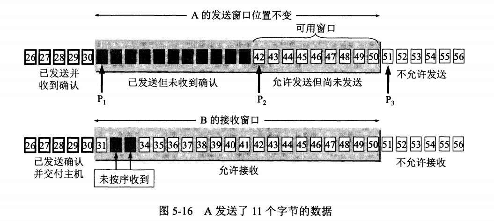
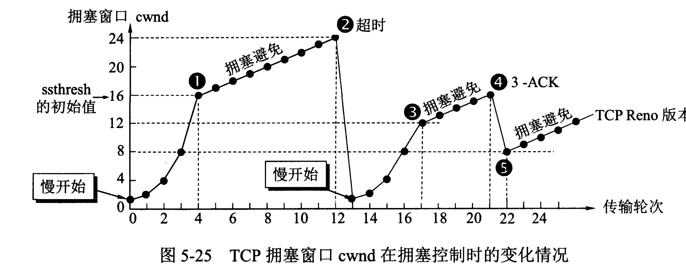

[TOC]

网络层只把分组发送到目的主机，但是真正通信的并不是主机而是主机中的进程。传输层提供了进程间的逻辑通信，传输层向高层用户屏蔽了下面网络层的核心细节，使应用程序看起来像是在两个传输层实体之间有一条端到端的逻辑通信信道。

# UDP 和 TCP 的特点

- 用户数据报协议 UDP（User Datagram Protocol）是无连接的，尽最大可能交付，没有拥塞控制，面向报文（对于应用程序传下来的报文不合并也不拆分，只是添加 UDP 首部），支持一对一、一对多、多对一和多对多的交互通信。

- 传输控制协议 TCP（Transmission Control Protocol）是面向连接的，提供可靠交付，有流量控制，拥塞控制，提供全双工通信，面向字节流（把应用层传下来的报文看成字节流，把字节流组织成大小不等的数据块），每一条 TCP 连接只能是点对点的（一对一）。

# UDP 首部格式

     

首部字段只有 8 个字节，包括源端口、目的端口、长度、检验和。**12 字节的伪首部是为了计算检验和临时添加的。**

# TCP 首部格式

     

-  **序号**  ：用于对字节流进行编号，例如序号为 301，表示第一个字节的编号为 301，如果携带的数据长度为 100 字节，那么下一个报文段的序号应为 401。

-  **确认号**  ：期望收到的下一个报文段的序号。例如 B 正确收到 A 发送来的一个报文段，序号为 501，携带的数据长度为 200 字节，因此 B 期望下一个报文段的序号为 701，B 发送给 A 的确认报文段中确认号就为 701。

-  **数据偏移**  ：指的是数据部分距离报文段起始处的偏移量，实际上指的是首部的长度。

-  **确认 ACK**  ：当 ACK=1 时确认号字段有效，否则无效。TCP 规定，在连接建立后所有传送的报文段都必须把 ACK 置 1。

-  **同步 SYN**  ：在连接建立时用来同步序号。当 SYN=1，ACK=0 时表示这是一个连接请求报文段。若对方同意建立连接，则响应报文中 SYN=1，ACK=1。

-  **终止 FIN**  ：用来释放一个连接，当 FIN=1 时，表示此报文段的发送方的数据已发送完毕，并要求释放连接。

-  **窗口**  ：窗口值作为接收方让发送方设置其发送窗口的依据。之所以要有这个限制，是因为接收方的数据缓存空间是有限的。

# TCP 的三次握手

  

   

假设 A 为客户端，B 为服务器端。

- 首先 B 处于 LISTEN（监听）状态，等待客户的连接请求。

- A 向 B 发送连接请求报文，SYN=1，ACK=0，选择一个初始的序号 x。

- B 收到连接请求报文，如果同意建立连接，则向 A 发送连接确认报文，SYN=1，ACK=1，确认号为 x+1，同时也选择一个初始的序号 y。

- A 收到 B 的连接确认报文后，还要向 B 发出确认，确认号为 y+1，序号为 x+1。

- B 收到 A 的确认后，连接建立。

**三次握手的原因** 

**第三次握手是为了防止失效的连接请求到达服务器，让服务器错误打开连接。**

客户端发送的连接请求如果在网络中滞留，那么就会隔很长一段时间才能收到服务器端发回的连接确认。客户端等待一个超时重传时间之后，就会重新请求连接。但是这个滞留的连接请求最后还是会到达服务器，如果不进行三次握手，那么服务器就会打开两个连接。如果有第三次握手，客户端会忽略服务器之后发送的对滞留连接请求的连接确认，不进行第三次握手，因此就不会再次打开连接。

# TCP 的四次挥手

     

以下描述不讨论序号和确认号，因为序号和确认号的规则比较简单。并且不讨论 ACK，因为 ACK 在连接建立之后都为 1。

- A 发送连接释放报文，FIN=1。

- B 收到之后发出确认，此时 TCP 属于半关闭状态，B 能向 A 发送数据但是 A 不能向 B 发送数据。

- 当 B 不再需要连接时，发送连接释放报文，FIN=1。

- A 收到后发出确认，进入 TIME-WAIT 状态，等待 2 MSL（最大报文存活时间）后释放连接。

- B 收到 A 的确认后释放连接。

**四次挥手的原因** 

客户端发送了 FIN 连接释放报文之后，服务器收到了这个报文，就进入了 CLOSE-WAIT 状态。这个状态是为了让服务器端发送还未传送完毕的数据，传送完毕之后，服务器会发送 FIN 连接释放报文。

**TIME_WAIT** 

客户端接收到服务器端的 FIN 报文后进入此状态，此时并不是直接进入 CLOSED 状态，还需要等待一个时间计时器设置的时间 2MSL。这么做有两个理由：

- 确保最后一个确认报文能够到达。如果 B 没收到 A 发送来的确认报文，那么就会重新发送连接释放请求报文，A 等待一段时间就是为了处理这种情况的发生。

- 等待一段时间是为了让本连接持续时间内所产生的所有报文都从网络中消失，使得下一个新的连接不会出现旧的连接请求报文。

# TCP 可靠传输

**（1）检验和**

**（2）序列号**

**（3）确认应答机制（ACK）**

**（4）超时重传机制** 

**（5）连接管理机制**：三次握手和四次挥手

**（6）流量控制**

**（7）拥塞控制** 

**TCP 使用超时重传来实现可靠传输**：如果一个已经发送的报文段在超时时间内没有收到确认，那么就重传这个报文段。

一个报文段从发送再到接收到确认所经过的时间称为往返时间 RTT，加权平均往返时间 RTTs 计算如下：

    

其中，0 ≤ a ＜ 1，RTTs 随着 a 的增加更容易受到 RTT 的影响。

超时时间 RTO 应该略大于 RTTs，TCP 使用的超时时间计算如下：

    

其中 RTTd 为偏差的加权平均值。

# TCP 滑动窗口

窗口是缓存的一部分，用来暂时存放字节流。发送方和接收方各有一个窗口，接收方通过 TCP 报文段中的窗口字段告诉发送方自己的窗口大小，发送方根据这个值和其它信息设置自己的窗口大小。

发送窗口内的字节都允许被发送，接收窗口内的字节都允许被接收。如果发送窗口左部的字节已经发送并且收到了确认，那么就将发送窗口向右滑动一定距离，直到左部第一个字节不是已发送并且已确认的状态；接收窗口的滑动类似，接收窗口左部字节已经发送确认并交付主机，就向右滑动接收窗口。

接收窗口只会对窗口内最后一个按序到达的字节进行确认，例如接收窗口已经收到的字节为 {31, 34, 35}，其中 {31} 按序到达，而 {34, 35} 就不是，因此只对字节 31 进行确认。发送方得到一个字节的确认之后，就知道这个字节之前的所有字节都已经被接收。

 

# TCP 流量控制

流量控制是为了控制发送方发送速率，保证接收方来得及接收。

接收方发送的确认报文中的窗口字段可以用来控制发送方窗口大小，从而影响发送方的发送速率。将窗口字段设置为 0，则发送方不能发送数据。

# TCP 拥塞控制

如果网络出现拥塞，分组将会丢失，此时发送方会继续重传，从而导致网络拥塞程度更高。因此当出现拥塞时，应当控制发送方的速率。这一点和流量控制很像，但是出发点不同。流量控制是为了让接收方能来得及接收，而拥塞控制是为了降低整个网络的拥塞程度。

  

TCP 主要通过四个算法来进行拥塞控制：慢开始、拥塞避免、快重传、快恢复。

**发送方需要维护**一个叫做**拥塞窗口（cwnd）**的状态变量，注意拥塞窗口与发送方窗口的区别：拥塞窗口只是一个状态变量，实际决定发送方能发送多少数据的是发送方窗口。

为了便于讨论，做如下假设：

- 接收方有足够大的接收缓存，因此不会发生流量控制；
- 虽然 TCP 的窗口基于字节，但是这里设窗口的大小单位为报文段。

     

## 1. 慢开始与拥塞避免

发送的最初执行慢开始，令 cwnd = 1，发送方只能发送 1 个报文段；当收到确认后，将 cwnd 加倍，因此之后发送方能够发送的报文段数量为：2、4、8 ...

注意到慢开始每个轮次都将 cwnd 加倍，这样会让 cwnd 增长速度非常快，从而使得发送方发送的速度增长速度过快，网络拥塞的可能性也就更高。**设置一个慢开始门限 ssthresh**，当 cwnd **>=** ssthresh 时，**进入拥塞避免**，每个轮次只将 cwnd 加 1。

如果出现了超时，则令 ssthresh = cwnd / 2，然后重新执行慢开始。

## 2. 快重传与快恢复

在接收方，要求每次接收到报文段都应该对最后一个已收到的有序报文段进行确认。例如已经接收到 M1 和 M2，此时收到 M4，应当发送对 M2 的确认。

在发送方，如果收到三个重复确认，那么可以知道下一个报文段丢失，**此时执行快重传**，立即重传下一个报文段。例如收到三个 M2，则 M3 丢失，立即重传 M3。

在这种情况下，**只是丢失个别报文段，而不是网络拥塞。因此执行快恢复，**令 ssthresh = cwnd / 2 ，cwnd = ssthresh，注意到此时直接进入拥塞避免。

慢开始和快恢复的快慢指的是 cwnd 的设定值，而不是 cwnd 的增长速率。慢开始 cwnd 设定为 1，而快恢复 cwnd 设定为 ssthresh。

     

# TCPIP各层的协议

# △UDP 如何实现可靠性传输？

UDP 不属于连接性协议，因而具有资源消耗小，处理速度快的优点，所以通常音频、视频和普通数据在传输时使用 UDP 较多，因为它们即使偶尔丢失一两个包，也不会对接收结果产生太大影响

传输层无法保证数据的可靠传输，只能通过应用层来实现，实现的方式可以参考 TCP 可靠性传输，只是实现不在传输层，实现转移到了应用层

实现确认机制，重传机制，窗口确认机制

如果不利用 Linux 协议栈及上层 socket 机制，自己通过抓包和发包的方式去实现可靠性传输，那么必须实现以下功能

- 发送：包的分片、包确认、包的重发
- 接收：包的调序、包的序号确认
- 目前已有如下开源程序利用 UDP 实现了可靠的数据传输，分别为：RUDP、RTP、UDT

# RUDP

RUDP 提供一组数据服务质量增强机制，如拥塞控制的改进、重发机制及淡化服务器算法等，从而在包丢失和网络拥塞的情况下， RTP 客户机（实时位置）面前呈现的就是一个高质量的 RTP 流。在不干扰协议的实时特性的同时，可靠 UDP 的拥塞控制机制允许 TCP 方式下的流控制行为

# RTP

实时传输协议（RTP）为数据提供了具有实时特征的端对端传送服务，如在组播或单播网络服务下的交互式视频音频或模拟数据。应用程序通常在 UDP 上运行 RTP 以便使用其多路结点和校验服务；这两种协议都提供了传输层协议的功能。但是 RTP 可以与其它适合的底层网络或传输协议一起使用。如果底层网络提供组播方式，那么 RTP 可以使用该组播表传输数据到多个目的地。

RTP 本身并没有提供按时发送机制或其它服务质量（QoS）保证，它依赖于底层服务去实现这一过程。 RTP 并不保证传送或防止无序传送，也不确定底层网络的可靠性。 RTP 实行有序传送， RTP 中的序列号允许接收方重组发送方的包序列，同时序列号也能用于决定适当的包位置，例如：在视频解码中，就不需要顺序解码。

# UDT

基于 UDP 的数据传输协议（UDP-basedData Transfer Protocol，简称UDT）是一种互联网数据传输协议。UDT的主要目的是支持高速广域网上的海量数据传输，而互联网上的标准数据传输协议 TCP 在高带宽长距离网络上性能很差。顾名思义，UDT 建于 UDP 之上，并引入新的拥塞控制和数据可靠性控制机制。UDT 是面向连接的双向的应用层协议。它同时支持可靠的数据流传输和部分可靠的数据报传输。由于 UDT 完全在 UDP 上实现，它也可以应用在除了高速数据传输之外的其它应用领域，例如点到点技术（P2P），防火墙穿透，多媒体数据传输等等。

 因项目中的需要，现在详细分析一下 UDT 是如何通过 udp 实现数据的可靠传输。通过阅读源码的方式。

# UDT 原理分析

主要通过分析源码弄清如何使用 UDP 进行数据的可靠传输，主要按照协议格式，关键数据等展开

## UDT 应用层协议

UDT 并不是在瓶劲带宽相对较小的和大量多元短文档流的情况下用来取代 TCP 的。

UDT 主要作为 TCP 的朋友，和 TCP 并存，UDT 分配的带宽不应该超过根据 MAX-MIN 规则的最大最小公平共享原则。（备注，最大最小规则允许 UDT 在高 BDP 连接下分配 TCP 不能使用的可用带宽）。

UDT 是双工的，每个 UDT 实体有两个部分：发送和接收。

发送者根据流量控制和速率控制来发送（和重传）应用程式数据。

接收者接收数据包和控制包，并根据接收到的包发送控制包。发送和接收程式共享同一个UDP端口来发送和接收。

接收者也负责触发和处理任何的控制事件，包括拥塞控制和可靠性控制和他们的相对机制，例如RTT估计、带宽估计、应答和重传。

UDT总是试着将应用层数据打包成固定的大小，除非数据不够这么大。和TCP相似的是，这个固定的包大小叫做MSS（最大包大小）。由于期望UDT用来传输大块数据流，我们假定只有很小的一部分不规则的大小的包在UDT session中。MSS能够通过应用程式来安装，MTU是其最优值（包括任何包头）。

UDT拥塞控制算法将速率控制和窗口（流量控制）合并起来，前者调整包的发送周期，后者限制最大的位被应答的包。在速率控制中使用的参数通过带宽估计技术来更新，他继承来自基于接收的包方法。同时，速率控制周期是估计RTT的常量，流控制参数依赖于对方的数据到达速度，另外接收端释放的缓冲区的大小。

## 报文类型及格式

UDT有两种包：数据包和控制包。他们通过包头的第一位来区分（标志位）。如果是0，表示是数据包，1表示是控制包。

### 数据包

### 控制包

## 定时器

UDT在接收端使用4个定时器来触发不同的周期事件，包括速率控制、应答、丢失报告（negative应答）和重传/连接维护。

UDT中的定时器使用系统时间作为源。UDT接收端主动查询系统时间来检查一个定时器是否过期。对于某个定时器T来说，其拥有周期TP，将定变量t用来记录最近T被设置或复位的时间。如果T在系统时间t0（t= t0）被复位，那么任何t1（t1-t>=TP）是T过期的条件。

四个定时器是：RC定时器、ACK定时器、NAK定时器、EXP定时器。他们的周期分别是：RCTP、ATP、NTP、ETP。

RC定时器用来触发周期性的速率控制。ACK定时器用来触发周期性的有选择的应答（应答包）。RCTP和ATP是常量值，值为：RCTP=ATP=0.01秒。

NAK被用来触发negative应答（NAK包）。重传定时器被用来触发一个数据包的重传和维护连接状态。他们周期依赖于对于RTT的估计。ETP值也依赖于连续EXP时间溢出的次数。推荐的RTT初始值是0.1秒，而NTP和ETP的初始值是：NTP=3*RTT，ETP=3*RTT+ATP。

在每次bounded UDP接收操作（如果收到一个UDP包，一些额外的必须的数据处理时间）时查询系统时间来检查四个定时器是否已经过期。推荐的周期粒度是微秒。UDP接收时间溢出值是实现的一个选择，这依赖于循环查询的负担和事件周期精确度之间的权衡。

速率控制事件更新包发送周期，UDT发送端使用STP来安排数据包的发送。假定一个在时间t0被发送，那么下一次包发送时间是（t0+ STP）。换句话说，如果前面的包发送花费了t’时间，发送端将等待（STP-t’）来发送下一个数据包（如果STP-t’ <0，就不需要等待了）。这个等待间隔需要一个高精确度的实现，推荐使用CPU时钟周期粒度。

## 个人感悟

最简单的方式是在应用层模仿传输层TCP的可靠性传输。下面不考虑拥塞处理，谈谈自己的个人简单粗暴的设计。

- 添加seq/ack机制，确保数据发送到对端。
- 添加发送和接收缓冲区，主要是用户超时重传。
- 添加超时重传机制。

1、发送端发送数据时，生成一个随机seq=x，然后每一片按照数据大小分配seq。数据到达接收端后接收端放入缓存，并发送一个ack=x的包，表示对方已经收到了数据。发送端收到了ack包后，删除缓冲区对应的数据。

2、时间到后，定时任务检查是否需要重传数据。

