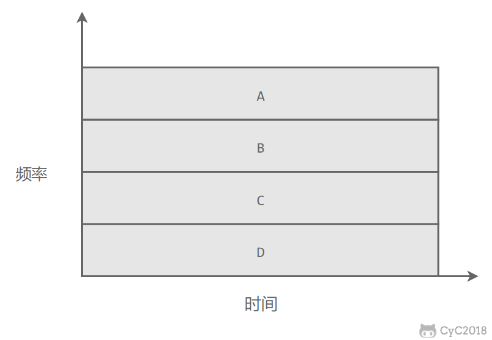
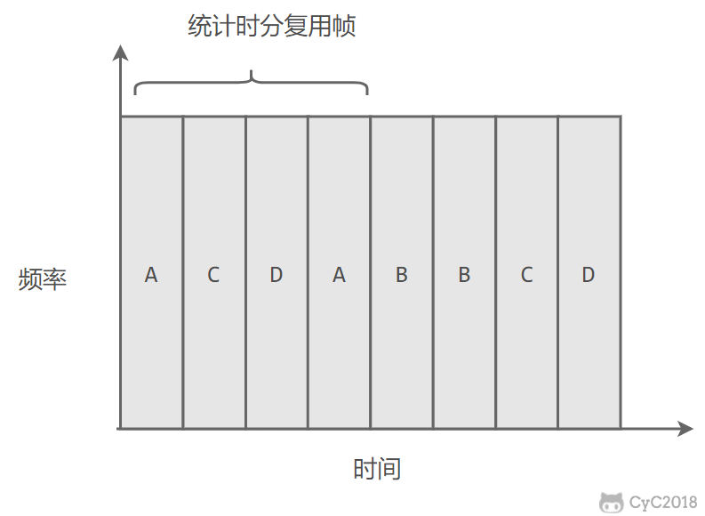

[TOC]

# 基本问题

## 1. 封装成帧

将网络层传下来的分组添加首部和尾部，用于标记帧的开始和结束。

     

## 2. 透明传输

透明表示一个实际存在的事物看起来好像不存在一样。

**帧使用首部和尾部进行定界**，如果帧的数据部分含有和首部尾部相同的内容，那么帧的开始和结束位置就会被错误的判定。需要在数据部分出现首部尾部相同的内容前面插入转义字符。如果数据部分出现转义字符，那么就在转义字符前面再加个转义字符。在接收端进行处理之后可以还原出原始数据。这个过程透明传输的内容是转义字符，用户察觉不到转义字符的存在。

     

## 3. 差错检测

目前数据链路层广泛使用了**循环冗余检验（CRC）**来检查比特差错。

# 信道分类

## 1. 广播信道

一对多通信，一个节点发送的数据能够被广播信道上所有的节点接收到。

所有的节点都在同一个广播信道上发送数据，因此需要有专门的控制方法进行协调，避免发生冲突（冲突也叫碰撞）。

主要有两种控制方法进行协调，一个是使用信道复用技术，一是使用 CSMA/CD 协议。

## 2. 点对点信道

一对一通信。

因为不会发生碰撞，因此也比较简单，使用 PPP 协议进行控制。

# 信道复用技术

## 1. 频分复用

频分复用的所有主机在相同的时间占用不同的频率带宽资源。

     

## 2. 时分复用

时分复用的所有主机在不同的时间占用相同的频率带宽资源。

     

使用频分复用和时分复用进行通信，在通信的过程中主机会一直占用一部分信道资源。但是由于计算机数据的突发性质，通信过程没必要一直占用信道资源而不让出给其它用户使用，因此这两种方式对信道的利用率都不高。

## 3. 统计时分复用

是对时分复用的一种改进，不固定每个用户在时分复用帧中的位置，只要有数据就集中起来组成统计时分复用帧然后发送。

     

## 4. 波分复用

光的频分复用。由于光的频率很高，因此习惯上用波长而不是频率来表示所使用的光载波。

## 5. 码分复用

为每个用户分配 m bit 的码片，并且所有的码片正交，对于任意两个码片  和  有

<!--      -->

     

为了讨论方便，取 m=8，设码片  为 00011011。在拥有该码片的用户发送比特 1 时就发送该码片，发送比特 0 时就发送该码片的反码 11100100。

在计算时将 00011011 记作 (-1 -1 -1 +1 +1 -1 +1 +1)，可以得到

<!--      -->

<!--      -->

     

     

其中  为  的反码。

利用上面的式子我们知道，当接收端使用码片  对接收到的数据进行内积运算时，结果为 0 的是其它用户发送的数据，结果为 1 的是用户发送的比特 1，结果为 -1 的是用户发送的比特 0。

码分复用需要发送的数据量为原先的 m 倍。

     

# CSMA/CD 协议

CSMA/CD 表示载波监听多点接入 / 碰撞检测。

-  **多点接入** ：说明这是总线型网络，许多主机以多点的方式连接到总线上。
-  **载波监听** ：每个主机都必须不停地监听信道。在发送前，如果监听到信道正在使用，就必须等待。
-  **碰撞检测** ：在发送中，如果监听到信道已有其它主机正在发送数据，就表示发生了碰撞。虽然每个主机在发送数据之前都已经监听到信道为空闲，但是由于电磁波的传播时延的存在，还是有可能会发生碰撞。

记端到端的传播时延为 τ，最先发送的站点最多经过 2τ 就可以知道是否发生了碰撞，称 2τ 为  **争用期** 。只有经过争用期之后还没有检测到碰撞，才能肯定这次发送不会发生碰撞。

当发生碰撞时，站点要停止发送，等待一段时间再发送。这个时间采用  **截断二进制指数退避算法**  来确定。从离散的整数集合 {0, 1, .., (2k-1)} 中随机取出一个数，记作 r，然后取 r 倍的争用期作为重传等待时间。

     

# PPP 协议

互联网用户通常需要连接到某个 ISP 之后才能接入到互联网，PPP 协议是用户计算机和 ISP 进行通信时所使用的数据链路层协议。

     

PPP 的帧格式：

- F 字段为帧的定界符
- A 和 C 字段暂时没有意义
- FCS 字段是使用 CRC 的检验序列
- 信息部分的长度不超过 1500

     

# MAC 地址

mss(maximum segment size)

tcp最大负载为65535-40=655495，因为需要满足在IP层的需求，tcp最小头部20字节，ip头部20字节
macceng， 以太网mtu=1500，mss=1500-40=1460；因特网internetmtu=576，mss=576-40=536
tcp最小数据长度1460，跟具体传输网络有关

以太网最大数据帧1518=6+6+2+1500+4.    可以看到， 在单个帧中， IP数据包必须小于1500字节，  这个1500就是MTU(max transmission unit)能达到的最大值,  它是数据链路层允许的最大IP包。

总结一下：64字节的由来即以太网帧的18 Byte (目的MAC（6）＋源MAC（6）＋Type（2）＋CRC（4）)加上实际载荷的最小长度46 Byte(数据：46～1500字节) ，总共64字节！46Byte中，还有ip头部+tcp头部=20+20=40，

### 为什么802.3MAC帧最小是64字节?

| Pre | SFD | DA | SA | Length Type | Data unit + pad | FCS | 
|__7__|__1__|__6_|__6_|______2______|______46-1500____|__4__| 

- 前导码字段(Pre):由7个字节组成。其功能是使接收器建立比特同步。编码形式为多个“1”或“0”交替构成的二进制序列,最后一比特为“0”。 

- 帧首定界符(SFD):是MAN帧的第2个字段,其编码形式为“10101011”序列，长度刚好为一个字节。该字段的功能是指示一帧的开始。 

- 目的地址字段(DA):为第3个字段，长度为6个字节。该字段用来指出帧要发住的工作站。 

- 源点地址(SA)处于终点地址字段之后,其长度也为6个字节。该字段功能是指示发送该帧的工作站地址。 

- 长度指示符字段为第5个字段，其长度为2个字节，用来指示紧随其后的逻辑链路控制(LLC)数据字节的长度，长度单位为字节数。 

- LLC数据字段是帧要载携的用户数据，该数据由LLC子层提供或接收。 

- 填充(PAD)字段紧接的LLC之后，用来对LLC数据进行填加，以保证帧有足够长度，适应前面所述的碰撞检测的需要。 

- 帧检验序列(FCS)处于帧的最后，其长度为32比特，用于检验帧在传输过程中有无差错。 

帧总值最小为64字节。这是因为： 

A.当站点正在发送数据时，发生了冲突，就将未发送的部分丢弃，这样导致了物理线路上的残余帧的LEN可能为0，若MAC的LEN为0是合法的将无法区别。 
B.另一个原因是为了防止一个站点发送短帧时，在第一比特还未到达线缆的最远端就已完成发送，这时它会认为已成功的发送完数据；如果最远端也同时发送一帧数据，它检测到了冲突即发送一冲突帧，这样发送方必须在发送完数据之前接收到最远端的冲突帧，否则将生产冲突而检测不到的现象。在一个最大长度为2500米，拥有4个中继器的10Mb/s的局域网中，允许的最小发送时间为51.2us，**这个时间等于64字节的发送时间**，64字节就是因此而来。

**MAC 地址是链路层地址**，长度为 6 字节（48 位），用于唯一标识网络适配器（网卡）。

一台主机拥有多少个网络适配器就有多少个 MAC 地址。例如笔记本电脑普遍存在无线网络适配器和有线网络适配器，因此就有两个 MAC 地址。

# 局域网

局域网是一种典型的广播信道，主要特点是网络为一个单位所拥有，且地理范围和站点数目均有限。

主要有以太网、令牌环网、FDDI 和 ATM 等局域网技术，目前以太网占领着有线局域网市场。

可以按照网络拓扑结构对局域网进行分类：

     

# 以太网

以太网是一种星型拓扑结构局域网。

早期使用集线器进行连接，集线器是一种物理层设备， 作用于比特而不是帧，当一个比特到达接口时，集线器重新生成这个比特，并将其能量强度放大，从而扩大网络的传输距离，之后再将这个比特发送到其它所有接口。如果集线器同时收到两个不同接口的帧，那么就发生了碰撞。

目前以太网使用交换机替代了集线器，交换机是一种链路层设备，它不会发生碰撞，能根据 MAC 地址进行存储转发。

以太网帧格式：

-  **类型** ：标记上层使用的协议；
-  **数据** ：长度在 46-1500 之间，如果太小则需要填充；
-  **FCS** ：帧检验序列，使用的是 CRC 检验方法；

     

# 交换机

**交换机具有自学习能力，学习的是交换表的内容，交换表中存储着 MAC 地址到接口的映射。**

正是由于这种自学习能力，因此交换机是一种即插即用设备，不需要网络管理员手动配置交换表内容。

下图中，交换机有 4 个接口，主机 A 向主机 B 发送数据帧时，交换机把主机 A 到接口 1 的映射写入交换表中。为了发送数据帧到 B，先查交换表，此时没有主机 B 的表项，那么主机 A 就发送广播帧，主机 C 和主机 D 会丢弃该帧，主机 B 回应该帧向主机 A 发送数据包时，交换机查找交换表得到主机 A 映射的接口为 1，就发送数据帧到接口 1，同时交换机添加主机 B 到接口 2 的映射。

     

# 虚拟局域网

虚拟局域网可以建立与物理位置无关的逻辑组，只有在同一个虚拟局域网中的成员才会收到链路层广播信息。

例如下图中 (A1, A2, A3, A4) 属于一个虚拟局域网，A1 发送的广播会被 A2、A3、A4 收到，而其它站点收不到。

使用 VLAN 干线连接来建立虚拟局域网，每台交换机上的一个特殊接口被设置为干线接口，以互连 VLAN 交换机。IEEE 定义了一种扩展的以太网帧格式 802.1Q，它在标准以太网帧上加进了 4 字节首部 VLAN 标签，用于表示该帧属于哪一个虚拟局域网。

     

